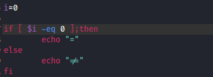
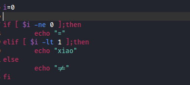
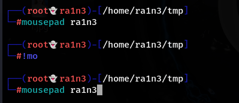
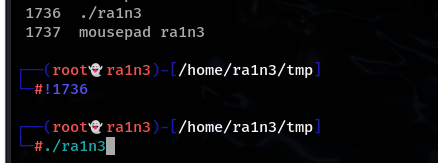

标准格式

If后面跟一个中括号，判断中括号中的语法是否为真，分号，then

换行之后，如果判断为真，则执行then后面的语句

如果不为真，则执行else后的语句

用fi作为if判断的结束

 

如果有多个条件，用elif

分号就相当于是一个回车

 

 

快速回到之前的某个命令

如ls：

!ls

即从history中自下到上寻找以ls开头的命令

 

或者直接查看history然后!+序号

