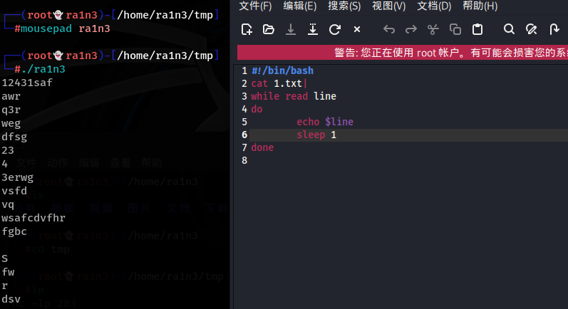
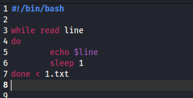
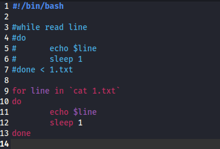

利用while循环

首先读取1.txt文件，并接管道符

while循环，read读取 后面跟循环变量，这里为line

do和done中间是循环体

每次循环执行输出line变量的内容，并睡眠一秒钟

 

 

 

 

或者不用cat+管道符

 

在done后面接重定向

 

 

 

 

也可以利用for来实现

但是for循环有个缺点，它不是按行来输出的，而是以空格为分隔符