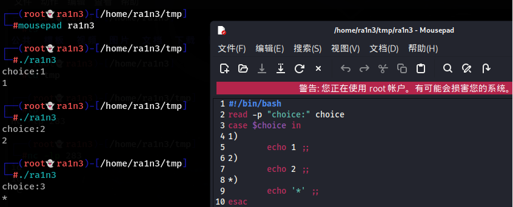

首先读取用户输入，赋值给参数choice

case判断参数choice在哪个分支中 in

值1)

执行语句 ;;

值2) 

执行语句 ;;

*)

执行语句 ;;

esac

 

当choice为值1时执行第一条，同时在执行语句后加 ;; 作为该语句结束

当choice未在分支结构中，则执行*)后的语句

esac同if判断

反写case作为结束

 

在示例中的 '*'表示输出 *

加单引号是因为\*表示通配符，加单引号表示不转义，即输出\*，否则输出*匹配到的内容

 

 

 

 

 

也可以在括号中加 |，表示或

1|3)

echo "yes" ;;

2|4) 

echo "no" ;;

 

表示如果变量为1或3，输出yes

如果变量为2或4，输出no

bash -x 调试脚本