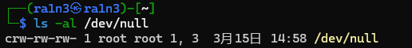
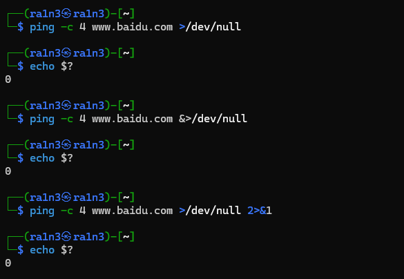
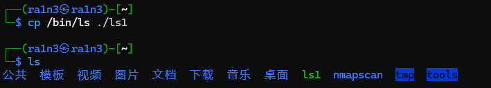
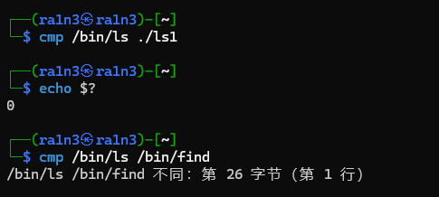
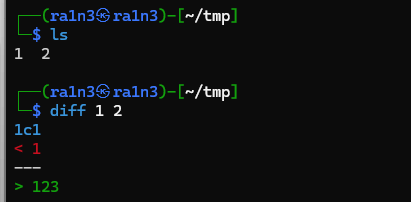
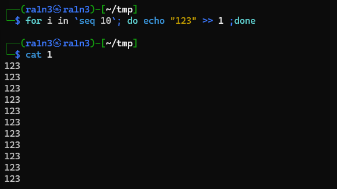
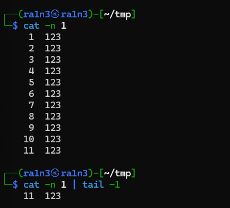
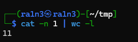
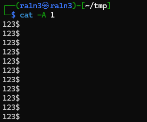
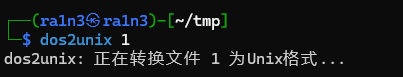

/dev/null



垃圾桶


```
ping -c 4 www.baidu.com >/dev/null 2>&1
```

将标准输出和标准错误输出重定向到垃圾桶，即不输出内容

或者

```
&>/dev/null
```

同等效果





cmp命令

compare 比较，比较两个内容是否相同






相同内容无输出，但是查看$?可知成功执行

内容不同会报错


diff 

different




cat -n 显示行数,结合 tail -1





或者wc -l






linux文本中结尾是$符号，和windows不同

windows结尾一般是 ^M

因此可能某些windows脚本无法直接在linux执行

dos2unix filename

通过dos2unix转换

