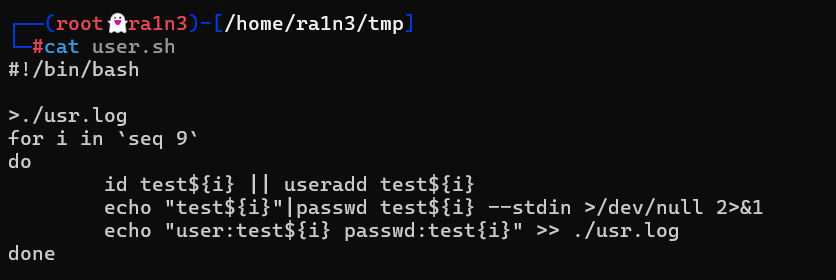
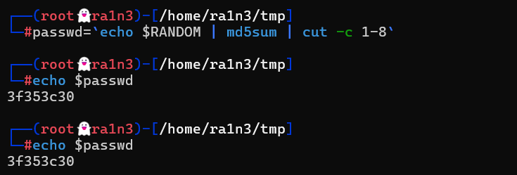

非交互式的设置用户密码

```
echo "test" | passwd test --stdin
```

首先清空user.log


创建九个用户

id用来检查是否存在该用户，如果不存在则创建

非交互式为用户创建密码，并将标准输出和标准错误输出重定向到/dev/null

然后将用户名和密码保存到user.log中


密码可以用随机数




但是定义变量passwd的时候，必须在循环内部，不然随机数会相同