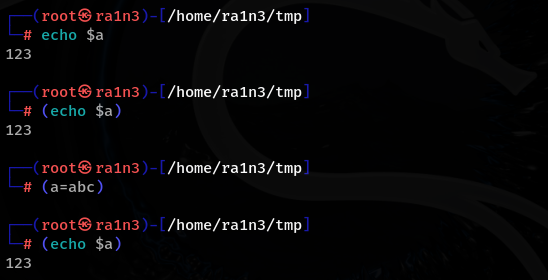
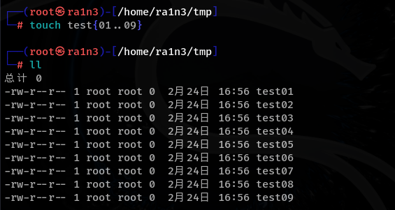
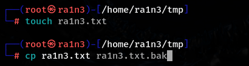
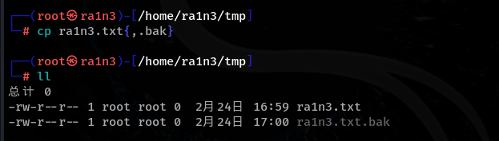
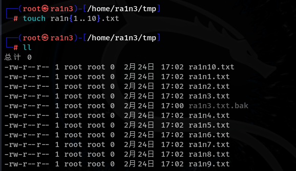

()

{}

[]

 

 

 

( ) 概念：

小括号执行的命令不是在一个shell中

父子shell

小括号中的是子shell

其执行的内容与父shell无关

但是父shell中的值会影响子shell

即便子shell中定义了该变量，依旧按照父shell中的变量值执行

小括号进行算数计算(( 1 + 2))

{}花括号是在同一个shell

把两个命令写到一行，相当于一个换行符

 

用{ } 表示序列

利用 { } 快速备份文件

常规写法：

快速

[ ]中加入通配符

[1-3]表示1--3中的任意一个字符