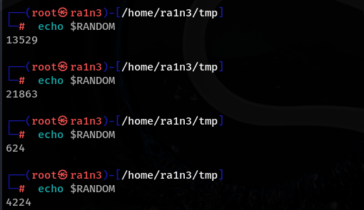
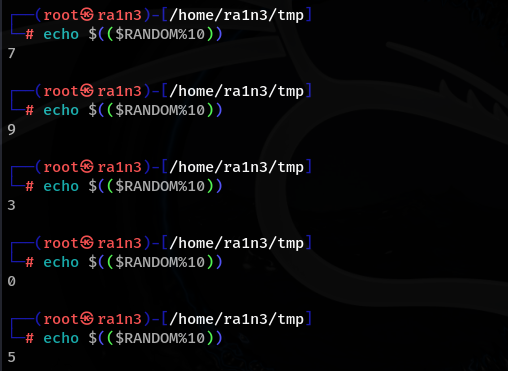
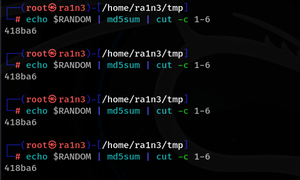
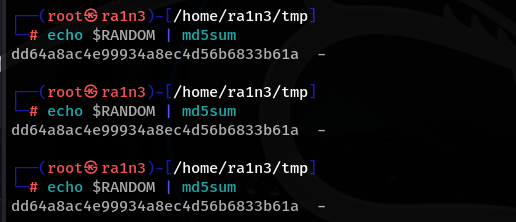
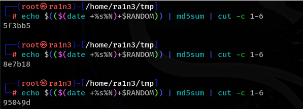
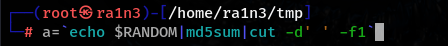
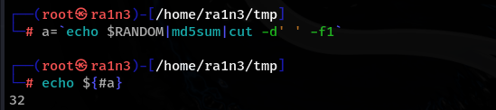

shel中内置随机数$RANDOM

一般是四到五位

取0--9随机数

1--10

 

$(($RANDOM%10+1))

生成字母加数字的随机数

按老师讲的做法生成的随机数重复

Md5sum,生成md5加密

cut -c n-x

-c 取第n到x的值

这里介绍另外一种写法：

使用$RANDOM结合时间戳

date +%s%N 获取当前时间的秒数和纳秒数

\#取字符串长度

生成随机数，交给md5sum处理，并利用cut取出第一个字符串

 

${#a}

${}

首先用美刀符和大括号包裹，接着在变量前跟一个#

统计字符串长度