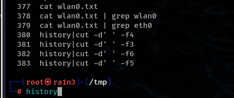
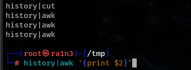
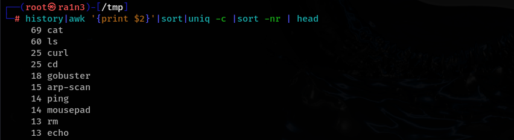

cut进行文本处理

cut -d'' -fn

-d'' 单引号中指定分割符

-fn n指定要取出第几项

以空格为分隔符取出第五列

 

或者用awk

awk默认以空格作为分隔符

sort排序

-nr

-r reverse（加的话从大到小，不加的话从小到大）

 

uniq去重

uniq -c

-c count计数

 

 

head -n 取前n行

不加-n参数，默认取前十行

 

排序，去重并计数，再排序，然后只输出前十行

