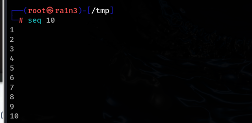
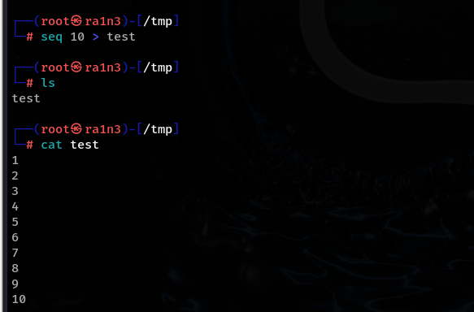
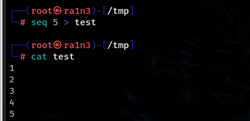
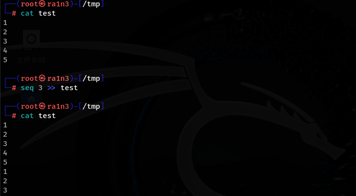
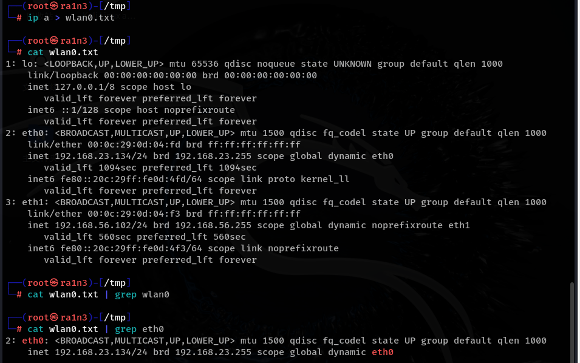
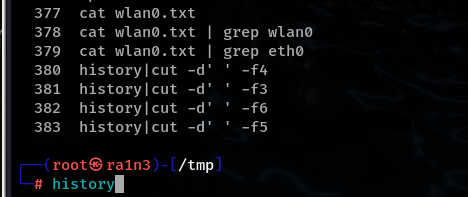
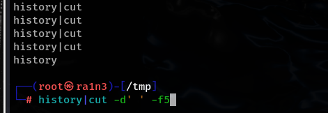
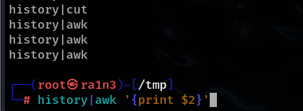

\>

\>>

|

首先

seq 10为标准输入

输出的内容为标准输出

 

还有一个是标准错误输出

 

管道0表示标准输入

管道1表示标准输出

管道2表示标准错误输出

\>重定向到一个文件，如果存在该文件则覆盖文件内容，如果不存在该文件则创建该文件并写入标准输出内容

（即先清空文件内容，然后写入）

\>>追加重定向，将标准输出内容追加到文件尾部

Clear  或 ctrl + l

清屏

 

 

|

将 ip a输出内容重定向到wlan0.txt

cat wlan0.txt | grep eth0

查看wlan0.txt的内容，并将输出的内容交给grep处理

 

grep为过滤器，过滤存在eth0的行

 

 

| 将上一条命令执行的结果作为标准输入

 

 

 

cut进行文本处理

Cut -d'' -fn

-d'' 单引号中指定分割符

-fn n指定要取出第几项

以空格为分隔符取出第五列

 

或者用awk

awk默认以空格作为分隔符

 

 

 

 

sort排序

-nr

-r reverse（加的话从大到小，不加的话从小到大）

 

uniq去重

uniq -c

-c count计数

 

 

head 默认取前十行

 

排序，去重并计数，再排序，然后只输出前十行

