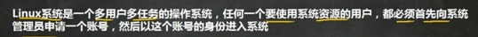

# 目录结构

基本介绍

文件系统采用级层的树状目录解耦给，在此结构中的最上层是 "/" 根目录，,然后在此目录下再创建其他的目录。

在linux世界里，一切皆文件

文件系统采用级层的树状目录结构，在此结构中的最上层是 "/" 根目录，,然后在此目录下再创建其他的目录。

在linux世界里，一切皆文件

 

 

 

 

 

 

#  vi和vim文本编辑器

 

拷贝当前行 yy

拷贝当前行向下的5行 5yy

粘贴 p

删除当前行 dd

删除当前行向下的5行 5dd

查找关键词 命令行下 /关键字 回车查找 输入n就是查找下一个

设置行号 :set nu

取消设置行号 :set nonu

定位到文档首行 gg

定位到文档末行 G

撤销动作 u

跳转到某一行 数字（看不到） 然后shift+g 

 

 

#  关机&重启命令

 

 

-h halt 停止

-r  reboot

 

 

#  用户登录和注销

 

 

 

 

 

# 用户管理

 

##  添加用户

 

 

 

 

##  指定/修改密码

 

 

 

 

 

 

 

 

 

 

 

##  删除用户

 

 

 

 

 

 

 

该命令仅删除用户，保留家目录

 

 

 

该命令删除用户以及用户主目录

##  查询用户信息

 

 

 

 

 

## 切换用户

## 查看当前用户/登录用户

 

 

 

 

 

 

# 用户组

## 新增组

共性可以理解为权限

 

 

 

 

 

 

 

当添加用户时未指定其组，会自动生成一个与用户同名的组，并将其添加进去

 

##  修改用户的组

 

 

 

 

 

 

##  运行级别

 

init 3

init 5

init 0

 

 

 

 

 