# shell脚本的执行方式

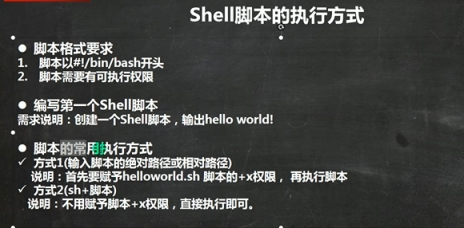

chmod u+x Helloworld.sh

 

#  变量

 变量

 

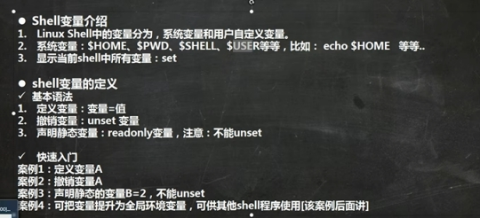 

 

定义变量的时候不能加空格

a=1 (ok)

a = 1 (no)

 

定义变量不需要加$

输出变量要加$

 

a=100

echo $a

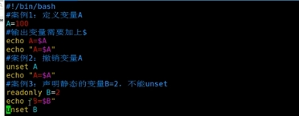 

 

 

 

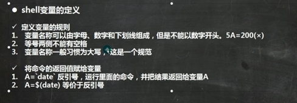 

 

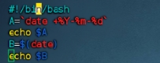 

 

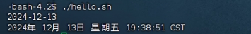 

 

 

#  设置环境变量

 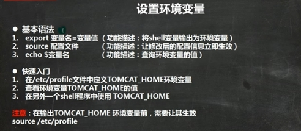

 

 

#  多行注释

 多行注释

开头处 :<<!

结尾处 !

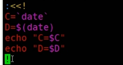 

 

 

 

#  位置参数变量

 

 

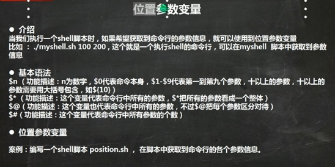 

 

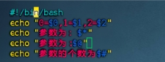 

 

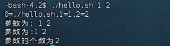 

 

 

 

#  预定义变量

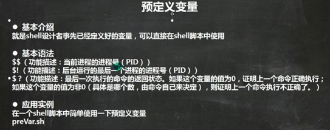

 

 

 

#  运算符

   

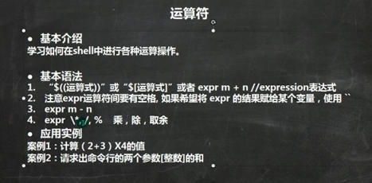 

 

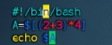 

 

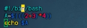 

 

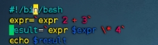 

 

 

 

 

# 条件判断 

  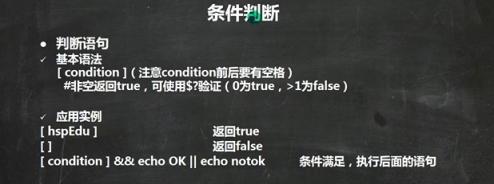

 

 

 

 

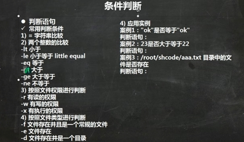 

 

 

判断字符串是否相等 用 = （=号两边要有空格）

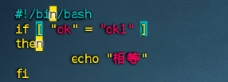 

 

 

判断a是否大于b

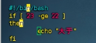 

 

 

判断一个文件是否存在

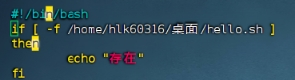 

 

#  流程控制

## if

 

 

 

 

判断字符串是否相等 用 = （=号两边要有空格）

 

 

 

判断a是否大于b

 

 

 

判断一个文件是否存在

 

 

 

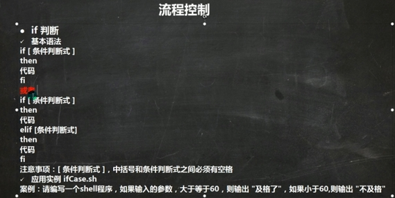 

 

 

 

 

 

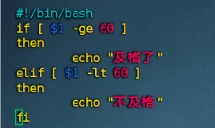 

 

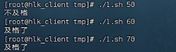 

 

 

#  case

  

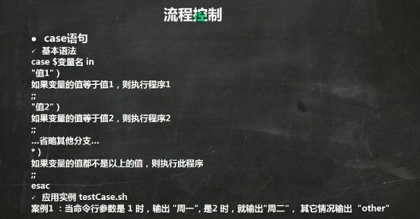 

 

 

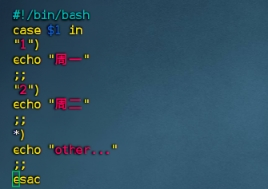 

 

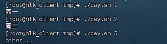 

 

##  for

  

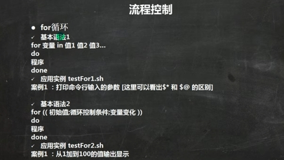 

 

 

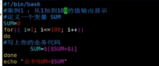 

 

 

 

##  while

 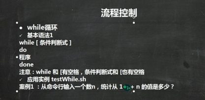

 

 

 

## 读取控制台输入 

  

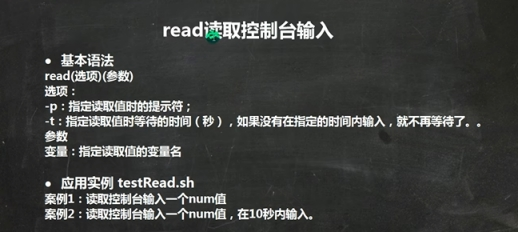 

 

 

 

 

 

 

##  函数

  

 

 

 

 

 

 

 

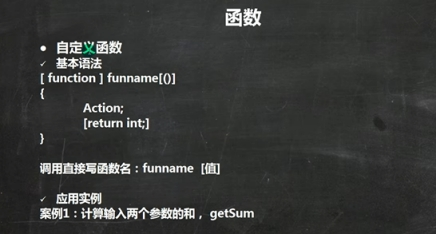 

 

 

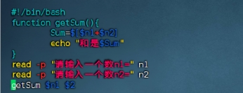 

 

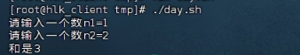 

 

 