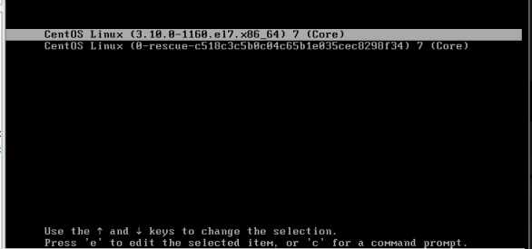
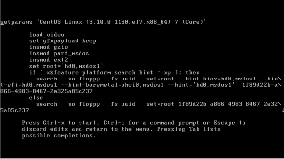
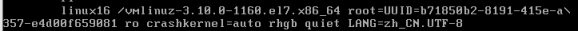
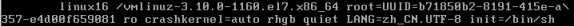
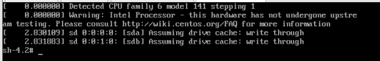
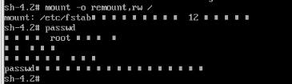

单用户模式下找回root密码

 

 

启动系统，开机界面，在界面中按 "e"进入编辑页面

 

 

 

 

 

在该行末尾输入：init=/bin/sh

 

 

接着快捷键 ctrl+x进入单用户模式

 

 

在光标闪烁处输入：mount -o remount,rw / 

 

 

 

在新的一行输入passwd，回车后输入密码，修改完成后，会显示passwd….

 

 

接着输入 touch /.autorelabel

 

 

最后输入 exec /sbin/init

 

 