# 帮助指令

## man

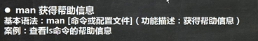

## help

# 文件目录类

## pwd

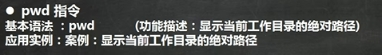

 

 

 

 

## ls

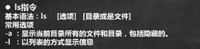

 

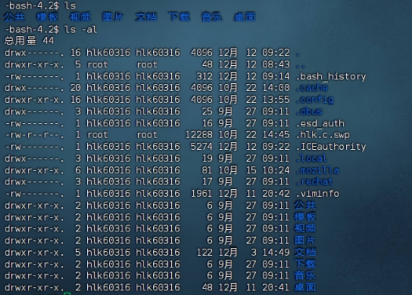 

 

##  cd

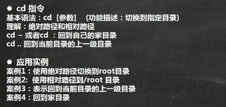

 

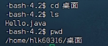 

 

 

 

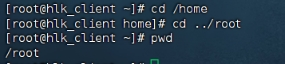 

 

 

 

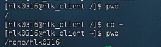 

 

##  mkdir

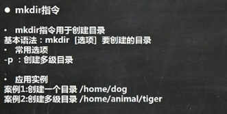

 

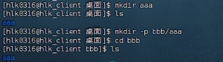 

 

 

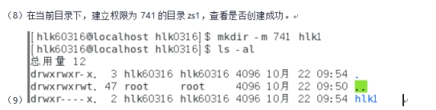 

 

 

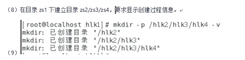 

 

 

## touch

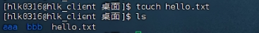 

 

## cp

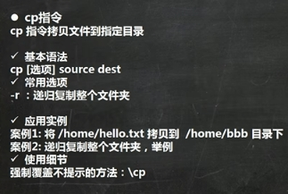

 

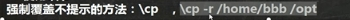 

 

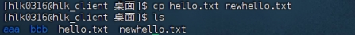 

 

 

 

 

 

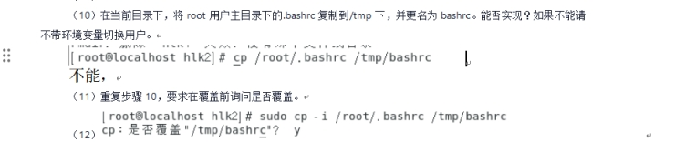 

 

 

## rm

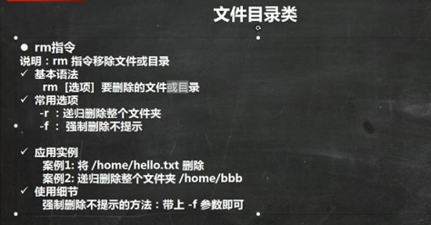

 

 

 

 

 

 

 

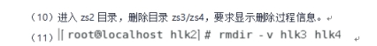 

 

##  mv

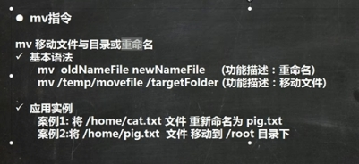

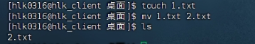 

 

## cat

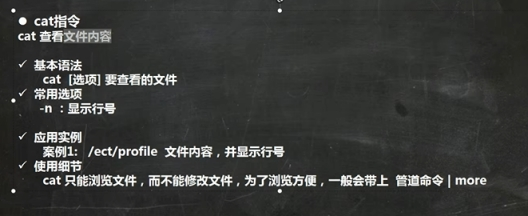

 

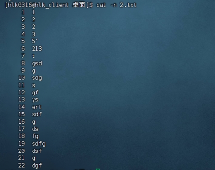 

 

## more

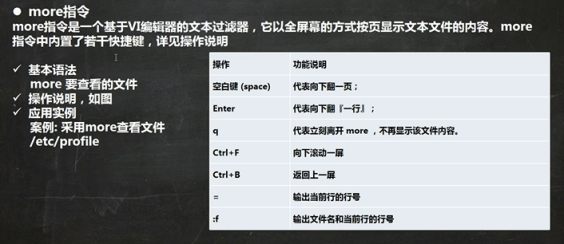

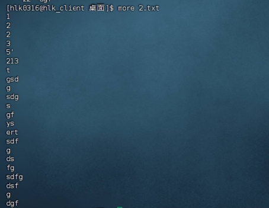 

 

## less

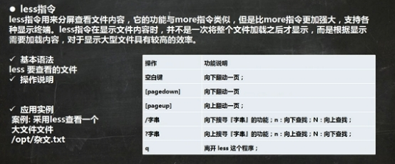

## echo

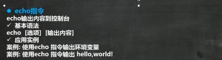

 

 

 

 

## head

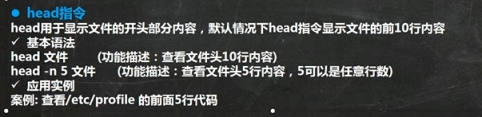

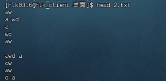 

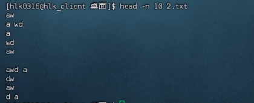 

 

## tail

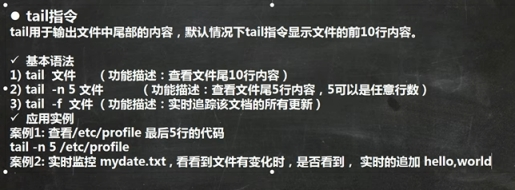

 

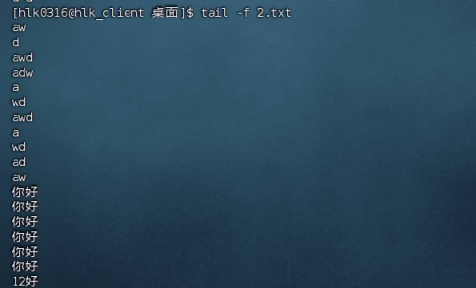 

 

## \> 和 >>

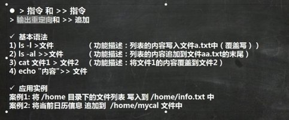

\>覆盖

\>> 追加

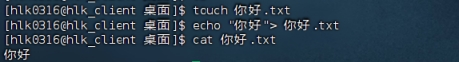 

 

 

## ln

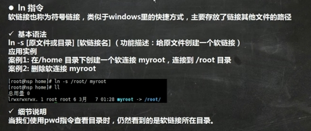

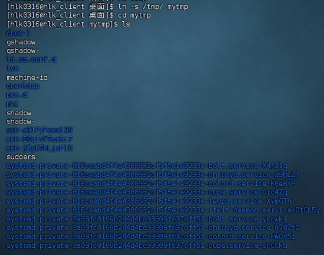 

 

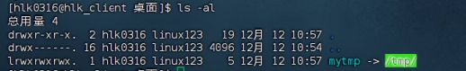 

 

## history

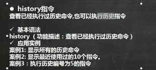

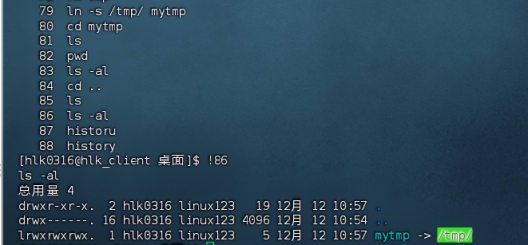 

 

# 时间日期类

## date

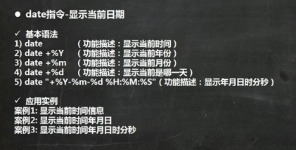

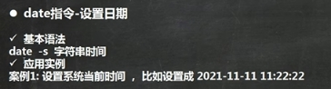 

 

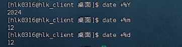 

 

 

 

## cal

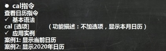

 

 

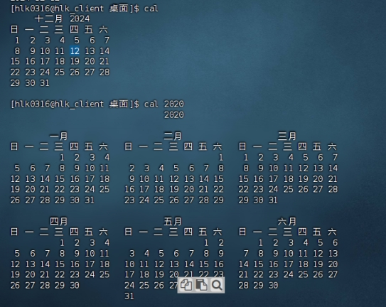 

 

 

## 搜索查找类

## find

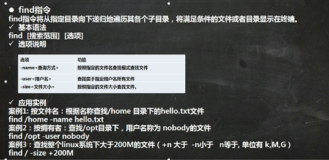

## locate

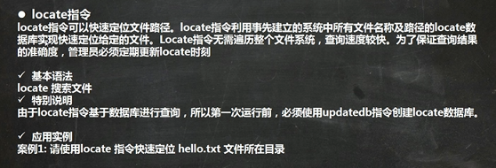

## which

## grep

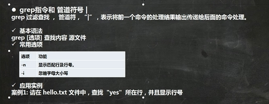

# 压缩和解压

## gzip/gunzip

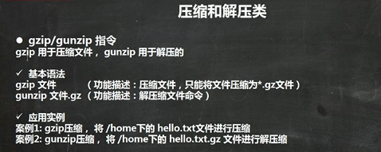

## zip/unzip

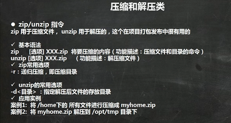

## tar

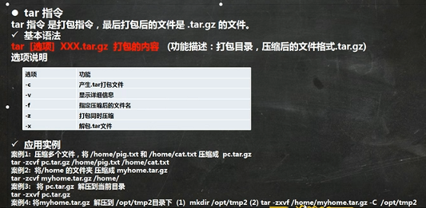

