如某些由js开发游戏题目

结束后有弹窗提示

可以查看js源码

搜索alert，接着查找关键信息就好

如果返回url+参数

可以去js源码中分析参数信息

 如game1

可以去控制台中选择弹窗或者编码解码

(当存在某些加密如base64，但是经过某些网站加密后仍然无效，此时可以选用网站控制台进行加密，详见game 1)

# 例题

## game1

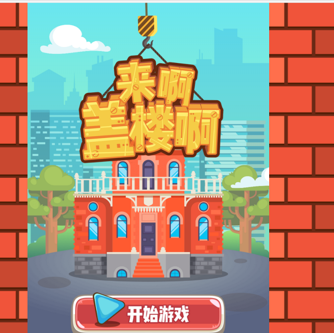

抓包

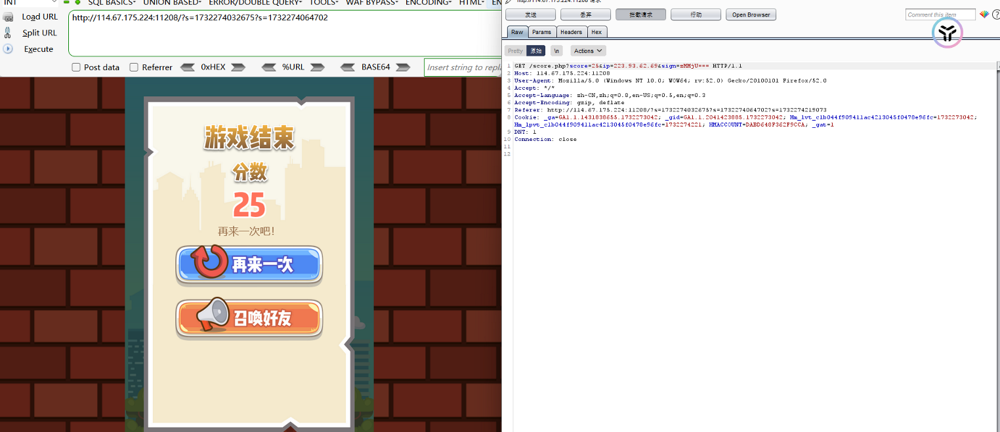

提交score ip sign等参数

score和ip可以理解

sign像是base64编码

解码后出错

搜索sign

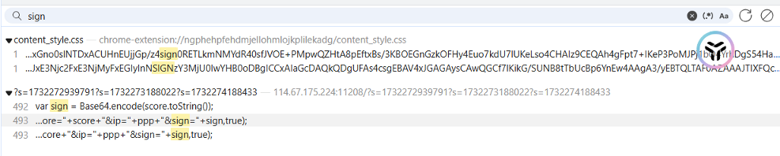

发现一处定义sign

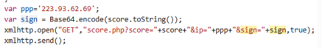

sign值为Base64.encode（score）

修改分数为1000000000000000000000000000

并将其base64加密

bp抓包修改

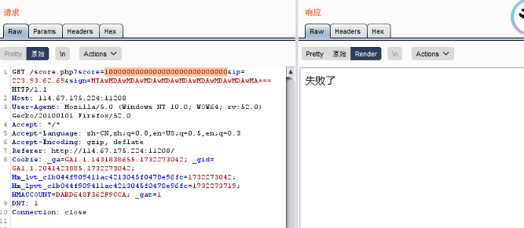

报错

 

尝试利用控制台加密

设置分数为100000000

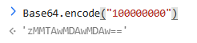

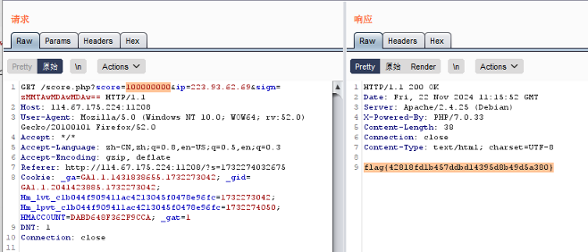

成功得到flag

## Classic Childhood Game

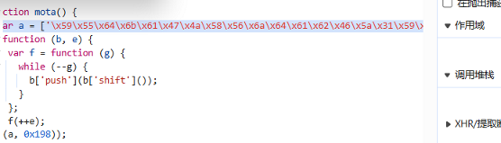

mota函数中存在字符串

控制台调用该函数

得到flag

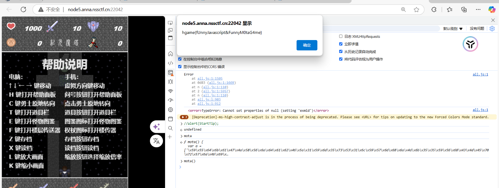

## 2048

提示需要达到20000分

 

查看页面源码

找到

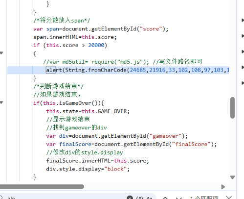

控制台执行

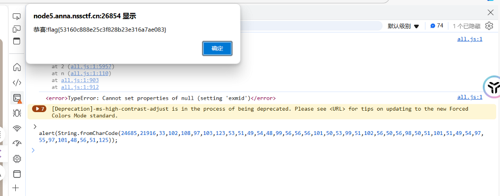

## ezgame

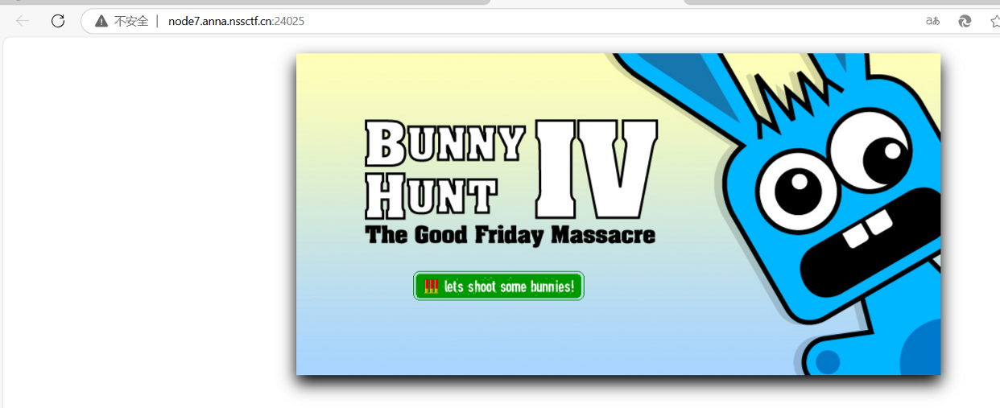

查看源码

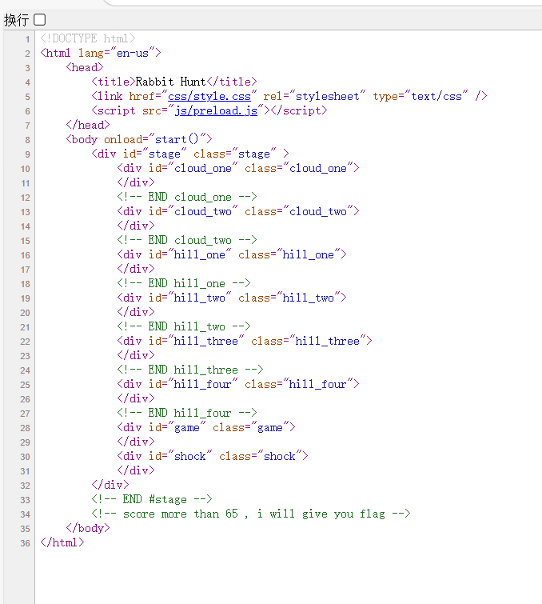

如果分数超过65 可以得到flag

查看网页js信息

发现flag

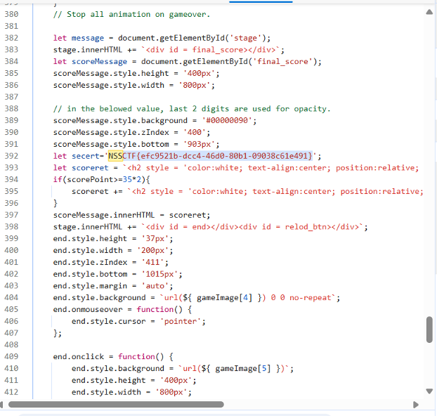

或者控制台修改分数

首先找到分数的变量

scorePoint

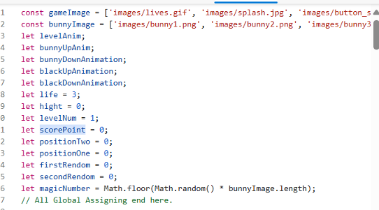

修改值

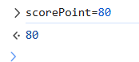

## Welcome To HDCTF 2023

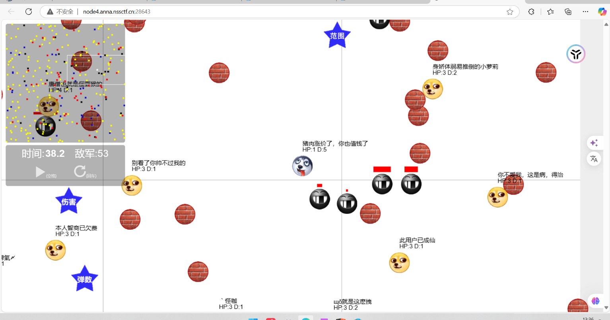

F12查看js源码

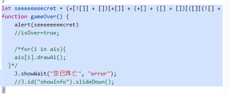

jsfuck解码

 

或者控制台直接输出

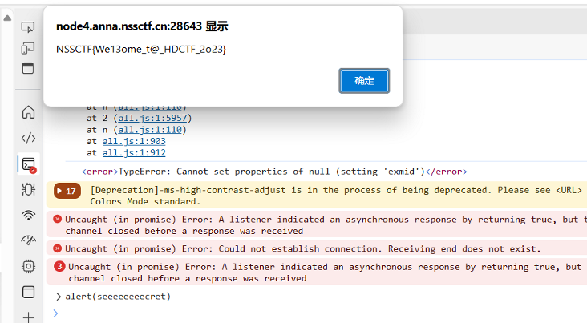