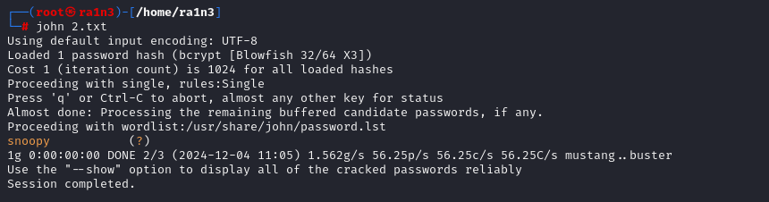

### 介绍

john the Ripper是一个广泛使用的密码破解工具，主要用于破解哈希值和弱密码。它支持多种哈希算法和加密格式，并且可用通过字典攻击，暴力破解等方式进行密码恢复


### 基本功能

- 破解哈希
  - 支持多种哈希算法，包括MD5，SHA-1，SHA-256，bcypt
- 字典攻击
  - 利用用户提供的字典文件尝试匹配密码
- 暴力破解
  - 自动生成可能的密码组合进行尝试
- 组合攻击
  - 结合字典和规则生成密码
- 格式检测
  - 自动识别哈希的类型，或使用参数指定哈希类型


#### 基本用法


#### 破解哈希文件

首先创建一个包含哈希值的文件

```
echo '5d41402abc4b2a76b9719d911017c592' > hash.txt
```

使用john破解

```
john hash.txt
```




#### 指定哈希类型

```
john --format=raw-md5 hash.txt
```

如果john无法自动识别哈希类型，可以手动指定


### 查看破解结果

```
john --show hash.txt
```


### ssh2john

ssh2john可以从SSH公钥/私钥对中提取哈希，允许将提取的数据输入到john中进行密码破解


提取ssh密钥中的哈希

```
ssh2john id_rsa > id_rsa_hash.txt
```

一旦有了哈希文件，就可以运行john来尝试破解密码

```
john id_rsa_hash.txt
```

同时也可以选择字典文件进行破解

```
john -w=/usr/share/wordlists/rockyou.txt id_rsa_hash.txt
```


### zip2john

zip2john可以从zip文件中提取哈希，允许将提取的数据输入到john中进行密码破解

```
zip2john back.zip > hash
```

提取zip文件的哈希

```
john hash -w=/usr/share/wordlists/rockyou.txt
```

利用john爆破哈希
