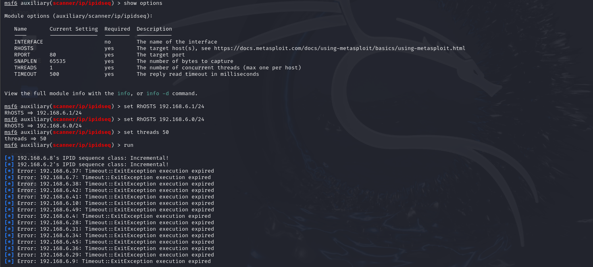
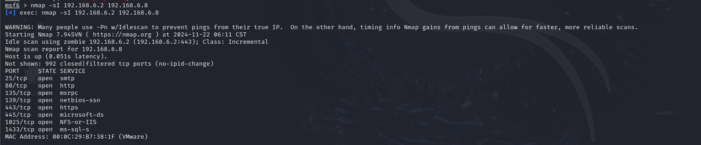

### 介绍

nmap（Network Mapper）是一个开源的网络扫描工具，广泛用于网络发现、漏洞扫描和安全审计。它可以帮助你识别目标主机的开放端口、操作系统类型、服务版本等信息。


### github项目地址

[GitHub - nmap/nmap: Nmap - the Network Mapper. Github mirror of official SVN repository.](https://github.com/nmap/nmap)


### 基本用法


#### 服务版本检测

```
nmap -sV -p- <ip>
```

-sV服务版本检测

-p- 全端口扫描


#### 默认脚本扫描

```
nmap -sC <ip>
```

 -sC 选项可以运行默认的脚本进行扫描


#### 快速扫描

```
nmap -T4 <ip>
```

快速扫描

-T4 是扫描速度的一个预设值，相比默认值，他会加快扫描过程


#### 跳过ping命令扫描

```
nmap -Pn <ip>
```

跳过ping命令直接扫描目标


#### 执行SYN扫描

```
nmap -sS <ip>
```

执行SYN扫描，这是一种隐蔽的扫描方式


#### 三次握手确定端口状态

```
nmap -sT <ip>
```

发送完整的TCP连接

解决隐蔽性和准确性


#### 发送ping命令

```
nmap -sn <ip>
```

发送ping，回显存活主机（主机探活）

n指的是noportscan，即不进行端口扫描

（等效于arp-scan）


#### 扫描指定端口

```
nmap -p [start_port]-[end_port] <ip>
nmap -p 1,2,3,4 <ip>
```

扫描范围内的端口或扫描特定端口


#### 全端口扫描

```
nmap -p- <ip>
nmap -p 1-65535 <ip>
```

扫描目标主机的所有端口


#### 操作系统检测

```
nmap -o 192.168.1.1
```

使用 -o 选项来进行操作系统识别

nmap会尝试通过分析网络响应来识别操作系统


#### 避免ping扫描

```
nmap -Pn <ip>
```

在扫描之前不对目标主机进行Ping检查（有时目标设备禁用了Ping）（或防火墙禁用ICMP报文）

-Pn 跳过Ping扫描，直接扫描目标


#### 发送ICMP时间戳请求

``` 
nmap --send-ip <ip>
```

ARP请求可能不会被所有主机所响应，ICMP时间戳请求更可靠的用于主机发现


#### 指定最小速率

```
nmap --min-rate 10000 <ip>
```

解决速度和准确性的问题


#### 系统版本检测

```
nmap -O <ip>
```

检测系统版本信息


#### UDP扫描

```
nmap -sU <ip>
```


#### 常用端口扫描

```
nmap -top-ports 20 <ip>
```

--top--ports 

常用端口扫描


#### 漏洞脚本扫描

```
nmap --script=vuln <ip>
```

--script=vuln 指定vuln脚本


输出扫描结果

```
nmap -oN output.txt 192.168.1.1
```

-oN 可以将扫描结果保存到文件中，支持多种格式（如普通文本，XML，grepable格式）

将扫描结果输出为普通文本文件output.txt


### nmap结合msf进行TCP空闲扫描


#### 意义

在不直接与目标主机进行通信的情况下识别开放的端口。

空闲扫描通常被用于绕过防火墙，入侵检测系统（IDS）或入侵防御系统（IPS）等安全措施，避免直接暴露攻击者的IP地址。


#### TCP空闲扫描原理

TCP空闲扫描（Idle Scan）是一种通过利用中间代理主机（通常是一个空闲主机或不活跃的设备）来执行端口扫描的方法。


#### 过程

首先通过msf寻找满足TCP空闲扫描的主机

进入msf

```
msfconsole
use auxiliary/scanner/ip/ipidseq
```




接着在nmap中利用 -sI选项利用获取到的空闲主机对目标主机进行扫描

```
nmap -sI <跳板机> <目标主机>
```




#### 优点

隐蔽性：攻击者的IP不会出现在目标主机的日志中，因为实际的扫描数据包是由空闲主机发出的。


### 细节问题

首先要考虑隐蔽性

-sT -sS等参数


准确性

-sT


速度

--min-rate 10000

