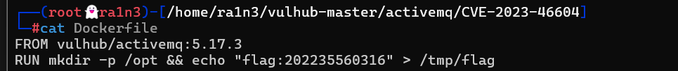

# Docker Hub镜像Pull失败

[Docker Hub 镜像 Pull 失败的解决方案_docker pull拉取镜像失败问题-CSDN博客](https://blog.csdn.net/weixin_60033897/article/details/145427049)

## 配置国内镜像加速器

vim /etc/docker/daemon.json

```
{
    "registry-mirrors": [
    "https://2a6bf1988cb6428c877f723ec7530dbc.mirror.swr.myhuaweicloud.com",
    "https://docker.m.daocloud.io",
    "https://hub-mirror.c.163.com",
    "https://mirror.baidubce.com",
    "https://your_preferred_mirror",
    "https://dockerhub.icu",
    "https://docker.registry.cyou",
    "https://docker-cf.registry.cyou",
    "https://dockercf.jsdelivr.fyi",
    "https://docker.jsdelivr.fyi",
    "https://dockertest.jsdelivr.fyi",
    "https://mirror.aliyuncs.com",
    "https://dockerproxy.com",
    "https://mirror.baidubce.com",
    "https://docker.m.daocloud.io",
    "https://docker.nju.edu.cn",
    "https://docker.mirrors.sjtug.sjtu.edu.cn",
    "https://docker.mirrors.ustc.edu.cn",
    "https://mirror.iscas.ac.cn",
    "https://docker.rainbond.cc"
    ]
}
```

## 重新加载docker配置文件

```
systemctl daemon-reload
```

## 重启docker

```
systemctl restart docker.service
```


## 拉取镜像

```
docker-compose up -d
```


## 重构镜像

```
vim Dockerfile
From xxx:tags
command
```




## 装载镜像

```
docker build -t xxx:tags .
```


## 进入镜像命令行

```
docker run -it xxx:tags /bin/sh
```


## 保存镜像

```
docker save -o xxx.img xxx:tags
```


## 加载镜像

```
docker load -i xxx.img
```


## 列出容器列表

```
docker load 
docker laod -a
```


## 命令执行

```
docker exec ID command
```


```
docker run -it xxx:tag /bin/sh
docker run -it xxx:tag /bin/bash
```


## 删除容器

```
docker rm -f $(docker ps -a -q)
```


## 删除镜像

```
docker rmi -f $(docker images -q)
```


## 删除未使用的网络和卷

```
docker network prune -f
docker volume prune -fa
```

