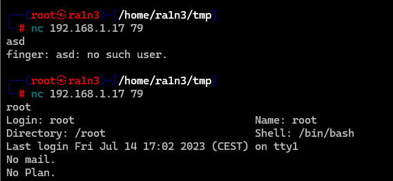

# 介绍

Finger 是一种早期的网络协议和服务，用于查询远程主机的用户信息。


## 主要功能

用户信息查询

- Finger 允许用户查询远程主机上某个账户的详细信息，例如：

  - 用户是否在线。

  - 最后登录时间。

  - 主目录、shell 类型等。

  - 用户的 .plan 或 .project 文件内容（用户自定义的文本）。

简单通信

- 通过客户端发送请求，服务器返回纯文本响应。


# 默认端口

79


# 简单使用

```
finger <user>@<ip>
```

查询远程用户信息


```
nc <ip> 79
<user>
```



当用户不存在时，会提示没有这个用户

当用户存在时，会显示用户信息

也就是我们可以利用脚本遍历用户字典，然后发送nc请求


# 利用MSF枚举用户名

```
msfconsole
use auxiliary/scanner/finger/finger_users
set rhosts <ip>
set USERS_FILE /path/wordlists    
# 默认/usr/share/metasploit-framework/data/wordlists/namelist.txt
set THREADS 50
run
```


当我们得到用户名信息

就可以尝试利用hydra爆破ssh服务