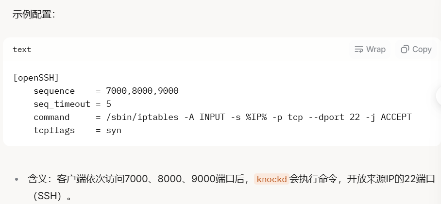

## .bash_history

.bash_history 是 Linux 或类 Unix 系统中 Bash shell 的一个隐藏文件，通常位于用户的家目录（~/.bash_history）。它的作用是记录用户在终端中执行过的命令历史。每次你在 Bash 终端输入并执行命令时，这些命令可能会被保存到这个文件中，以便以后通过 history 命令查看或使用箭头键快速调用之前的命令。


## /etc/passwd

/etc/passwd是linux系统中存储用户信息的文件，位于文件系统的根目录下

其内容包括：

- 用户名
- UID（用户id）
- GID（组ID）
- 主目录
- 默认Shell

```
ra1n3:x:1000:1000:ra1n3,,,:/home/ra1n3:/usr/bin/zsh
```

当第三位>=1000时，表示是正常用户（通过提取普通用户可以尝试爆破ssh服务等）

第二位有x表示存在密码

当我们对/etc/passwd文件存在读写权限时，可以尝试往其中追加用户实现提权

首先利用openssl生成hash

```
openssl passwd 123
```

接着将hash追加到/etc/passwd

```
echo 'ra1n3:$1$hjO.SDKY$.3mqQRkvDN6gUHGIs4wZQ1:0:0:123:/root:/bin/bash' >> /etc/passwd
```

也可以通过将root用户的x字段删除，实现免密登录root

```
root:x:0:0:root:/root:/bin/bash
```

从 root 用户的密码条目中删除 'x' 字符会使其成为 /etc/passwd 文件中的空字段，这会导致系统允许任何非特权用户以 root 身份登录，而无需提供密码


## /etc/shadow

/etc/shadow是linux系统中存储用户密码的哈希文件，相比/etc/passwd，它更敏感且权限更严格

默认情况下只有root用户能直接访问

其内容包括：

- 用户名
- 加密后的密码哈希
- 密码最后修改时间，有效期等


## /etc/sudoers

/etc/sudoers是Linux系统中配置sudo权限的文件，它定义了哪些用户或组可以以超级用户root或其他用户身份运行特定命令。

错误配置这个文件可能导致普通用户轻松提权


root ALL=(ALL:ALL) ALL

当我们向该文件追加


Ra1n3 ALL=(ALL:ALL) ALL

即Ra1n3可以sudo执行任何命令


## /proc/sched_debug

/proc/sched_debug是linux内核提供的一个虚拟文件，位于/proc伪文件系统中。

它包含了关于系统调度器（scheduler）的调试信息，用来分析CPU的调度状态，文件内容会动态生成，反映当前系统的运行情况，即linux系统中的任务调度情况

默认情况下，/proc/sched_debug需要root权限才能读取，通常是400，即-r--------

普通用户无法直接访问，除非系统配置宽松

通过读取该文件，可以大致分析该服务器开启了什么服务


## /etc/knockd.conf

/etc/knockd.conf是knockd服务的配置文件，knockd是一个端口敲门（port knocking）工具，用于增强服务器安全性，它通过监听特定的端口敲门序列（例如按顺序访问某些端口）来动态开放防火墙规则，允许后续连接（如SSH）

 

文件通常定义敲门规则，如：

序列：敲门的端口顺序

超时：敲门有效时间

命令：敲门成功后执行的操作（如开放SSH端口）



默认情况下，/etc/knockd.conf全局可读，但是只有root可写

如果目标服务器运行了knockd，这个文件可能存在


读取/etc/knockd.conf可以暴露敲门序列，从而绕过端口屏蔽

如 22端口的filtered，直接访问隐藏服务


## .ssh目录

每个目录在其主目录下通常会有一个.ssh子目录，这个目录存储与SSH相关的文件，包括私钥（通常命为id_rsa）和公钥（通常命为id_rsa.pub），以及其他与SSH认证和配置相关的文件（如authorized_keys等）

 

公钥和私钥：

公钥：可以安全地贡献给任何人，它用于认证

私钥：必须严格保密。它与公钥配对，用于在SSH连接中进行身份验证

 

SSH免密登录：

在指定地用户中（如ra1n3）的.ssh/authorized_kys文件中，如果包含了用户xxx的公钥，那么用户xxx就可以使用其私钥进行SSH免密登录，前提是私钥与公钥匹配

 

如果获取了ra1n3的私钥

那么我们可以先通过ssh2john工具将SSH密钥文件转换成john可处理的格式，接着利用john爆破工具

 

 

## ssh认证日志

```
/var/log/secure
/var/log/auth.log
```


 

## /etc/issue

查看关于操作系统发行版的基本信息

 

 

## Nginx

```
/var/log/nginx/access.log
/var/log/nginx/error.log
```

日志文件


## Apache

```
/var/log/apache2/access.log
/var/log/apache2/error.log

/var/log/httpd/access.log
/var/log/apache/access.log
```


## 系统日志

```
/var/log/messages
```


## redis日志

```
/var/log/redis.log
```


## config/settings文件

关注网站的默认配置文件

其中可能存在数据库连接的配置信息

可能存在相关的账号密码

web：

```
/var/www/html/config.php

/var/www/html/settings.php

/var/www/html/.env

/var/www/html/app/config/config.ini
```

框架：

```
Laravel：.env
Django：settings.py
Spring Boot：application.properties 或 application.yml
```

数据库：

```
MySQL：my.cnf
PostgreSQL：postgresql.conf
MongoDB：mongod.conf
```

