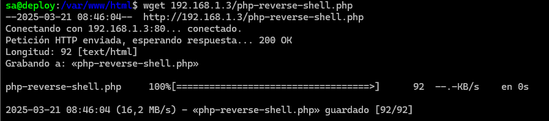
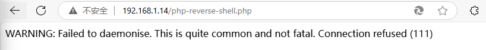
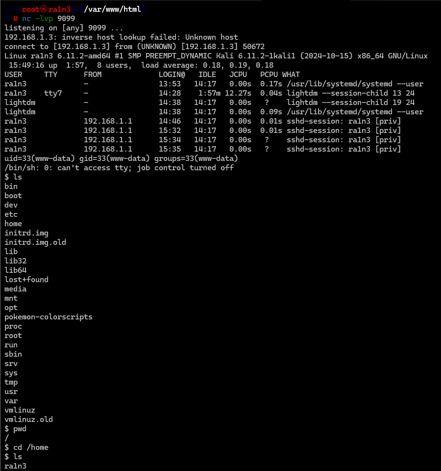
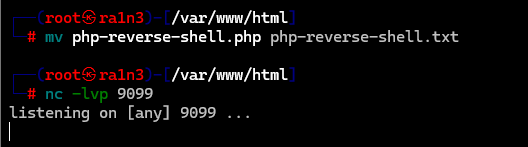
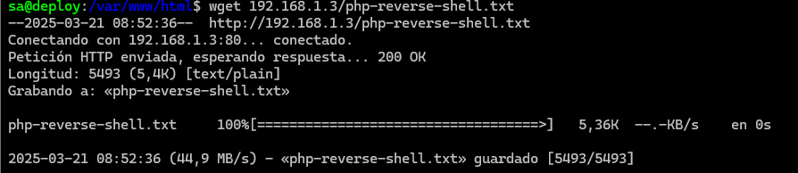
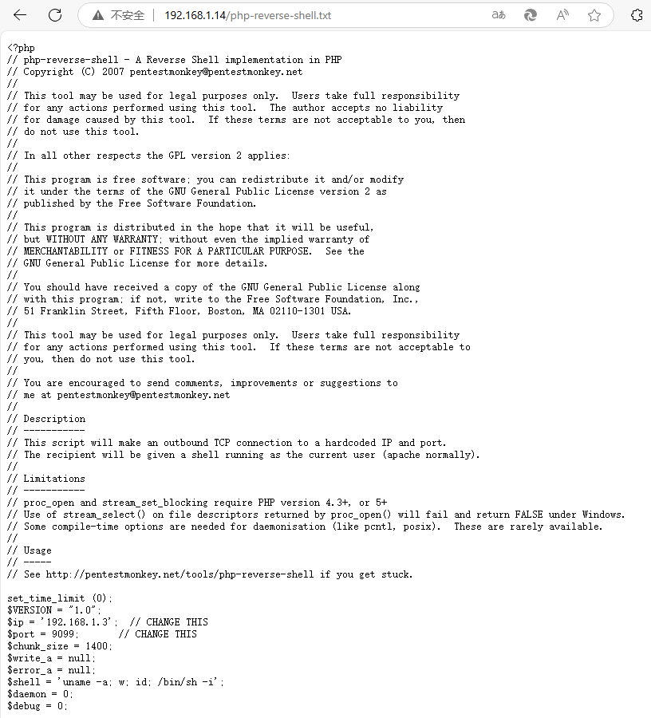
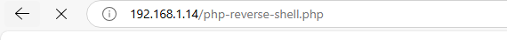
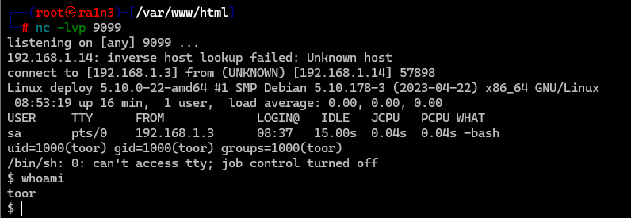

## php-reverse-shell.php

当我们进入靶机的/var/www/html上传弹shell脚本时，不能直接从攻击机的web服务器wget php脚本，因为它会先在攻击机的web服务器解析，此时我们如果触发该脚本拿到的不是toor用户的shell

简单理解就是，php-reverse-shell.php会在攻击机上进行解析，然后再发送给靶机

如果先wget，再开启监听，当在浏览器触发该脚本时，会提示连接被拒绝

而如果先监听，再wget，则弹回的时攻击机的shell

因为php-reverse-shell.php已经在攻击机解析过了，然后才发送给靶机

而如果我们将php脚本改一下后缀名（如txt），然后在攻击机上wget后再改回来，那么就不会在本地解析，从而可以拿到toor用户的shell

或者在攻击机上开启一个简单的python web服务器，然后进行文件上传下载，这样也可以避免本地解析