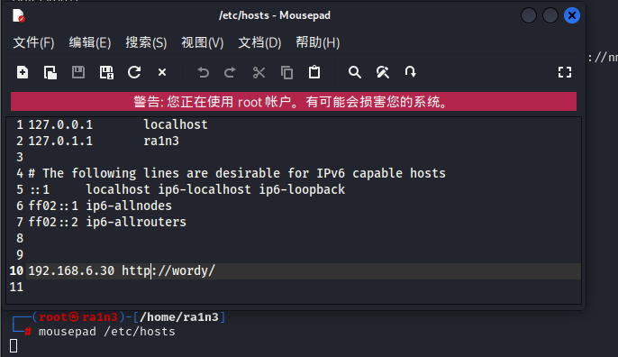

# 添加本地hosts解析

某些目标可能使用 DNS 安全防御机制（如 DNS 过滤、防火墙策略）阻止外部访问。通过修改 hosts 文件，可以跳过这些 DNS 防御机制，直接与目标系统通信。


# 修改 `hosts` 文件的作用

- 绕过 DNS 防御：
  - 通过修改 `hosts` 文件，可以直接将域名解析到指定的 IP 地址，绕过 DNS 过滤或防火墙策略。
- 测试内网服务：
  - 通过修改 `hosts` 文件，可以模拟内网环境，测试内网服务。
- 访问被屏蔽的域名：
  - 通过修改 `hosts` 文件，可以访问被屏蔽的域名（如某些国家的域名屏蔽）。


# 路径

```
kali:
/etc/hosts
```



```
windows：
C:\Windows\System32\drivers\etc\hosts
```


