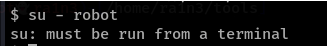

### 意义

当通过受限的shell获得权限后，可能会面临输入和输出显示不正常的情况，例如某些功能无法使用，输出不完整，无法实现交互等等，此时利用终端转换技术可以改善交互体验，恢复更完整的命令行功能



提示需要在交互式的终端中运行


```
python -c 'import pty;pty.spawn("/bin/bash")'
```


```
python3 -c 'import pty;pty.spawn("/bin/bash")'
```


```
/usr/bin/script -qc /bin/bash /dev/null
```


```
perl -e 'exec "/bin/bash";'
```


```
/bin/bash -i
```


```
ruby -e 'exec "/bin/bash"'
```

