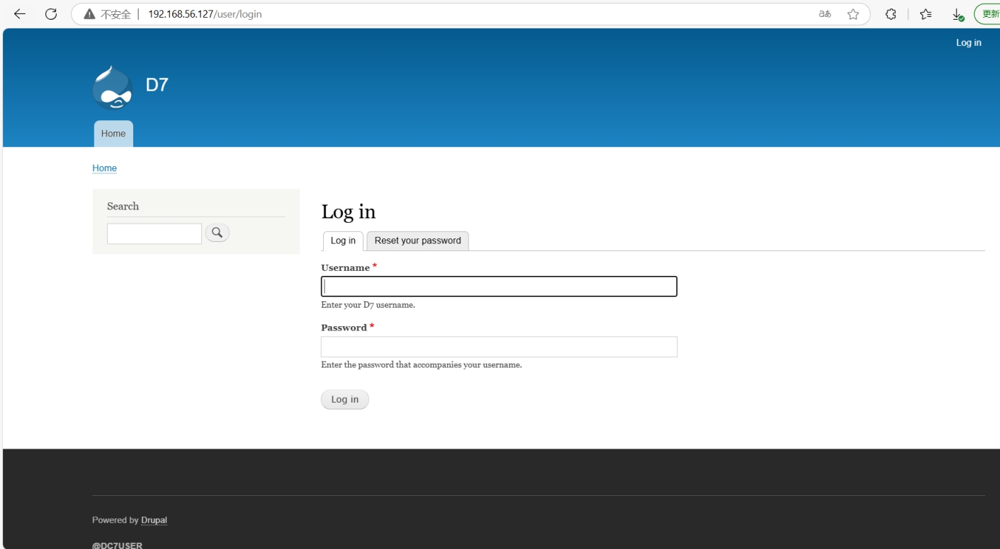
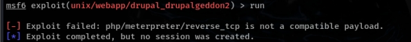
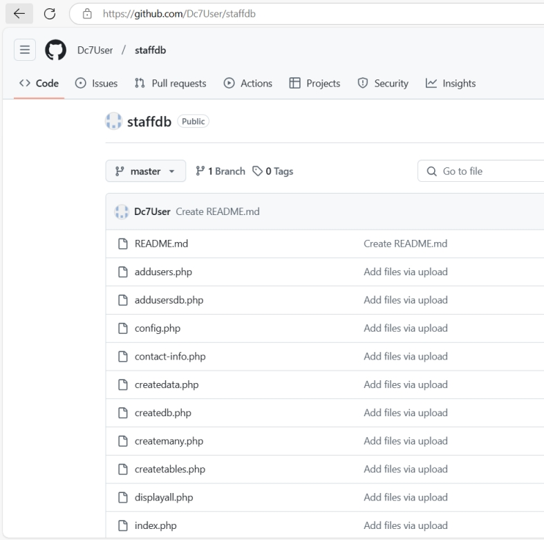
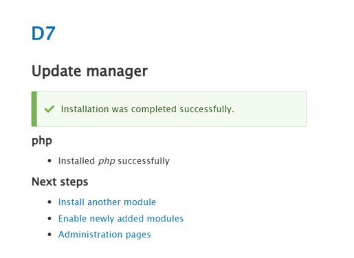

靶机地址：

[DC: 7 ~ VulnHub](https://www.vulnhub.com/entry/dc-7,356/)

 

靶机ip：192.168.56.127

nmap扫描靶机开放端口

 

 

 

 

22：ssh服务

80：http服务

访问192.168.56.127

 

只有一个搜索框，并提示我们跳出框框

 

 

搜索框随便输入内容

 

 

利用sqlmap测试是否存在sql注入

 

 

不存在SQL注入漏洞

 

dirsearch扫描目录

 

 

 

 

 

 

 

 

 

 

 

 

得到五个关键目录

分别访问

 

 

只有一处关键的login页面

 

 

 

whatweb识别网站指纹信息

 

 

 

 

wappalyzer识别

 

得知是Drupal 8 CMS

 

搜索相关漏洞

 

 

 

 

 

但是经过尝试后都不行

 

 

 

 

 

 

回到主页

 

 

 

左下角有一个id，搜索

 

 

找到一个github用户

查看他的项目内容

 

 

 

 

 

 

查看config.php

 

 

 

存在用户名和密码

 

尝试登录网站，失败

 

 

 

尝试登录ssh

成功

 

 

有一个mbox和backups文件

mbox是linux中的邮件存储箱

上传linpeas.sh

本地开启http服务

 

 

 

执行

 

到这里我们理一下思路：

首先我们目前是dc7user用户

而我们可以利用drush修改admin密码登录网站后台，

尝试利用后台漏洞弹回一个www-data用户

www-data可以修改backups.sh内容

而backups.sh属于root用户

因此，如果我们往backups.sh中添加一条反弹shell的命令

那么我们就可以收到root用户发出的shell

即取得了root权限

 

切换到网站目录

 

 

利用drush修改admin密码

 

成功登录网站后台

 

尝试模板注入

 

 

 

 

 

但是不支持解析为php语言

插件页面

 

点击下载新的模块

可以访问drupal官网下载模块然后在此处导入

 

 

访问drupal.org官网

搜索php，找到php解释器

 

最下面查看所有版本

 

 

我选择的是这一个

 

 

然后下载

 

 

然后将下载的压缩包直接导入

 

 

导入成功

 

 

接着开启该模块

 

 

 

 

 

 

返回content页面

 

 

可以解析php代码

 

写入反弹shell脚本

 

本地开启监听

 

 

 

返回content页面，点击触发该代码

 

成功弹回shell

 

转换终端

 

进入/opt/scripts目录下，往backups.sh追加反弹shell任务，然后本地开启监听

等待定时任务触发后，会得到root弹回的shell

 

 

注意点：

虽然backups.sh这个shell脚本我们也可以执行，但是如果写入了反弹shell的脚本，那么本地接收到的终端是执行者的

即如果是www-data用户执行该脚本，那么本地接收到的终端就是www-data用户的，而我们要获取的是root用户

即我们要等到定时任务，每十五分钟触发一次拿到root用户的shell，得到root用户权限

 