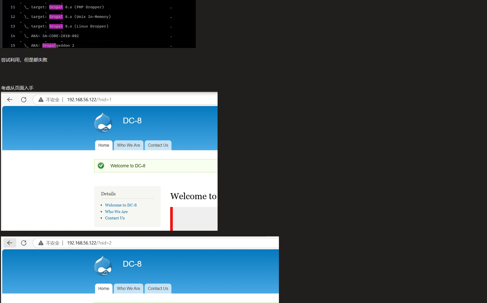
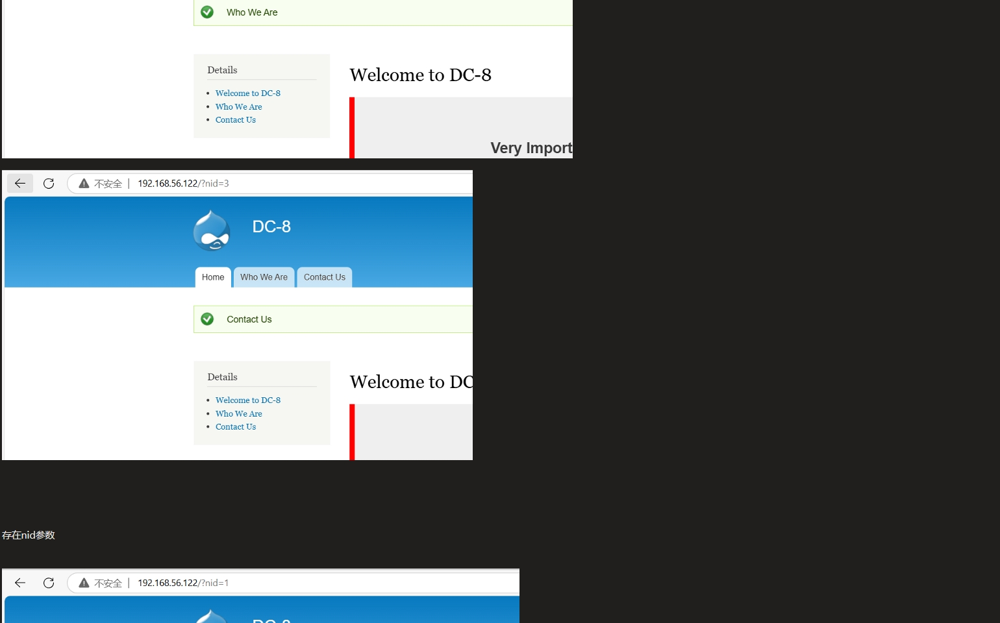
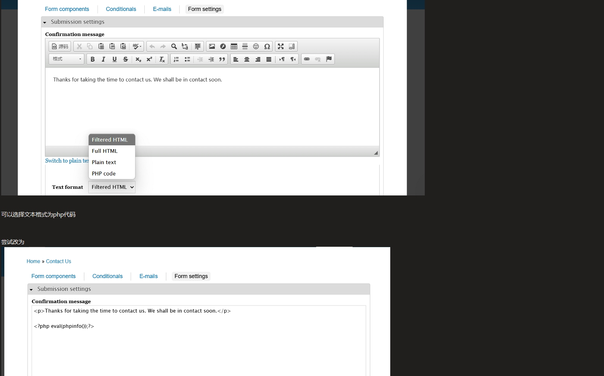

 

 

 

将php代码改为反弹shell脚本

本地监听，触发后成功反弹shell

 

（环境又崩了，重新搭建）

 

 

 

 

python转换终端

 

尝试传入linpeas脚本

 

本地开启http服务

 

 

切换到tmp目录

 

重新wget，成功

 

 

但是扫描后无关键内容

 

尝试sudo -l

但是需要提交www-data的密码，而我们没有，尝试suid提权

 

查找suid位

 

搜索相关漏洞

最后在exim中找到可用漏洞

 

查看exim4版本信息

 

 

找到两个可用来提权的漏洞

 

 

 

查看46996.sh

 

 

提供了两种提权方式

 

保存脚本

 

 

 

本地开启http服务

 

 

 

 

 

尝试第二种提权方式

 

成功

 

读取flag

 

 

 

 