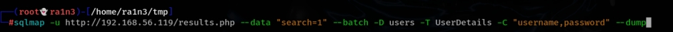

 

 

 

 

主机探活：

arp-scan -l --interface=eth1

 

 

 

确定靶机ip：192.168.56.119

 

 

 

nmap扫描端口信息

这里我们使用CTFEnum

 

 

 

 

可以看到开放了

21

22

80

但是22端口显示filtered，即过滤状态，无法进行暴力破解

 

访问192.168.56.119

 

 

 

 

 

 

关键点在于一个搜索框，一个登录页面

 

 

dirsesarch进行扫描目录

 

 

 

无关键信息

 

Wappalyzer进行指纹识别，依旧无关键信息

 

 

 

whatweb也是无信息

 

 

无法识别该靶机的CMS

 

 

 

尝试从页面入手

 

其中search页面

 

 

 

 

尝试sql注入

 

抓包

可以看到为post请求，post到results.php参数为search

 

 

 

利用sqlmap

 

 

 

 

 

 

 

可以看到search是一个注入点，且数据库为mysql

 

 

或者直接将抓包内容保存到文件中，利用sqlmap读取文件内容自动检测

 

 

 

 

 

 

查找数据库

 

 

 

 

 

 

三个数据库

Staff

和users

 

查看users数据库下的表名

 

 

 

 

 

存在UserDetails表

 

 

查看该表中的所有字段

 

 

 

 

查看该表中的username和password的值

 

 

 

 

 

 

 

查看

 

 

 

处理数据

将用户名保存到users.txt

将密码保存到password.txt

 

 

 

 

 

 

 

 

 

继续利用sqlmap跑Staff数据库

 

 

 

 

得到Users表

 

 

查找Users表中的字段

 

 

 

 

 

查询username和password的字段

 

 

 

得到admin的账号和密码

 

 

 

 

 

 

 

 

返回登录页面

成功登录

 

 

 

下面提示File does not exist，文件不存在

判断可能存在文件读取，尝试bp爆破参数及路径

 

尝试直接?file=../../../../../../etc/passwd

 

 

 

 

成功读取/etc/passwd

 

即参数为file

 

 

尝试读取/etc/shadow

 

失败

 

 

 

 

结合22ssh端口的filter被过滤

 

查看/proc/sched_debug

这个文件可以读取linux系统中的任务调度情况

 

 

 

 

 

将内容保存到2.txt文件

 

 

过滤出所有服务

可以看到存在knockd服务

 

 

 

读取该服务的配置文件/etc/knockd.conf

 

 

 

存在三个端口7469，8457，9842

向三个端口发送SYN请求（敲门）

 

可以使用knock发送请求，也可以用nc

 

（我这里复现的时候有问题，重装靶机后可以看到22端口开放）

（ip由192.168.56.119变为192.168.56.120）

 

 

22端口开放，利用hydra爆破ssh账号密码

 

 

 

 

 

 

 

前两个用户登陆后无关键信息

第三个用户登陆后发现新的密码

 

 

 

将新密码追加到password.txt文件

 

 

重新爆破ssh服务

 

 

爆破出新的用户名fredf

登录

 

查看sudo -l

 

 

提示可以以root身份执行/opt/devstuff/dist/test/test文件

 

尝试执行

 

 

 

查找test.py

 

 

 

查看test.py

 

 

 

 

 

即读取第一个文件的内容，然后追加到第二个文件里

 

因此我们可以执行这一条命令，将fredf  ALL=(ALL:ALL) ALL追加到/etc/sudoers文件中

即fredf可以利用sudo执行任何命令

 

 

 

 

 

 

 